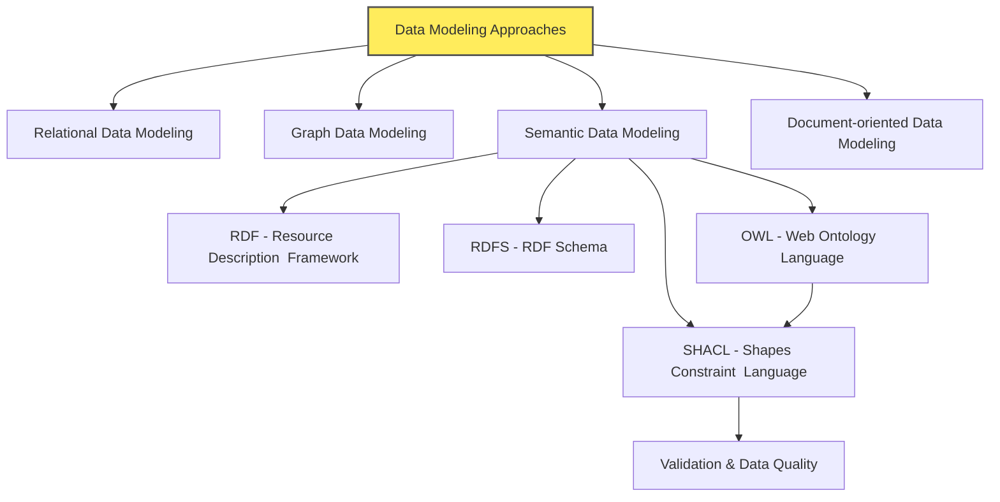
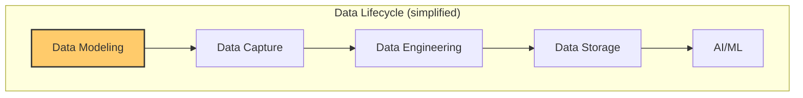

# Overview of the Contents

- The files in this folder cover various data modeling techniques.
- Check out these files for detailed explanations and examples:
  - [Overview of Data Modeling Concepts](./05-overview_of_data_modeling_concepts.md)
  - [Relational Data Modeling](./10-relational_data_modeling.md)
  - [Graph Data Modeling](./20-graph_data_modeling.md)
  - [Semantic Data Modeling](./30-semantic_data_modeling.md)
    - [Resource Description Framework (RDF)](./31-resource_description_framework.md)
    - [RDF Schema (RDFS)](./32-resource_description_framework_schema.md)
    - [Web Ontology Language (OWL)](./33-web_ontology_language.md)
    - [Shapes Constraint Language (SHACL)](./34-shapes_constraint_language.md)
  - [JSON-based Document-oriented Data Modeling](./40-json_based_modeling.md)

# Data Modeling in Data Lifecycle

