# Introduction to Data Modeling

## What is Data Modeling?

- **What is it?**
  - Process of creating visual, conceptual data representations
  - Shows data and its relationships in a system
  - Like a blueprint for data structures
- **Purpose:**
  - Organizes and structures data
  - Enables efficient storage, retrieval, and management
  - Acts as communication tool
  - Ensures shared understanding of data

## Why Data Modeling Matters

- **Improved Communication:**
  - Bridges gap between business and technical teams
  - Common language for data understanding
  - Like city plans for coordinating city departments
- **Enhanced Data Organization:**
  - Structures data logically for efficiency
  - Improves data storage and retrieval
  - Like city zoning for better functionality
- **Data Quality and Consistency:**
  - Enforces data integrity through rules and relationships
  - Leads to consistent, reliable data
  - Like building codes for construction standards
- **Foundation for System Development:**
  - Blueprint for databases and applications
  - Guides creation of effective data systems
  - Like city plans for urban development
- **Business Understanding:**
  - Helps understand data assets and flow
  - Supports better decision-making and planning
  - Like urban analysis for city planners

## Abstraction levels in Data Modeling

### Conceptual, Logical, and Physical Data Models

- Data Modeling is often done at three levels of abstraction:
  - **Conceptual:** High-level view of data, focusing on business needs.
  - **Logical:** More detailed, technology-independent view of data.
  - **Physical:** Database-specific view, considering implementation details.
- Each level serves a different purpose and audience:
  - **Conceptual:** Business stakeholders, project managers, data analysts.
  - **Logical:** Data modelers, database designers, developers.
  - **Physical:** Database administrators (DBAs), database developers.
- **Analogy:** Building a house
  - **Conceptual:** "I need a house with bedrooms, a kitchen, and a living room."
  - **Logical:** "The bedrooms will have beds and closets, the kitchen will have a stove and sink."
  - **Physical:** "The walls will be brick, the roof will be tile, the doors will be oak."

### Examples of Conceptual, Logical, and Physical Data Models

#### Understanding Conceptual Model through an Example

- Let's say we want to build a database for an online store.
- At the conceptual level, we might identify these key "things":
  - `Customer:` We need to store information about our customers.
  - `Product:` We sell products, so we need to track products.
  - `Order:` Customers place orders, so we need to manage orders.
- And the main relationships might be:
  - Customers _place_ Orders.
  - Orders _contain_ Products.
- This abstraction level
  - This is a very high-level view, focusing on the main entities and their relationships.
  - We are not concerned about how we will store this data or what technology we will use.
  - We are just trying to understand the business needs.
- Diagram below
  - We use simple boxes to represent our "things" (Customer, Order, Product).
  - Arrows show the relationships (Customers place Orders, Orders contain Products).
  - This is very basic – no details about what _kind_ of information we store about customers or products.

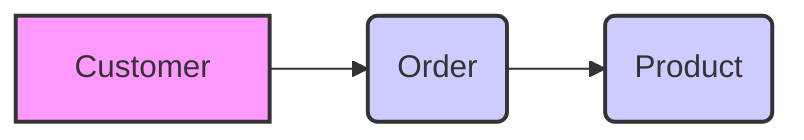

#### Understanding Logical Model through an Example

- **Think of it as:**
  - A more detailed floor plan of your house.
  - Now you're thinking about _what's in each room_ - like bedrooms need beds, kitchens need stoves.
  - You're also thinking about _how rooms are connected_ more specifically.
- **Example: Online Store (Logical)**
  - Now we add more detail to our online store example.
  - We still don't care about _how_ this will be implemented in a database.

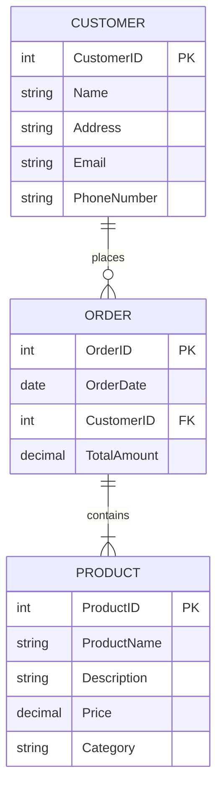

- **Focus:**
  - We are now thinking about _what information_ we need to store about each entity.
  - For example, for a customer, we might want to store their name, address, email, and phone number.
  - For a product, we might want to store its name, description, price, and category.
  - We also define the relationships more clearly:
    - A customer can place many orders (one-to-many).
    - An order can contain many products (many-to-many).

#### Understanding Physical Model through an Example

- **Think of it as:**
  - The blueprints for your house, ready for construction.
- **Focus:**
  - Database-specific.
  - Now we consider the _specific database system_ we'll use (like MySQL, PostgreSQL, SQL Server, etc.).
  - We choose _data types_ that are supported by that database.
  - We think about _performance_ – indexes, storage, etc.
  - We create actual _tables_, _columns_, and define _constraints_ (rules) to ensure data quality.
- **Example of SQL DDL (for PostgreSQL):**

```sql
CREATE TABLE customers (
    customer_id INT PRIMARY KEY,
    name VARCHAR(255),
    address TEXT,
    email VARCHAR(100) UNIQUE,
    phone_number VARCHAR(20)
);

CREATE TABLE products (
    product_id INT PRIMARY KEY,
    product_name VARCHAR(255),
    description TEXT,
    price DECIMAL(10, 2),
    category VARCHAR(50)
);

CREATE TABLE orders (
    order_id INT PRIMARY KEY,
    order_date DATE,
    customer_id INT REFERENCES customers(customer_id),
    total_amount DECIMAL(12, 2)
);
```

## Overview of Main Data Modeling Approaches

- **Relational Data Modeling:**
  - `Structure:` Tables with rows and columns
  - `Relationships:` Defined through keys
  - `Analogy:` "Grid City" - well-defined blocks, streets
  - `Best for:` Structured data, transactions
- **Graph Data Modeling:**
  - `Structure:` Nodes (entities) and edges (relationships)
  - `Focus:` Connections and networks
  - `Analogy:` "Network City" - connections are key
  - `Best for:` Relationship-rich data, network analysis
- **Semantic Data Modeling:**
  - `Structure:` Triples (subject-predicate-object)
  - `Focus:` Meaning, context, knowledge
  - `Analogy:` "Knowledge City" - semantically labeled elements
  - `Best for:` Knowledge graphs, data integration, reasoning
- **Document-oriented Data Modeling:**
  - `Structure:` Flexible JSON documents
  - `Focus:` Flexibility, schema-on-read
  - `Analogy:` "Flexible Neighborhoods" - varied layouts within guidelines
  - `Best for:` Content management, catalogs, evolving data

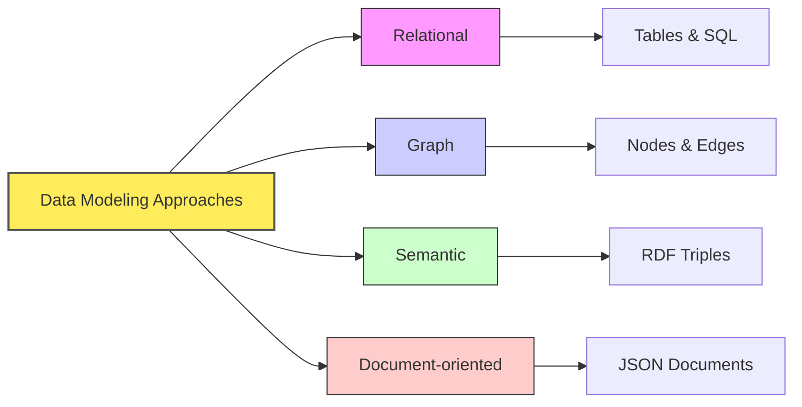

# Relational Data Modeling

## Core Concepts of Relational Data Modeling

- **Introduction to Relational Model**
  - Widely used data modeling approach.
  - Organizes data into relations (tables).
  - Tables have columns (attributes) and rows (records).
  - Relationships established via shared attributes and keys.
- **Entities, Attributes, and Relationships**
  - `Entity:`
    - Real-world object or concept (e.g., Customer, Product).
    - Represented as a table.
    - In "Grid City" analogy: Entities are like _Buildings_.
  - `Attribute:`
    - Property or characteristic of an entity (e.g., Customer Name, Product Price).
    - Represented as a column in a table.
    - In "Grid City" analogy: Attributes are like _Building Features_ (e.g., number of floors, address).
  - `Relationship:`
    - Association between entities (e.g., Customer places Order).
    - Represented using foreign keys.
    - In "Grid City" analogy: Relationships are like _Roads connecting Buildings_.
- **Primary Keys and Foreign Keys**
  - `Primary Key (PK):`
    - Unique identifier for each row in a table.
    - Ensures each record is uniquely identifiable.
    - Example: `CustomerID` in `Customer` table.
    - Like a unique _Building Address_ in "Grid City".
  - `Foreign Key (FK):`
    - Attribute in one table referencing the primary key of another.
    - Establishes links between tables.
    - Example: `OrderID` table with `CustomerID` as FK referencing `Customer` table.
    - Like using a _Building Address_ in a separate registry to link back to the original building in "Grid City".

## Entity-Relationship (ER) Diagrams

- **What are ER Diagrams?**
  - Visual tools for relational data models.
  - Use symbols for entities, attributes, and relationships.
  - Simplify communication about database structure.
  - Like simplified _City Maps_ showing key buildings and roads.
- **ER Diagram Components:**
  - `Entities:`
    - Represented as rectangles.
    - In diagrams: `CUSTOMER`, `ORDER`.
    - Like _Building symbols_ on a city map.
  - **Attributes:**
    - Represented as ovals connected to entities.
    - In diagrams: `CustomerName`, `OrderID`.
    - Like _Labels for Building features_ on a map.
  - **Relationships:**
    - Represented as diamonds connecting entities.
    - In diagrams: `places`, `contains`.
    - Like _Road symbols_ connecting buildings on a map.
  - **Lines:**
    - Indicate relationship type (one-to-one, one-to-many, many-to-many).
    - Indicate _Road types_ (one-way, two-way, highways) on a map in terms of connection capacity.
    - Indicate _Connection capacity_ among the nodes.
- **Mermaid Syntax for ER Diagrams:**
  - Simple text-based syntax for creating diagrams.
  - Defines entities and relationships with specific notations.
  - Allows for clear, code-driven diagram creation.
  - Like a _City Map Key_ explaining symbols used.
- **Example ER Diagram Syntax Overview**
  - This diagram illustrates a basic ER diagram syntax using Mermaid.
  - It shows entities like `CUSTOMER`, `ORDER`, and `ORDER_ITEM` with their attributes, primary keys (PK), and foreign keys (FK).
  - Relationship cardinalities are also visualized (e.g., `||--o{` for one-to-many).
  - Comments (`%%`) explain key elements of the syntax.

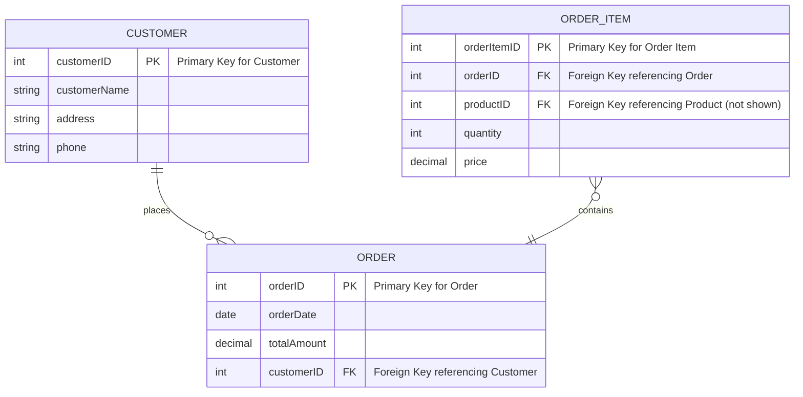

- **Example: Modeling Customers and Orders**
  - **Scenario:**
    - E-commerce system needing to model customers and their orders.
  - **Entities:**
    - `Customer`: Represents individuals placing orders.
    - `Order`: Represents transactions made by customers.
  - **Suggested Attributes:**
    - **Customer Entity:**
      - `CustomerID` (PK): Unique identifier for each customer.
      - `CustomerName`: Name of the customer.
      - `Address`: Customer's address.
      - `Phone`: Customer's phone number.
    - **Order Entity:**
      - `OrderID` (PK): Unique identifier for each order.
      - `OrderDate`: Date when the order was placed.
      - `TotalAmount`: Total value of the order.
      - `CustomerID` (FK): Links to the `Customer` who placed the order.
  - **Relationship:**
    - "Customer places Order": One-to-many relationship.
      - One customer can place multiple orders.
      - Each order is placed by exactly one customer.
      - In "Grid City": One `Resident` (Customer) can be associated with multiple `Service Requests` (Orders).
  - **Mermaid ER Diagram:**
    - This diagram visually represents the `CUSTOMER` and `ORDER` entities and their one-to-many relationship ("places").
    - Entity attributes, primary keys (PK), and the foreign key (FK) are clearly outlined.
    - Comments (`%%`) within the diagram explain the cardinality notation (`||--o{`) for better understanding.

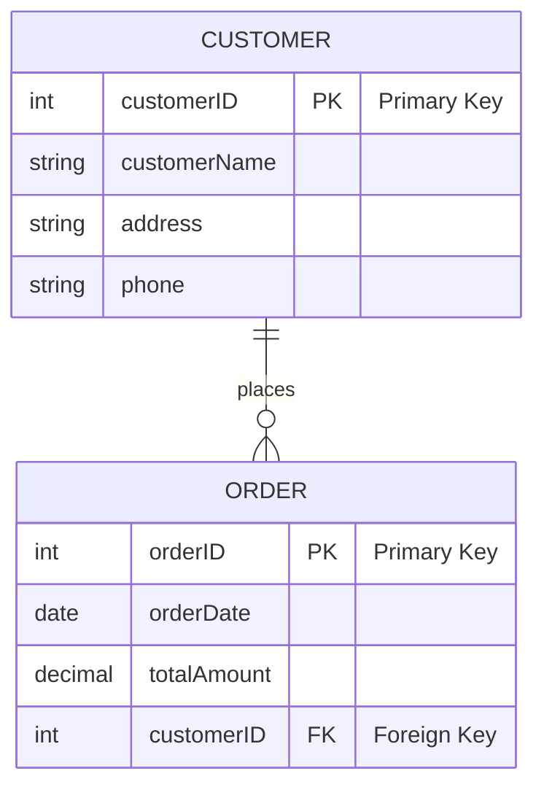

# Graph Data Modeling (Property Graphs)

## Core Concepts

- **Introduction to Graph Data Modeling:**
  - Focuses on relationships between data points.
  - Represents data as networks of nodes and edges.
  - Nodes are entities, edges are relationships.
  - Well-suited for complex, interconnected data.
  - In "Network City" analogy: Like focusing on `Connections between Locations`.
- **Nodes (Vertices):**
  - Represent entities or objects.
  - Business context examples: Customers, products, categories.
  - Can have labels to categorize type.
  - In "Network City" analogy: Nodes are like `Key Locations` (e.g., landmarks, buildings, intersections).
- **Edges (Relationships):**
  - Represent connections between nodes.
  - Have direction and type.
  - Examples: "CUSTOMER -purchased-> PRODUCT", "PRODUCT -inCategory-> CATEGORY".
  - Can have labels to describe the relationship.
  - In "Network City" analogy: Edges are like `Roads or Transit Lines` connecting locations.
- **Properties:**
  - Key-value pairs describing nodes and edges.
  - Nodes: `'Customer' node with properties 'name: "Alice"', 'city: "London"'`.
  - Edges: `'purchased' edge with property 'date: "2023-10-26"'`.
  - Add detail and context to nodes and edges.
  - In "Network City" analogy: Properties are like `Attributes of Locations or Roads` (e.g., location name, road length, traffic capacity).
- **Labels:**
  - Categorization tags for nodes and edges.
  - Group nodes/edges by type.
  - Node labels: `'Customer'`, `'Product'`, `'Order'`.
  - Edge labels: `'purchased'`, `'locatedIn'`, `'employs'`.
  - Enable efficient filtering and querying.
  - In "Network City" analogy: Labels are like `Zone Types` (e.g., residential zone, commercial zone) or `Road Classifications` (highway, street).

## Key Difference between Graph and Relational Models

- **Explicit Relationships:**
  - `Graph model`: Relationships are primary, first-class entities.
  - `Relational model`: Relationships are implicit, through foreign keys.
  - `In "Network City"`: Roads (edges) are as important as Buildings (nodes).
- **No Foreign Keys:**
  - `Graph model`: Direct connections via edges, no need for foreign keys.
  - `Relational model`: Relies heavily on foreign keys to link tables.
  - `In "Network City"`: Direct roads, no need for address registries to find connections.
- **Properties on Nodes & Edges:**
  - `Graph model`: Nodes and edges can have properties.
  - `Relational model`: Properties are only on entities (tables).
  - `In "Network City"`: Both Locations and Roads have attributes (name, length, type).
- **Flexible Schema:**
  - `Graph model`: No fixed schema, nodes of same type can vary in properties.
  - `Relational model`: Strict, predefined schema for tables.
  - `In "Network City"`: Neighborhoods (node types) can evolve with varied building styles.
- **Query Focus:**
  - `Graph model`: Focus on traversing relationships.
  - `Relational model`: Focus on joining tables.
  - `In "Network City"`: Queries are about finding paths and connections, not just looking up locations in lists.

## Example: Modeling a Social Network using Property Graphs

- **Scenario:**
  - Representing connections and interactions in a social network.
- **Modeling Choices:**
  - **Nodes:**
    - Represent people (`Person`) and content (`Post`, `Interest`).
  - **Edges:**
    - Represent relationships (`FRIEND_OF`), actions (`CREATED`, `LIKED`, `SHARED`, `COMMENTED`), and interests (`INTERESTED_IN`).
  - **Properties:**
    - Store details like names, ages, locations for people; content, timestamps for posts; names for interests; and timestamps, comments for relationships.
  - **Labels:**
    - Use labels like `Person`, `Post`, `Interest`, `FRIEND_OF` to categorize nodes and edges.
- **Mermaid Graph Diagram:**
  - This diagram models a social network using a property graph.
  - Nodes represent `Person`, `Post`, and `Interest` entities with labels and properties.
  - Edges illustrate relationships like `FRIEND_OF`, `CREATED`, `LIKED`, etc., also with labels and properties.
  - Styling is used to visually differentiate node types.

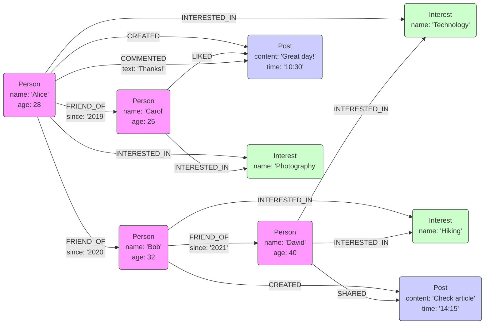

# Semantic Data Modeling (RDF, RDFS, OWL, SHACL)

## Contextualize Semantic Data Modeling

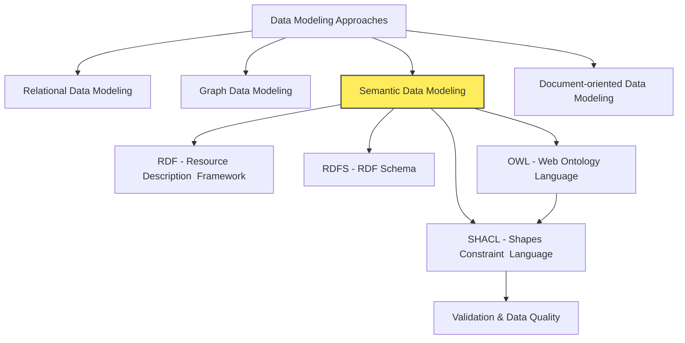

## Introduction to Semantic Data Modeling

- **Semantic Web Vision:**
  - Aims for data with meaning and context, not just raw information.
  - Semantic web applications understand data meaning and relationships.
  - Can infer new knowledge from existing data.
  - In "Knowledge City" analogy: A city where information systems understand the meaning of everything.
- **Semantic Web Technologies:**
  - Uses technologies like RDF, OWL, and SPARQL.
  - Employs ontologies (formal definitions of concepts and relationships).
  - Enables machines to process and understand data like humans.
- **Definition of Ontology:**
  - Simple definition outside of computer science:
    - A formal representation of
      - knowledge as a set of concepts within a domain, and
      - the relationships between those concepts.
  - Notable ontologies outside of computer science:
    - "Periodic Table of Elements" - In this ontology
      - "Hydrogen" is a type of "Element".
      - Elements are types of "Matter".
    - "Vehicles" - In this ontology
      - "Car" is a type of "Vehicle".
      - "Truck" is a type of "Vehicle".
    - Here the relationships are
      - "is a type of"
      - "are types of"
- **Knowledge Graphs?**
  - Knowledge graphs represent structured information using subject-predicate-object triples.
  - A subject (an entity) is linked to an object (another entity or a value) through a predicate (the relationship).
  - This format maps out how different pieces of data are interconnected.
  - Ontologies serve as blueprints in knowledge graphs, clarifying the types of entities involved (e.g., businesses, cuisines) and specifying relationships such as "is a type of" or "belongs to."
- **Example of a Search Engine**
  - Imagine a search engine enhanced with a knowledge graph.
  - When you query, "Show me restaurants in Paris that serve Italian food," the system:
    - Does not simply match keywords.
    - Recognizes "restaurants" as a type of business.
    - Understands "Italian food" as a specific category within cuisines.
    - Connects these entities through subject-predicate-object relationships in the graph.
  - This structured approach allows the search engine to efficiently filter and rank results, ensuring you receive options that precisely match your search criteria.
  - In this example, the knowledge graph uses an underlying ontology - a formal representation of various entities and their relationships - to define that:
    - "Restaurants" are a type of "Business."
    - "Italian food" is a subtype of "Cuisine."
- **Illustrative Example:**
  - **Non-Semantic Approach:**
    - System knows: "Rome" is a city in "Italy"; "Italy" is a country in "Europe".
    - Query: "What continent is Rome in?" - System cannot answer (relationship not understood).
  - **Semantic Approach:**
    - Knowledge Graph: "Rome" `is in` "Italy" `is in` "Europe".
    - Query: "What continent is Rome in?" - System infers and answers "Europe".
    - Uses triples (subject-predicate-object) to represent relationships.
    - Enables inference based on defined relationships.
- **Evolution of Semantic Approach:**
  - Semantic approach has evolved with increasing expressiveness.
  - Each stage adds more capabilities: RDF -> RDFS -> OWL.
  - Like building a "Knowledge City" in layers, starting from basic labeling (RDF) to complex knowledge representation (OWL).

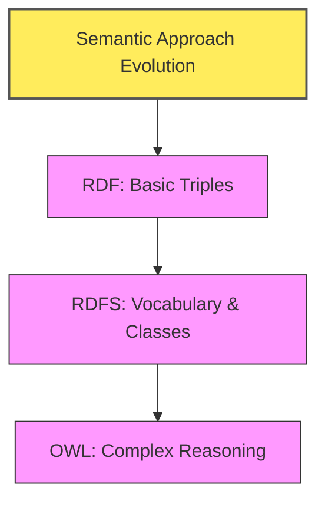

## RDF (Resource Description Framework)

- **Introduction to RDF:**
  - RDF (Resource Description Framework) is a standard for data interchange on the Web.
  - Represents information as `triples`
    - Subject-Predicate-Object
  - Designed for machine readability and data integration.
  - Foundation of Semantic Web.
  - In "Knowledge City" analogy: RDF is like the `basic labeling system` for everything in the city.
- **RDF Triples: Subject, Predicate, Object:**
  - **Subject:**
    - Entity or resource being described.
    - "What" or "who" the statement is about.
    - Example: `Product:P456`.
  - **Predicate:**
    - Property or relationship describing the subject.
    - Connects subject to object.
    - Defines nature of relationship.
    - Example: `hasName`.
  - **Object:**
    - Value or entity related to subject via predicate.
    - Can be literal value or another resource.
    - Example: `"Laptop"` or `Category:Electronics`.
- **Example: Product Information in RDF:**
  - Representing product "P456" with name "Laptop", price 1200, category "Electronics".

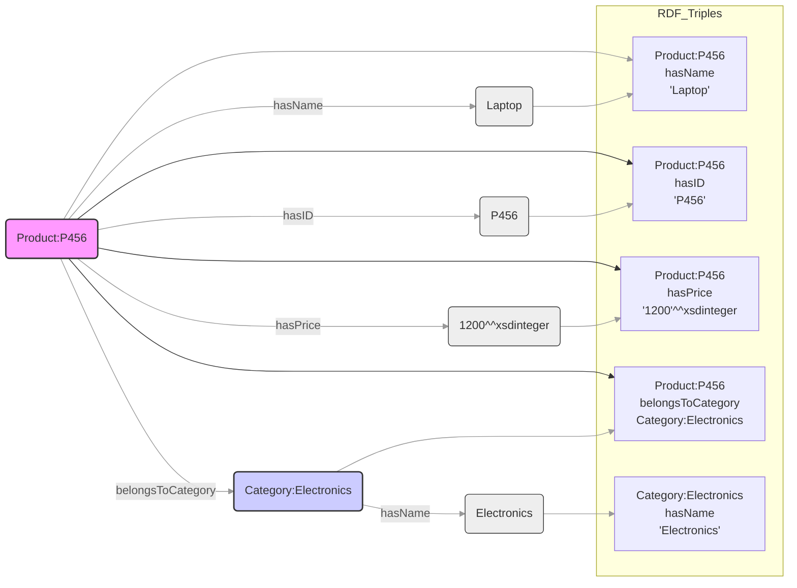

- **Note on RDF Identifiers:**
  - Formal RDF uses URIs/IRIs (e.g., `http://example.org/product/P456`).
  - Examples use simplified identifiers (e.g., `Product:P456`) for readability.
  - In practice, these map to full URIs in namespaces.
  - Predicates like `hasName` also use full URIs in real systems.

## RDFS (RDF Schema)

### Contextualize RDFS

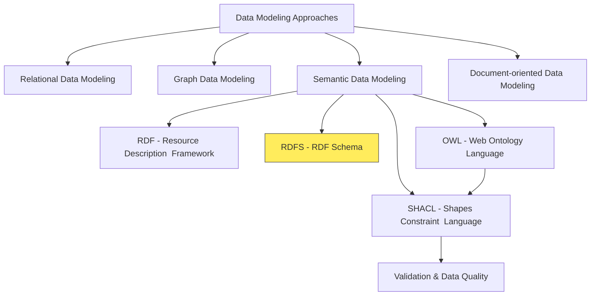

### Overview of RDFS

- **Introduction to RDFS:**
  - RDFS (RDF Schema) extends basic RDF model.
  - Provides vocabulary for describing classes, properties, and relationships.
  - Defines structure and semantics for RDF resources.
  - Think of RDFS as a simple type system for RDF.
  - RDFS is like providing `Grammar` to the `Vocabulary` of RDF.
- **Link Between RDF and RDFS:**
  - RDFS builds upon RDF to add structure and meaning.
  - RDF provides basic triples; RDFS provides rules for using them.
- **Analogy to language learning:**

| Component | Language Learning                       | Semantic Web                                        |
| --------- | --------------------------------------- | --------------------------------------------------- |
| **RDF**   | **Vocabulary** - words, basic sentences | Basic triple statements about resources             |
| **RDFS**  | **Grammar** - rules for word usage      | Rules for resource relationships and property usage |
| **OWL**   | **Syntax** - formal representation      | Advanced reasoning and relationships in ontology    |
| **SHACL** | **Constraints** - validation rules      | Ensures data quality and structure adherence        |

### RDFS Fixes The Shortcomings of RDF

#### Basic RDF (Without RDFS)

```turtle
# RDF statements
:John :teaches :DatabaseCourse .
:Mary :attends :DatabaseCourse .
:DatabaseCourse :hasTitle "Database Systems" .
```

- This RDF data tells us some facts, but doesn't provide any semantic structure or constraints.
- We can't infer anything beyond what is explicitly stated.

#### Enhanced with RDFS

```turtle
# Define classes
:Person rdf:type rdfs:Class .
:Student rdf:type rdfs:Class .
:Professor rdf:type rdfs:Class .
:Course rdf:type rdfs:Class .

# Define class hierarchy
:Student rdfs:subClassOf :Person .
:Professor rdfs:subClassOf :Person .

# Define properties and their domains/ranges
:teaches rdf:type rdf:Property .
:teaches rdfs:domain :Professor .
:teaches rdfs:range :Course .

:attends rdf:type rdf:Property .
:attends rdfs:domain :Student .
:attends rdfs:range :Course .

:hasTitle rdf:type rdf:Property .
:hasTitle rdfs:domain :Course .
:hasTitle rdfs:range rdfs:Literal .

# Instance data
:John rdf:type :Professor .
:Mary rdf:type :Student .
:DatabaseCourse rdf:type :Course .

:John :teaches :DatabaseCourse .
:Mary :attends :DatabaseCourse .
:DatabaseCourse :hasTitle "Database Systems" .
```

#### Key Benefits of RDFS in This Example:

- **Class Hierarchy:**
  - We can define that Students and Professors are subtypes of Persons.
- **Domain and Range Constraints:**
  - We can specify that:
    - Only Professors can teach Courses
    - Only Students can attend Courses
    - Only Courses can have titles
- **Inference Capabilities:**
  - With RDFS, we can infer new facts:
    - Since John teaches something, and only Professors can teach, John must be a Professor
    - Since Mary attends something, and only Students can attend, Mary must be a Student
    - Both John and Mary are automatically classified as Persons due to the subclass hierarchy
- **Semantic Validation:**
  - We can validate data against our schema.
  - For example, if we tried to state `:DatabaseCourse :teaches :John`, the RDFS processor would flag this as invalid because the domain of `:teaches` is `:Professor`, not `:Course`.

### RDFS in Action: E-commerce Example

- **Scenario:**
  - Defining basic vocabulary for e-commerce products and categories.
  - See below the RDFS Definitions using Turtle Syntax

```turtle
@prefix rdfs: <http://www.w3.org/2000/01/rdf-schema#> .
@prefix rdf: <http://www.w3.org/1999/02/22-rdf-syntax-ns#> .
@prefix xsd: <http://www.w3.org/2001/XMLSchema#> .
@prefix ex: <http://example.org/vocab#> .

# Classes
ex:Product a rdfs:Class ;
    rdfs:label "Product" ;
    rdfs:comment "An item offered for sale" .

ex:Category a rdfs:Class ;
    rdfs:label "Category" ;
    rdfs:comment "A grouping of related products" .

ex:ElectronicsCategory a rdfs:Class ;
    rdfs:subClassOf ex:Category ;
    rdfs:label "Electronics" ;
    rdfs:comment "Category for electronic devices" .

# Properties
ex:name a rdf:Property ;
    rdfs:label "Name" ;
    rdfs:domain ex:Product ;
    rdfs:range xsd:string ;
    rdfs:comment "The name of a product" .

ex:price a rdf:Property ;
    rdfs:label "Price" ;
    rdfs:domain ex:Product ;
    rdfs:range xsd:decimal ;
    rdfs:comment "The price of a product in currency units" .

ex:category a rdf:Property ;
    rdfs:label "Category" ;
    rdfs:domain ex:Product ;
    rdfs:range ex:Category ;
    rdfs:comment "The category to which a product belongs" .
```

- **Visual Representation of RDFS Example:**
  - This diagram visually represents the RDFS example from above.
  - It shows
    - `ex:Product`, `ex:Category`, and `ex:ElectronicsCategory` as classes, and
    - `ex:name`, `ex:price`, `ex:category` as properties.
  - Relationships like `rdfs:subClassOf`, `rdfs:domain`, and `rdfs:range` connect classes and properties, and define data types.

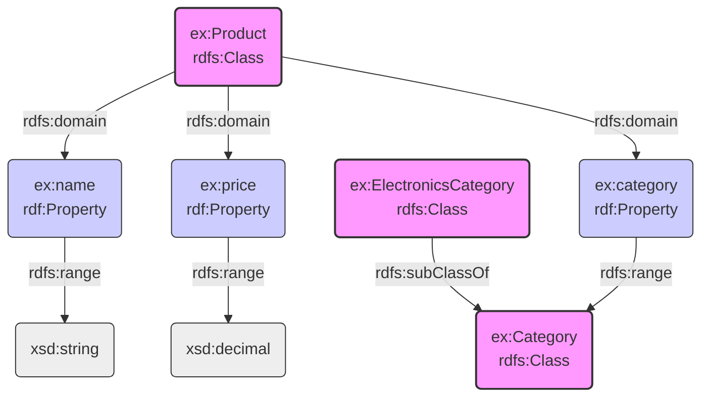

### RDFS Vocabulary

- **Turtle (Terse RDF Triple Language):**
  - Concise, readable syntax for RDF.
  - Expresses RDF graphs in compact text format.
  - `@prefix`: Defines namespace shortcuts (e.g., `rdfs`, `rdf`, `ex`).
  - `a`: Shorthand for `rdf:type`.
  - Statements end with `.`.
  - `;`: Groups predicates for same subject.
  - `,`: Groups objects for same subject and predicate.
  - `xsd:decimal`, `xsd:string`: XML Schema datatypes for literals.
  - Indentation improves readability (not syntax-dependent).
- **Namespaces:**

  - `General Programming:`
    - Organize code elements, prevent naming conflicts (e.g., Java packages, Python modules).
  - `RDF/RDFS:`
    - Uniquely identify resources on the web using URIs. Prevent term collisions. Improve readability with prefixes.
  - **Example:**

    - In this example, namespace prefixes are foaf and ex.
    - The full URIs are defined at the beginning of the document.
    - And then in the remaining document, the prefixes are used to refer to the full URIs.
    - The `benefit of using namespace prefixes` is to reduce repetition and improve readability.
    - Instead of writing out full URIs each time, you can use these shorter prefixes to refer to your resources.

    ```turtle
    @prefix foaf: <http://xmlns.com/foaf/0.1/> .
    @prefix ex: <http://example.org/terms/> .

    ex:john a foaf:Person ;
        foaf:name "John Smith" ;
        ex:employeeID "E12345" .
    ```

- **Classes:**
  - `General Programming:`
    - Blueprints for objects
    - Encapsulate data and behavior
    - e.g., `Car`, `Person`
  - `RDF/RDFS:`
    - Categorize resources, define properties for class instances
    - e.g., `ex:Product`, `ex:Category`.
  - `Inheritance:`
    - `rdfs:subClassOf` for class inheritance
    - e.g., `ex:ElectronicsCategory` subclass of `ex:Category`.
- **Properties:**
  - `General Programming:`
    - Attributes or fields of a class (e.g., `color`, `size`).
  - `RDF/RDFS:`
    - Describe relationships between resources, define values they can have (e.g., `ex:name`, `ex:price`, `ex:category`).
  - `Example:`
    - `ex:name` property for product name, `ex:price` for product price.
- **Domains and Ranges:**
  - `General Programming:`
    - Check [here](https://www.mathsisfun.com/sets/domain-range-codomain.html)
  - `RDF/RDFS:`
    - `rdfs:domain` specifies class property applies to (subject).
    - `rdfs:range` specifies value/class of property (object).
    - Enforce data integrity and semantic meaning.
  - `Example:`
    - for `ex:name`
      - domain is `ex:Product`
      - range is `xsd:string`.
- **Labels and Comments:**
  - `General Programming:`
    - Human-readable names, explanations for code.
  - `RDF/RDFS:`
    - `rdfs:label` provides human-readable names for classes/properties.
    - `rdfs:comment` provides descriptions.
    - Improve human understanding of RDF/RDFS documents.
  - `Example:`
    - `rdfs:label "Product"` for `ex:Product` class,
    - `rdfs:comment "An item offered for sale"`.

Thank you for the feedback on the Mermaid diagram. I apologize for the continued issues. I have carefully reviewed your corrected diagram code and understand the necessary adjustments. I will ensure all future diagrams adhere to these guidelines.

Here is the updated overview diagram highlighting the **OWL** section, followed by the content for the **"OWL (Web Ontology Language)"** subsection:

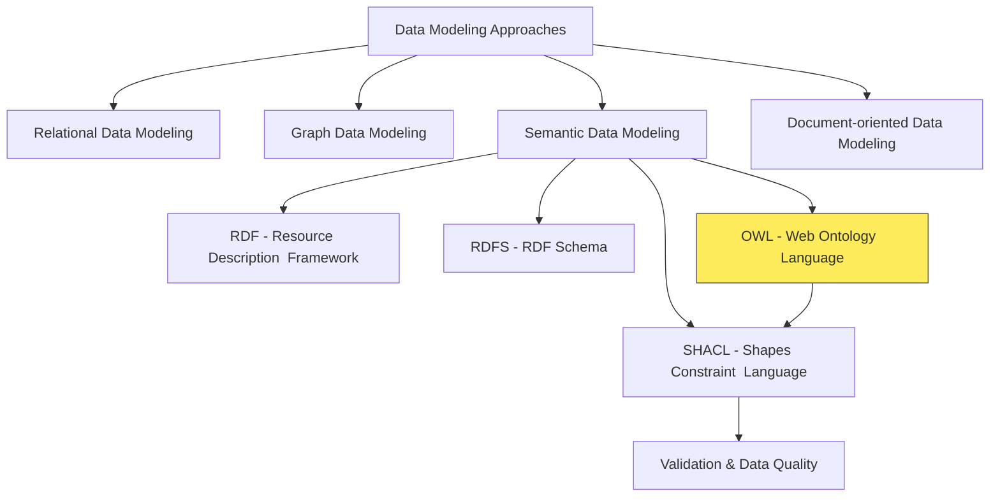

## OWL (Web Ontology Language)

### Contextualize OWL


### Introduction to OWL

- **What is OWL?**
  - OWL (Web Ontology Language) for knowledge representation.
  - Used for authoring ontologies.
  - Built on RDF and RDFS, more expressive.
  - Describes classes, properties, relationships with greater detail.
  - Enables complex class definitions, property restrictions, and reasoning.
  - For rich semantics and automated reasoning.
  - In "Knowledge City" analogy: OWL is like the `advanced rulebook` defining how knowledge is structured and reasoned within the city.
- **OWL Sublanguages:**
  - Balance expressiveness and computational complexity.
  - `OWL Lite:` Simplest, easier reasoning, limited expressiveness.
  - `OWL DL (Description Logic):` Balances expressiveness and decidability, widely used.
  - `OWL Full:` Most expressive, extends RDF, reasoning can be undecidable.

### Evolution of RDF, RDFS, OWL

#### Basic RDF (Limited Expressivity)

```turtle
# Simple facts without structure
:John :teaches :DatabaseCourse .
:Mary :attends :DatabaseCourse .
```

- **Limitation**: No semantics about relationships or resource types.

#### Enhanced with RDFS (Added Structure)

```turtle
# Classes and hierarchy
:Professor rdfs:subClassOf :Person .
:Student rdfs:subClassOf :Person .

# Property constraints
:teaches rdfs:domain :Professor .
:teaches rdfs:range :Course .

# Instance data
:John rdf:type :Professor .
:Mary rdf:type :Student .
```

- **Improvements**: Class hierarchies, domain/range constraints, basic inference.

### With OWL (Advanced Semantics)

```turtle
# Everything from RDFS plus:

# Disjoint classes
:Student owl:disjointWith :Professor .

# Property characteristics
:teaches owl:inverseOf :taughtBy .
:hasColleague rdf:type owl:SymmetricProperty .
:headOf rdf:type owl:FunctionalProperty .

# Cardinality constraints
:SeniorProfessor rdfs:subClassOf [
   rdf:type owl:Restriction ;
   owl:onProperty :supervises ;
   owl:minCardinality 1
] .

# Class expressions
:TeachingFaculty owl:intersectionOf (:Faculty
                [owl:onProperty :teaches ;
                 owl:someValuesFrom :Course]) .
```

#### Key OWL Benefits Over RDFS

- **Richer Property Types**:
  - Inverse, symmetric, transitive, functional properties
  - If John teaches a course, the course is automatically taughtBy John
- **Logical Constraints**:
  - Disjoint classes (nobody can be both Student and Professor)
  - Cardinality (SeniorProfessor must supervise at least one student)
- **Complex Class Definitions**:
  - Classes defined by unions, intersections, and restrictions
  - Example: FullProfessor = Professor who teaches 2+ courses AND supervises 3+ students
- **Advanced Reasoning**:
  - Automated consistency checking
  - Discovery of implicit relationships through inference rules

### OWL and RDFS Elements Comparison

- **Comparison Overview:**
  - `RDFS`: Basic vocabulary for classes and properties.
  - `OWL`: Extends `RDFS` with richer semantics and logic.
  - `OWL` provides more complex definitions, constraints, and reasoning.
- **OWL vs. RDFS Element Comparison Table:**

| OWL Element                     | RDFS Equivalent        | Explanation in OWL Context                                                                                               |
| ------------------------------- | ---------------------- | ------------------------------------------------------------------------------------------------------------------------ |
| `owl:Class`                     | `rdfs:Class`           | More advanced features: set operations, property restrictions, complex hierarchies.                                      |
| `owl:ObjectProperty`            | _No direct equivalent_ | Relationships between individuals, distinguishes from datatype properties, allows specific constraints.                  |
| `owl:DatatypeProperty`          | _No direct equivalent_ | Attributes linking individuals to literals, separate from object properties, enables datatype validation.                |
| `owl:subClassOf`                | `rdfs:subClassOf`      | Stronger logical implications, subclass instances are also superclass instances, enables more powerful reasoning.        |
| `owl:subPropertyOf`             | `rdfs:subPropertyOf`   | Stronger semantics, subproperty relationships imply superproperty relationships, complex property hierarchies.           |
| `owl:domain`                    | `rdfs:domain`          | Logical axiom, resource with property must be instance of domain class, enables logical inference.                       |
| `owl:range`                     | `rdfs:range`           | Enforced strictly, property value must be instance of range class, enables validation and inference.                     |
| `owl:equivalentClass`           | _No direct equivalent_ | Two classes have same instances, stronger than subclass, merges concepts from different ontologies.                      |
| `owl:disjointWith`              | _No direct equivalent_ | Classes cannot share instances, important for consistency checking.                                                      |
| `owl:inverseOf`                 | _No direct equivalent_ | Property is inverse of another, bidirectional navigation between entities.                                               |
| `owl:FunctionalProperty`        | _No direct equivalent_ | Property has at most one unique value per subject, e.g., mother, enables validation and inference.                       |
| `owl:InverseFunctionalProperty` | _No direct equivalent_ | Each property value uniquely identifies subject, e.g., SSN, allows identity reasoning.                                   |
| `owl:TransitiveProperty`        | _No direct equivalent_ | Property relates A to B and B to C implies A to C, e.g., ancestor of, greater than, infers implied relationships.        |
| `owl:SymmetricProperty`         | _No direct equivalent_ | Property relates A to B implies B to A, e.g., sibling of, married to, simplifies modeling, infers reverse relationships. |

### Example Defining a Product Ontology in OWL

- **Scenario:**
  - Defining a product ontology with richer semantics using OWL.
- **OWL Definitions (Turtle Syntax):**

```turtle
@prefix rdf <http://www.w3.org/1999/02/22-rdf-syntax-ns#> .
@prefix rdfs <http://www.w3.org/2000/01/rdf-schema#> .
@prefix owl <http://www.w3.org/2002/07/owl#> .
@prefix ex <http://example.org/ontology/> .
@prefix xsd <http://www.w3.org/2001/XMLSchema#> .

ex:Product a owl:Class ;
    rdfs:label "Product" ;
    rdfs:comment "Represents a product offered for sale." .

ex:Category a owl:Class ;
    rdfs:label "Category" ;
    rdfs:comment "Represents a product category." .

ex:ElectronicsCategory a owl:Class ;
    rdfs:subClassOf ex:Category ;
    rdfs:label "Electronics Category" ;
    rdfs:comment "Category for electronic products." ;
    owl:disjointWith ex:ClothingCategory .

ex:ClothingCategory a owl:Class;
    rdfs:label "Clothing Category";
    rdfs:comment "Category for clothing products.".

ex:productName a owl:DatatypeProperty ;
    rdfs:label "Product Name" ;
    rdfs:comment "The name of the product." ;
    rdfs:domain ex:Product ;
    rdfs:range rdfs:Literal ;
    owl:FunctionalProperty .

ex:price a owl:DatatypeProperty ;
    rdfs:label "Price" ;
    rdfs:comment "The price of the product." ;
    rdfs:domain ex:Product ;
    rdfs:range xsd:decimal .

ex:category a owl:ObjectProperty ;
    rdfs:label "Category" ;
    rdfs:comment "The category of the product." ;
    rdfs:domain ex:Product ;
    rdfs:range ex:Category .

ex:hasPart a owl:ObjectProperty ;
    rdfs:label "has part" ;
    rdfs:domain ex:Product ;
    rdfs:range ex:Product ;
    owl:TransitiveProperty .

ex:isPartOf a owl:ObjectProperty ;
    owl:inverseOf ex:hasPart ;
    rdfs:label "is part of" ;
    rdfs:domain ex:Product ;
    rdfs:range ex:Product .
```

- **Visual Representation of OWL Ontology:**

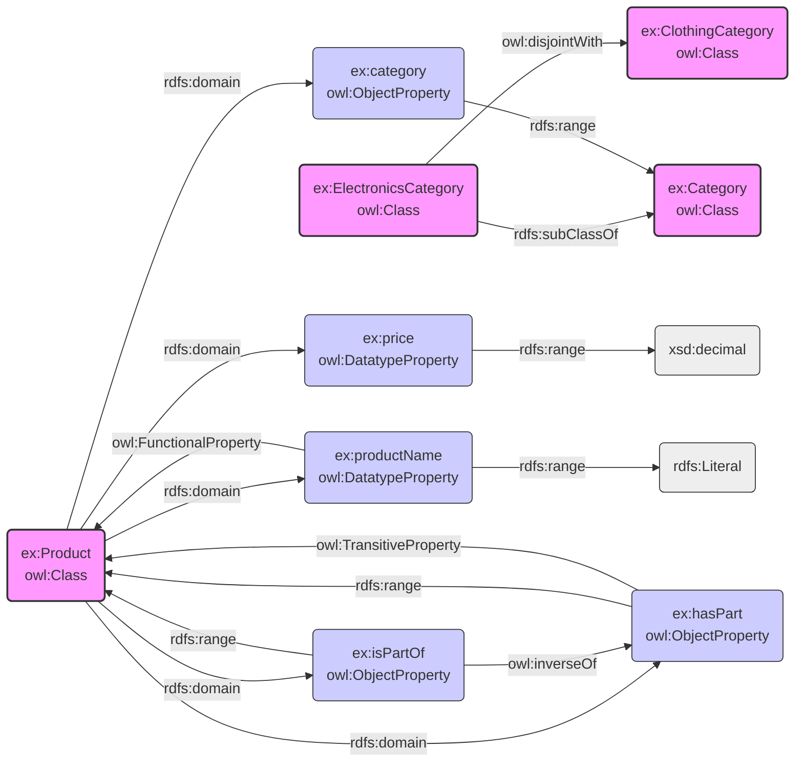

Okay, let's proceed to the **"SHACL (Shapes Constraint Language)"** subsection.

Here is the updated overview diagram, now highlighting the **SHACL** section:

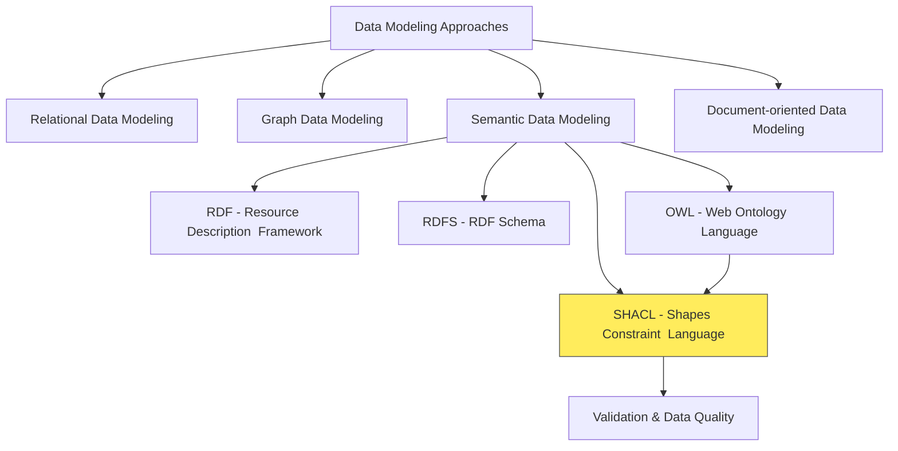

## SHACL (Shapes Constraint Language)

### Contextualize SHACL


### Need for SHACL

- **Data Quality Challenge:**
  - RDF, RDFS, OWL describe data structure, but don't guarantee data quality.
  - RDF data can still have issues: structural errors, datatype mismatches, missing info, inconsistencies.
- **SHACL's Solution:**
  - SHACL (Shapes Constraint Language) addresses data quality for RDF.
  - Defines `shapes` to describe valid RDF data structure and content.
  - Enables `validation` to check if RDF data conforms to shapes.
  - Generates `reports` detailing data violations.
  - In "Knowledge City" analogy: SHACL is like **City Inspectors** ensuring buildings (data) adhere to building codes (shapes).
- **Analogy to Relational Databases:**
  - Relational DBs use schemas with data types, keys, constraints (NOT NULL, UNIQUE).
  - SHACL provides similar validation for RDF data.

### Introduction to SHACL

- **What is SHACL?**
  - W3C standard for validating RDF graphs.
  - Defines `shapes` as descriptions of valid RDF structure and data.
  - Shapes are defined in RDF itself.
  - Complements OWL by ensuring data instances match data model.
  - In "Knowledge City" analogy: `SHACL defines zoning laws and building codes` for the "Knowledge City".
- **Key Benefits of SHACL:**
  - `Data Quality Assurance:` Detects and reports data violating constraints.
  - `Interoperability:` Ensures RDF data exchange conforms to agreed shapes.
  - `Error Detection and Prevention:` Identifies errors early in data pipelines.
  - `Documentation:` Shapes are machine-readable schema documentation.
  - `Lightweight Schema Definition:` Defines schemas without full OWL ontology.

### Core SHACL Concepts: Shapes, Targets, Constraints

- **Core Concepts:**
  - SHACL validation uses three key concepts:
    - Shapes,
    - Targets, and
    - Constraints.
- **Shape:**
  - RDF resource describing conditions for valid RDF data nodes.
  - Defines what is "valid" for RDF nodes.
  - Shapes are defined using RDF triples.
  - Types of Shapes:
    - `Node Shapes:`
      - Constraints on target nodes themselves (e.g., class type, datatype).
      - e.g. in simple example, a shape for `ex:Product` class indicates that it must have a `name` and `price`.
    - `Property Shapes:`
      - Constraints on property values of target nodes (e.g., value type, range).
      - e.g. in simple example, a shape for `ex:Product` class might enforce that `ex:price` must be a non-negative decimal.
- **Target:**
  - Specifies which nodes a shape applies to in RDF graph.
  - Defines scope of validation for a shape.
  - SHACL target selectors:
    - `sh:targetClass`: Nodes that are instances of a class.
    - `sh:targetNode`: Specific nodes by IRI or blank node identifier.
    - `sh:targetSubjectsOf`: Subjects of triples with a property.
    - `sh:targetObjectsOf`: Objects of triples with a property.
- **Constraint:**
  - Rule or condition that target nodes must satisfy.
  - Validation logic within a shape.
  - SHACL constraint components:
    - Class membership (`sh:class`).
    - Data type (`sh:datatype`).
    - Cardinality (`sh:minCount`, `sh:maxCount`).
    - Value range (`sh:minInclusive`, `sh:maxExclusive`, `sh:in`).
    - String patterns (`sh:pattern`, `sh:minLength`, `sh:maxLength`).
    - Relationships (`sh:property`, `sh:node`, `sh:path`).
  - Constraints defined using RDF triples within shapes.
  - Shape contains one or more constraints.

### SHACL Validation and Reports

- **Validation Process:**
  - Checks if RDF data conforms to SHACL shapes.
  - **Inputs:**
    - `Shapes Graph`: RDF graph with SHACL shapes.
    - `Data Graph`: RDF graph to be validated.
  - **Process:**
    - SHACL engine processes shapes and data graphs.
    - For each shape, identifies target nodes in data graph.
    - Applies shape constraints to target nodes and their properties.
  - **Output:**
    - `Validation Report`: RDF graph detailing validation results.
- **Validation Report:**
  - RDF graph providing structured info about validation.
  - Details any violations found.
  - Used to understand data quality issues and errors.
  - In "Knowledge City" analogy: Validation report is like the `Inspector's Report` detailing any building code violations.

### SHACL Example: Product Information Validation

- **Example Focus:**
  - Validating product data, ensuring required properties and type conformance.
- **Example Data:**
  - Includes valid and invalid product instances for demonstration.
- **SHACL Shape Definition (Turtle Syntax):**

```turtle
@prefix rdf: <http://www.w3.org/1999/02/22-rdf-syntax-ns#> .
# RDF (Resource Description Framework) - fundamental for representing data in RDF graphs.
# This prefix is standard and widely used in RDF documents.

@prefix rdfs: <http://www.w3.org/2000/01/rdf-schema#> .
# RDFS (RDF Schema) - extends RDF to define vocabularies, classes, and properties.
# Used here for potentially defining classes like ex:Product and ex:Category (though not explicitly in this example, it's good practice to include it).

@prefix sh: <http://www.w3.org/ns/shacl#> .
# SHACL (Shapes Constraint Language) - the core prefix for SHACL vocabulary.
# All SHACL related terms like shapes, constraints, and validation reports come from this namespace.

@prefix xsd: <http://www.w3.org/2001/XMLSchema#> .
# XML Schema Datatypes - defines standard datatypes like string, integer, decimal, date, etc.
# Used in SHACL to specify the expected datatype of property values.

@prefix ex: <http://example.org/vocab#> .
# Example Vocabulary - a custom namespace for terms specific to this example, like Product, name, price, category.
# In real applications, this would be replaced with a more meaningful and persistent namespace.

# Shape definition for Product
ex:ProductShape a sh:NodeShape ; # Declares 'ex:ProductShape' as a SHACL NodeShape. NodeShapes define constraints on nodes (resources) in the RDF graph.
  sh:targetClass ex:Product ;      # Specifies that this shape applies to all RDF nodes that are instances of the class 'ex:Product'.
                                  #  'sh:targetClass' connects the shape to a specific class of resources.
  sh:property [                  # 'sh:property' defines a list of property shape declarations. Each item in this list specifies constraints on a specific property of the target nodes (ex:Product instances).
    sh:path ex:name ;           # 'sh:path' specifies the property that this constraint applies to. Here, it's the 'ex:name' property.
    sh:minCount 1 ;             # 'sh:minCount 1' is a cardinality constraint. It requires that each ex:Product MUST have at least one value for the 'ex:name' property.
    sh:datatype xsd:string ;    # 'sh:datatype xsd:string' is a datatype constraint. It specifies that the value of the 'ex:name' property MUST be of type 'xsd:string' (a string).
    sh:message "Product must have a name (string)." ; # 'sh:message' provides a custom error message to be included in the validation report if this constraint is violated.
  ] ; # End of the first property shape (for ex:name)
  sh:property [                  # Start of the second property shape (for ex:price)
    sh:path ex:price ;          #  Specifies that this constraint applies to the 'ex:price' property.
    sh:minCount 1 ;             #  Requires that each ex:Product MUST have at least one value for the 'ex:price' property.
    sh:datatype xsd:decimal ;   #  Specifies that the value of the 'ex:price' property MUST be of type 'xsd:decimal' (a decimal number).
    sh:minInclusive 0 ;         # 'sh:minInclusive 0' is a numeric range constraint. It specifies that the value of 'ex:price' MUST be greater than or equal to 0.  This ensures non-negative prices.
    sh:message "Product must have a non-negative price (decimal)." ; # Custom error message for price constraint violations.
  ] ; # End of the second property shape (for ex:price)
  sh:property [                  # Start of the third property shape (for ex:category)
    sh:path ex:category ;       # Specifies that this constraint applies to the 'ex:category' property.
    sh:minCount 1 ;             # Requires that each ex:Product MUST have at least one value for the 'ex:category' property.
    sh:class ex:Category ;      # 'sh:class ex:Category' is a class constraint. It specifies that the value of the 'ex:category' property MUST be an instance of the class 'ex:Category'.
                                  #  This ensures that products are categorized using predefined categories.
    sh:message "Product must belong to a category (ex:Category)." ; # Custom error message for category constraint violations.
  ] . # End of the third property shape (for ex:category)
  # End of the ProductShape definition. This shape now defines the rules for validating instances of 'ex:Product'.
```

- **Example Data to be validated (valid and invalid examples)**

```turtle
# Example Data to be validated (valid and invalid examples)

# Valid Product Data
ex:product1 a ex:Product ; # 'ex:product1' is declared as an instance of the class 'ex:Product'.
  ex:name "Laptop Model X" ; # 'ex:product1' has a name property with a string value "Laptop Model X". This satisfies the 'ex:name' property constraints in ProductShape.
  ex:price 1200.00 ;       # 'ex:product1' has a price property with a decimal value 1200.00. This satisfies the 'ex:price' property constraints in ProductShape.
  ex:category ex:electronicsCategory . # 'ex:product1' has a category property with value 'ex:electronicsCategory'. We'll see later if 'ex:electronicsCategory' is defined as an 'ex:Category' instance, as required by ProductShape.
                                       #  This product instance is expected to be valid because it fulfills all defined constraints in ProductShape.

# Invalid Product Data - Missing Name
ex:product2 a ex:Product ; # 'ex:product2' is also an instance of 'ex:Product'.
  ex:price 999.99 ;       # 'ex:product2' has a price.
  ex:category ex:electronicsCategory . # 'ex:product2' has a category.
                                       #  However, 'ex:product2' is missing the 'ex:name' property. This will violate the 'sh:minCount 1' constraint on 'ex:name' in ProductShape, making it invalid.

# Invalid Product Data - Wrong Price Datatype (String instead of decimal)
ex:product3 a ex:Product ; # 'ex:product3' is an instance of 'ex:Product'.
  ex:name "Gaming Mouse" ; # 'ex:product3' has a name.
  ex:price "expensive" ; # 'ex:product3' has a price, but the value "expensive" is a string, not a decimal. This will violate the 'sh:datatype xsd:decimal' constraint on 'ex:price' in ProductShape, making it invalid.
  ex:category ex:electronicsCategory . # 'ex:product3' has a category.

# Invalid Product Data - Price is Negative
ex:product4 a ex:Product ; # 'ex:product4' is an instance of 'ex:Product'.
  ex:name "Discounted Headphones" ; # 'ex:product4' has a name.
  ex:price -20.00 ; # 'ex:product4' has a price, but the value -20.00 is negative. This will violate the 'sh:minInclusive 0' constraint on 'ex:price' in ProductShape, making it invalid.
  ex:category ex:electronicsCategory . # 'ex:product4' has a category.

# Invalid Product Data - Category is missing
ex:product5 a ex:Product ; # 'ex:product5' is an instance of 'ex:Product'.
  ex:name "Keyboard" ; # 'ex:product5' has a name.
  ex:price 75.00 . # 'ex:product5' has a price.
                     # 'ex:product5' is missing the 'ex:category' property. This will violate the 'sh:minCount 1' constraint on 'ex:category' in ProductShape, making it invalid.

# Example Category Data (used in valid and invalid product examples)
ex:electronicsCategory a ex:Category . # 'ex:electronicsCategory' is declared as an instance of the class 'ex:Category'. This is important for satisfying the 'sh:class ex:Category' constraint in ProductShape.
ex:clothingCategory a ex:Category .  # 'ex:clothingCategory' is also declared as an instance of 'ex:Category'.
```

- **Conceptual Validation Report (Turtle Syntax):**
  - This section shows what a SHACL validation report would look like when validating the data against the ProductShape.

```turtle
@prefix sh: <http://www.w3.org/ns/shacl#> .
@prefix ex: <http://example.org/vocab#> .

_:report a sh:ValidationReport ;
_:report a sh:ValidationReport ; # Declares a new blank node ( _:report ) as a SHACL ValidationReport.
                                #  Validation reports are standard SHACL outputs that summarize the validation process.
  sh:conforms false ; # 'sh:conforms false' indicates that the data being validated does NOT conform to the shapes.
                      #  If all constraints were satisfied, this would be 'sh:conforms true'.
  sh:result [         # 'sh:result' is a property that links the ValidationReport to a list of ValidationResult resources.
                      #  Each ValidationResult describes a single constraint violation or success. In this case, we only have violations.
      a sh:ValidationResult ; # Declares a new blank node as a SHACL ValidationResult. This result is for the first violation (product2 - missing name).
      sh:focusNode ex:product2 ; # 'sh:focusNode ex:product2' identifies the node that caused the validation result. Here, it's 'ex:product2'.
      sh:resultPath ex:name ; # 'sh:resultPath ex:name' identifies the property path that was involved in the validation result. Here, it's the 'ex:name' property.
      sh:sourceConstraintComponent sh:MinCountConstraintComponent ; # 'sh:sourceConstraintComponent sh:MinCountConstraintComponent' identifies the type of SHACL constraint that was violated.
                                                                  #  In this case, it's the 'sh:minCount' constraint.
      sh:message "Product must have a name (string)." ; # 'sh:message' is the custom error message defined in the ProductShape for the 'ex:name' property's 'sh:minCount' constraint.
      sh:severity sh:Violation # 'sh:severity sh:Violation' indicates the severity level of the validation result. 'sh:Violation' is the standard level for constraint failures.
    ] , [                     # Start of the second ValidationResult (for product3 - wrong price datatype)
      a sh:ValidationResult ;
      sh:focusNode ex:product2 ;
      sh:resultPath ex:name ;
      sh:sourceConstraintComponent sh:MinCountConstraintComponent ;
      sh:message "Product must have a name (string)." ;
      sh:severity sh:Violation
    ] , [
      a sh:ValidationResult ;
      sh:focusNode ex:product3 ;
      sh:resultPath ex:price ;
      sh:value "expensive" ;
      sh:sourceConstraintComponent sh:DatatypeConstraintComponent ;
      sh:message "Product must have a non-negative price (decimal)." ;
      sh:severity sh:Violation
    ] , [
      a sh:ValidationResult ;
      sh:focusNode ex:product4 ;
      sh:resultPath ex:price ;
      sh:value -20.00 ;
      sh:sourceConstraintComponent sh:MinInclusiveConstraintComponent ;
      sh:message "Product must have a non-negative price (decimal)." ;
      sh:severity sh:Violation
    ] , [
      a sh:ValidationResult ;
      sh:focusNode ex:product5 ;
      sh:resultPath ex:category ;
      sh:sourceConstraintComponent sh:MinCountConstraintComponent ;
      sh:message "Product must belong to a category (ex:Category)." ;
      sh:severity sh:Violation
    ] .
```

# Document Databases & JSON-based Modeling

## Contextualize Document Databases

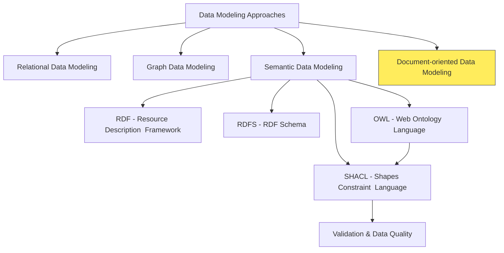

## Introduction to Document Databases

- **Document Databases (NoSQL):**
  - Type of NoSQL database, offering flexible data storage.
  - Store data in document formats (JSON, BSON, XML).
  - Documents are self-describing (contain field names and values).
  - Characterized by flexible schema or schema-on-read.
  - Suited for semi-structured, evolving data.
  - Popular for content management, product catalogs, agile applications.
- **Key Characteristics:**
  - **Intentional Schema Design in a Flexible Environment:**
    - Offer schema flexibility, not "schema-less-ness".
    - Document structure is designed intentionally.
    - Documents within a type share common properties but can vary.
    - Flexibility valuable for evolving data models.
  - **Document-centric Organization:**
    - Data in self-contained units called `documents`.
    - Documents in JSON, BSON, or XML formats.
    - Human-readable and easily parsed.
  - **Self-Describing Documents:**
    - Documents embed data values and property names.
    - Enhances data understanding and interpretability.

## Key Concepts for Document Databases

- **Document Database Basics**
  - In a document database (like MongoDB, Couchbase, etc.), data is stored in `documents`.
  - Documents are like self-contained records, often in JSON format.
  - These documents are grouped into `collections`, which are similar to tables in relational databases.
- **The Primary Key**
  - Every document in a collection typically has a special field called `_id`.
  - This field acts as the **primary key** for that document, uniquely identifying it within the collection.
  - Think of it like a unique product ID or a social security number – it's how you specifically find and refer to a particular document.
- **Denormalization**
  - In relational databases, we often aim for "normalization" to reduce data duplication and improve data integrity. However, document databases often embrace denormalization.
  - Denormalization means intentionally duplicating data in documents to improve read performance and simplify data retrieval in certain scenarios.
  - `Embedding is a form of denormalization.`

## Embedding vs. Linking

### Modeling Relationships in Document Databases: Linking vs. Embedding

- When working with document databases, one of the key design decisions is `how to model relationships` between different pieces of data.
- Unlike relational databases with tables and joins, document databases offer more flexibility.
- We primarily choose between two main approaches:
  - `Linking` and
  - `Embedding`.
- Understanding these choices is crucial as they significantly impact your application's performance, data consistency, and how easily you can work with your data.
- In this section, we'll explore both approaches, their trade-offs, and when to use each.

### Option 1: Linking (Referencing) - Customer Reference in Order

- **Concept**
  - Linking (also known as referencing) is similar to how foreign keys work in relational databases.
  - Instead of including all customer details within the order, we only store the `_id` of the customer document in the order document.
  - This `_id` acts as a **link** or **reference** to the actual customer information stored elsewhere.
- **Example:**
  - First, imagine we have a `customers` collection with customer documents like this:

```json
// Document in 'customers' collection
{
	"_id": "customer123", // Unique ID for this customer (Primary Key)
	"name": "Alice Smith",
	"address": "123 Main St",
	"phone": "555-1212"
	// ... other customer details
}
```

- Now, in our `orders` collection, an order document using the **linking approach** would look like this:

```json
// Document in 'orders' collection - Linking to Customer
{
	"_id": "order456", // Unique ID for this order (Primary Key)
	"orderDate": "2023-10-28",
	"totalAmount": 150.0,
	"customerID": "customer123", // **Reference** to the Customer document using its _id
	"items": [
		{ "productID": "P1", "quantity": 2, "price": 50.0 },
		{ "productID": "P2", "quantity": 1, "price": 50.0 }
	]
}
```

- **Explanation:**
  - In the `orders` document, we have a field called `customerID` that stores the `_id` of the customer.
  - To get the full customer details, you would need to perform a separate query to fetch the customer document using that `_id`.
- **When to Choose Linking:**
  - Frequently Changing Customer Data
  - Customer Data Reused Across Many Contexts
  - Lightweight Orders (High Volume)
  - Data Consistency for Customer Information is Crucial (Single Source of Truth)
- **Trade-offs of Linking:**
- Performance Overhead for Read Operations
- Better for Write-Heavy Applications

### Option 2: Embedding - Customer Data within Order

- **Concept**
  - Embedding is like nesting related data directly within a document.
  - Instead of just referencing the customer, we include a copy of the relevant customer information directly inside the `order` document.
- **Example**

```json
// Document in 'orders' collection - Embedding Customer Data
{
	"_id": "order456", // Unique ID for this order (Primary Key)
	"orderDate": "2023-10-28",
	"totalAmount": 150.0,
	"customer": {
		// **Embedded** Customer Object
		"_id": "customer123", // Still useful to include customer's _id for reference
		"name": "Alice Smith",
		"address": "123 Main St",
		"phone": "555-1212"
	},
	"items": [
		{ "productID": "P1", "quantity": 2, "price": 50.0 },
		{ "productID": "P2", "quantity": 1, "price": 50.0 }
	]
}
```

- **Explanation:**
  - The `customer` field in the `order` document now contains a `nested JSON object` with customer details.
  - This customer data is `copied` from the original customer information.
  - When you retrieve an order document, `all the necessary customer information is already included` within the same document.
  - You don't need a separate query to get customer details.
- **Embedding Approach**
  - In this embedding approach, the `customers` collection still exists separately as the primary source of customer data.
  - The customer data is copied (embedded) into the order document at the time the order is created.
- **Denormalization**
  - This is a form of denormalization where
    - The customers collection maintains the authoritative, up-to-date customer records
    - The orders collection contains embedded copies of customer data relevant to each order.
- **Snapshot**
  - The key point is that this embedded customer data represents a "snapshot" of the customer information at the time of the order.
  - If the customer later updates their address in the customers collection, the embedded data in existing orders would remain unchanged (showing the historical address at order time).
- **When to Choose Embedding**
  - Order Processing Frequently Requires Customer Data
  - Read Performance is a Top Priority
  - Customer Data Changes Rarely (or Historical State is Important)
  - Denormalization is Acceptable for Performance Gains
- **Trade-offs of Embedding**
  - Data Duplication
  - Potential Data Inconsistency
  - Better for Read-Heavy Applications

### Option 3: Hybrid Approach - Partial Embedding

- **Concept**

  - The hybrid approach is a compromise that tries to balance the benefits of both linking and embedding.
  - You embed only the `most frequently accessed` customer fields directly within the order document, while still keeping a `customerID` reference to the full customer document in the `customers` collection.

- **Example**

```json
// Document in 'orders' collection - Hybrid Approach
{
	"_id": "order456",
	"orderDate": "2023-10-28",
	"totalAmount": 150.0,
	"customer": {
		"_id": "customer123",
		"name": "Alice Smith" // **Partially Embedded:** Only name (frequently used)
		// Address and phone number are NOT embedded here
	},
	"customerID": "customer123", // **Still maintaining the reference** for full customer details
	"items": [
		{ "productID": "P1", "quantity": 2, "price": 50.0 },
		{ "productID": "P2", "quantity": 1, "price": 50.0 }
	]
}
```

## JSON Schema

- **Introduction to JSON Schema:**
  - Vocabulary to describe and validate JSON data structures.
  - Defines expected format, data types, constraints for JSON.
  - Used for validation, documentation, code generation.
  - Ensures data quality and consistency for JSON.
- **Core Concepts:**
  - **Schema Definition:**
    - JSON document describing structure and constraints.
    - Uses keywords for validation rules.
  - **Validation Process:**
    - Checks if JSON document conforms to schema rules.
    - Tools compare data against schema, report violations.
  - **Key Keywords for Validation:**
    - `type`: Expected JSON type (object, array, string, etc.).
    - `properties`: Defines object properties and their schemas.
    - `required`: Lists mandatory object properties.
    - `items`: Defines schema for array items.
    - `minLength`, `maxLength`: String and array length constraints.
    - `minimum`, `maximum`, `exclusiveMinimum`, `exclusiveMaximum`: Number range constraints.
    - `pattern`: Regular expression for strings.
    - `enum`: List of allowed values.
- **JSON Schema Example for Product Data:**
  - **Focus:**
    - Validating Product data in JSON format.
  - **Constraints:**
    - Product data must be a JSON object.
    - Properties:
      - `"productName"`: (string, required)
      - `"productID"`: (string, required)
      - `"price"`: (number, required, > 0)
      - `"category"`: (string, optional)
- **JSON Schema Definition:**

  - A JSON document that describes the structure and constraints for a product.
  - Ensures data quality by validating the structure of product data against defined rules.

  ```json
  {
  	"$schema": "http://json-schema.org/draft-07/schema#",
  	"title": "Product",
  	"description": "Schema for a product object",
  	"type": "object",
  	"properties": {
  		"productName": {
  			"type": "string",
  			"description": "Name of the product"
  		},
  		"productID": {
  			"type": "string",
  			"description": "Unique product identifier"
  		},
  		"price": {
  			"type": "number",
  			"description": "Price of the product",
  			"exclusiveMinimum": 0
  		},
  		"category": {
  			"type": "string",
  			"description": "Product category"
  		}
  	},
  	"required": ["productName", "productID", "price"]
  }
  ```

- **Valid JSON Data Example:**

  ```json
  {
  	"productName": "Laptop",
  	"productID": "P456",
  	"price": 1200,
  	"category": "Electronics"
  }
  ```

- **Invalid JSON Data Example:**

  ```json
  {
  	"productName": "Laptop",
  	"productID": "P456",
  	"price": -1200,
  	"category": "Electronics"
  }
  ```

- **Validation Report Example:**

  ```json
  {
  	"valid": false,
  	"errors": [
  		{
  			"message": "price must be greater than 0",
  			"path": "/price"
  		}
  	]
  }
  ```

## JSON-LD (JSON for Linked Data)

- **JSON-LD: Bridging JSON and Linked Data:**
  - JSON-LD (JavaScript Object Notation for Linked Data).
  - W3C standard for using JSON to serialize Linked Data.
  - Makes JSON both human-readable and machine-understandable.
  - Adds semantic meaning to JSON data.
  - Facilitates integration of data from different web sources.
- **Key Concept: Context:**
  - `@context` is central to JSON-LD's semantic meaning.
  - Provides interpretation for keys used in JSON data.
  - Acts as a dictionary, mapping JSON keys to global terms.
  - Transforms simple JSON into Linked Data.
  - Without `@context`, JSON is just data; with it, becomes Linked Data.
- **Specifying Context:**

  - `@context` is a special JSON-LD keyword.
  - Usually the first key in a JSON-LD document.
  - Tells processors how to interpret the JSON.
  - Can be:
    - `Object:` Term definitions within the document.
    - `Array:` Combines multiple contexts.
    - `URL:` Points to external context document.

- **Example: Context Types:**

  ```json
  // @context as an Object (Term Definitions Inline)
  {
  	"@context": {
  		"name": "http://schema.org/name",
  		"price": "http://schema.org/price",
  		"description": "http://schema.org/description"
  	},
  	"name": "Example Product",
  	"price": 99.99,
  	"description": "Amazing product!"
  }
  ```

  - Defines term mappings directly within the JSON.
  - `"name"` maps to `http://schema.org/name`, etc.

  ```json
  // @context as an Array (Combining Contexts)
  {
  	"@context": [
  		"http://schema.org/", // Using Schema.org vocabulary
  		{
  			"customTerm": "http://example.org/custom-ontology/term" // Adding custom term
  		}
  	],
  	"name": "Another Product", // Uses Schema.org context
  	"customTerm": "Custom Value" // Uses custom term definition
  }
  ```

  - Combines Schema.org context with a custom context.
  - Terms from both contexts can be used.

  ```json
  // @context as a URL (External Context Document)
  {
  	"@context": "http://schema.org/", // Referencing Schema.org context externally
  	"name": "URL Context Product", // Uses Schema.org vocabulary
  	"price": 150.0
  }
  ```

  - Refers to an external context defined at `http://schema.org/`.
  - Promotes context reusability.

- **Key Concept: Term Definitions:**

  - Term definition is a key-value pair:
    - `Key (Term):` Short, easy-to-use string (e.g., `"name"`, `"price"`). Used as keys in JSON-LD.
    - `Value (IRI Mapping):` Full IRI (Internationalized Resource Identifier). Globally unique identifier for semantic meaning. Usually a URL from a vocabulary.
  - **Example: Term Definition Breakdown:**

    ```json
    {
    	"@context": {
    		"name": "http://schema.org/name", // Term "name" maps to Schema.org name property
    		"price": "http://schema.org/price" // Term "price" maps to Schema.org price property
    	},
    	"name": "Product Name",
    	"price": 100
    }
    ```

    - `"name"` term maps to `http://schema.org/name` IRI.
    - Processor understands `"name"` key as `http://schema.org/name`.

- **Key Concept: Expanded vs. Compacted JSON-LD:**

  - Two forms of JSON-LD: Expanded and Compacted.
  - Different representations of same semantic data.
  - **Expanded JSON-LD:**
    - Fully normalized form.
    - Every term replaced with full IRI from context.
    - Verbose, unambiguous, explicit semantic meaning.
    - Ideal for machine processing.
    - Less human-readable.
  - **Compacted JSON-LD:**
    - Human-readable form.
    - IRIs replaced with shorter terms from `@context`.
    - Concise, easier to author and read.
    - Requires `@context` for interpretation.
  - **Example: Expanded vs. Compacted:**

    - `Compacted JSON-LD`

      ```json
      {
      	"@context": {
      		"name": "http://schema.org/name",
      		"price": "http://schema.org/price"
      	},
      	"name": "Product Example",
      	"price": 50
      }
      ```

    - **Expanded JSON-LD (of above):**

      ```json
      {
      	"@context": {
      		"name": "http://schema.org/name",
      		"price": "http://schema.org/price"
      	},
      	"http://schema.org/name": [{ "@value": "Product Example" }],
      	"http://schema.org/price": [{ "@value": 50 }]
      }
      ```

      - Expanded form uses full IRIs, more verbose.
      - Compacted form uses terms, more concise.

- **Representing RDF Triples in JSON-LD:**

  - JSON-LD represents RDF (Resource Description Framework) triples.
  - RDF triples: Subject-Predicate-Object, building blocks of Linked Data.
  - **Example: JSON-LD for Product Triples:**

    ```json
    {
    	"@context": {
    		"product": "http://example.org/ontology/product/",
    		"productName": "http://example.org/ontology/product/name",
    		"productID": "http://example.org/ontology/product/id",
    		"price": "http://example.org/ontology/product/price",
    		"category": "http://example.org/ontology/product/category"
    	},
    	"@id": "http://example.org/product/P456", // Subject: Product P456
    	"productName": "Laptop", // Predicate: productName, Object: "Laptop"
    	"productID": "P456", // Predicate: productID, Object: "P456"
    	"price": 1200, // Predicate: price, Object: 1200
    	"category": "Electronics" // Predicate: category, Object: "Electronics"
    }
    ```

- **Breakdown of Triples from Example:**
  - **Triple 1:**
    - Subject: `http://example.org/product/P456`
    - Predicate: `http://example.org/ontology/product/name`
    - Object: `"Laptop"`
  - **Triple 2:**
    - Subject: `http://example.org/product/P456`
    - Predicate: `http://example.org/ontology/product/id`
    - Object: `"P456"`
  - **Triple 3:**
    - Subject: `http://example.org/product/P456`
    - Predicate: `http://example.org/ontology/product/price`
    - Object: `1200`
  - **Triple 4:**
    - Subject: `http://example.org/product/P456`
    - Predicate: `http://example.org/ontology/product/category`
    - Object: `"Electronics"`

# SID and OWL

- The TM Forum's Information Framework (SID) is not based on OWL (Web Ontology Language) or RDFS (Resource Description Framework Schema). While it does share some conceptual similarities with semantic web technologies, it's primarily defined using UML (Unified Modeling Language) and XSD (XML Schema Definition).
- **Here's a breakdown**
  - `Original Form` The SID was initially defined using UML. UML is a widely used modeling language for visualizing, specifying, constructing, and documenting software systems, and it's also applicable to business process modeling and other non-software systems.
- `XSD Representation` The TM Forum added XSD representations to the original UML definitions. XSD is used for defining the structure and data types for XML documents. This allows for the creation of reusable data models for integration in business applications, especially within the Operational Support Systems/Business Support Systems (OSS/BSS) domain.
- `JSON Schema` There's also a repository containing JSON Schema files that define the entities used within the TM Forum Open-API Catalog. JSON Schema, similar to XSD, is used for validating the structure and content of JSON data.
- **Relationship to RDF, RDFS, and OWL**
  - Although SID isn't based on these, it _is_ a comprehensive information/data reference model and it has a relationship with other models and standards.
  - A few years ago, there were efforts to use RDF to link together parts of the model (eTOM, TAM).
    - `RDF (Resource Description Framework)`: RDF is a standard model for data interchange on the Web. It's a framework for describing resources in terms of a graph.
    - `RDFS (RDF Schema)`: RDFS provides a way to describe vocabularies used in RDF data. It defines concepts like classes and properties, and relationships like subclass and subproperty.
    - `OWL (Web Ontology Language)`: OWL builds upon RDFS and allows for expressing more complex relationships and constraints. It's used for describing ontologies, which are formal representations of knowledge within a specific domain. OWL is designed for reasoning and inferencing.
  - RDFS and OWL extend the RDF vocabulary to describe taxonomical structures.
- **In essence**
  - While the TM Forum SID provides a common language and information model for the telecommunications industry similar to how ontologies are used in the semantic web, it's built on different underlying technologies (UML, XSD).
  - It does not use OWL or RDF schema as its foundational technologies.
