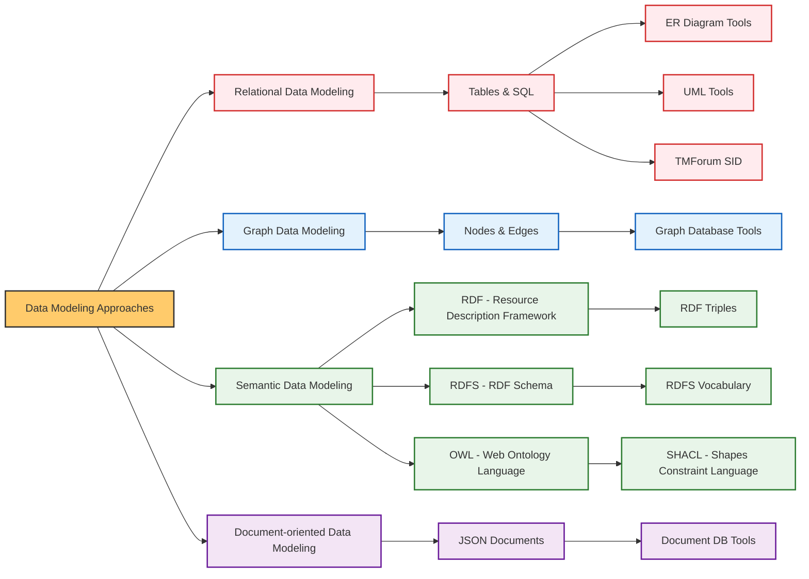
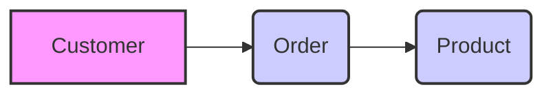
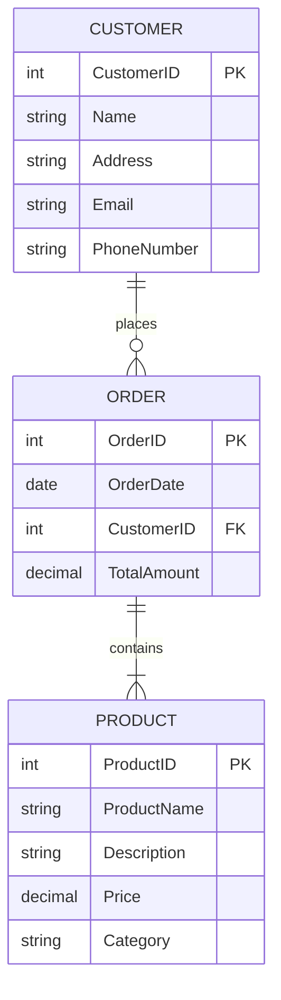
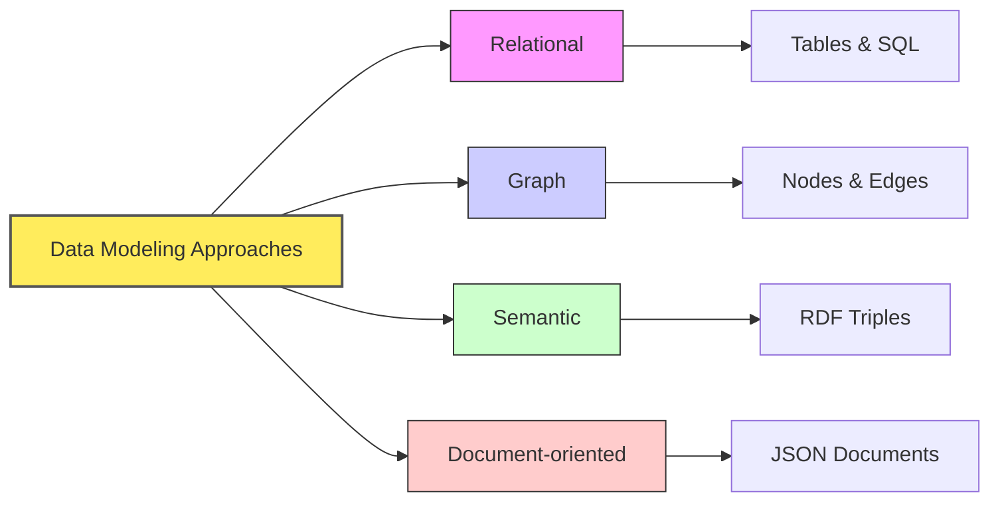

# On this page

- This page serves as an introduction to the topic of `data modeling`.
- To check out other related topics, click on the links from the diagram below.
- To continue with the current topic, scroll down to read more.



# Introduction to Data Modeling

## What is Data Modeling?

- **What is it?**
  - Process of creating visual, conceptual data representations
  - Shows data and its relationships in a system
  - Like a blueprint for data structures
- **Purpose:**
  - Organizes and structures data
  - Enables efficient storage, retrieval, and management
  - Acts as communication tool
  - Ensures shared understanding of data

## Why Data Modeling Matters

- **Improved Communication:**
  - Bridges gap between business and technical teams
  - Common language for data understanding
  - Like city plans for coordinating city departments
- **Enhanced Data Organization:**
  - Structures data logically for efficiency
  - Improves data storage and retrieval
  - Like city zoning for better functionality
- **Data Quality and Consistency:**
  - Enforces data integrity through rules and relationships
  - Leads to consistent, reliable data
  - Like building codes for construction standards
- **Foundation for System Development:**
  - Blueprint for databases and applications
  - Guides creation of effective data systems
  - Like city plans for urban development
- **Business Understanding:**
  - Helps understand data assets and flow
  - Supports better decision-making and planning
  - Like urban analysis for city planners

## Abstraction levels in Data Modeling

### Conceptual, Logical, and Physical Data Models

- Data Modeling is often done at three levels of abstraction:
  - **Conceptual:** High-level view of data, focusing on business needs.
  - **Logical:** More detailed, technology-independent view of data.
  - **Physical:** Database-specific view, considering implementation details.
- Each level serves a different purpose and audience:
  - **Conceptual:** Business stakeholders, project managers, data analysts.
  - **Logical:** Data modelers, database designers, developers.
  - **Physical:** Database administrators (DBAs), database developers.
- **Analogy:** Building a house
  - **Conceptual:** "I need a house with bedrooms, a kitchen, and a living room."
  - **Logical:** "The bedrooms will have beds and closets, the kitchen will have a stove and sink."
  - **Physical:** "The walls will be brick, the roof will be tile, the doors will be oak."

### Examples of Conceptual, Logical, and Physical Data Models

#### Understanding Conceptual Model through an Example

- Let's say we want to build a database for an online store.
- At the conceptual level, we might identify these key "things":
  - `Customer:` We need to store information about our customers.
  - `Product:` We sell products, so we need to track products.
  - `Order:` Customers place orders, so we need to manage orders.
- And the main relationships might be:
  - Customers _place_ Orders.
  - Orders _contain_ Products.
- This abstraction level
  - This is a very high-level view, focusing on the main entities and their relationships.
  - We are not concerned about how we will store this data or what technology we will use.
  - We are just trying to understand the business needs.
- Diagram below
  - We use simple boxes to represent our "things" (Customer, Order, Product).
  - Arrows show the relationships (Customers place Orders, Orders contain Products).
  - This is very basic – no details about what _kind_ of information we store about customers or products.



#### Understanding Logical Model through an Example

- **Think of it as:**
  - A more detailed floor plan of your house.
  - Now you're thinking about _what's in each room_ - like bedrooms need beds, kitchens need stoves.
  - You're also thinking about _how rooms are connected_ more specifically.
- **Example: Online Store (Logical)**
  - Now we add more detail to our online store example.
  - We still don't care about _how_ this will be implemented in a database.



- **Focus:**
  - We are now thinking about _what information_ we need to store about each entity.
  - For example, for a customer, we might want to store their name, address, email, and phone number.
  - For a product, we might want to store its name, description, price, and category.
  - We also define the relationships more clearly:
    - A customer can place many orders (one-to-many).
    - An order can contain many products (many-to-many).

#### Understanding Physical Model through an Example

- **Think of it as:**
  - The blueprints for your house, ready for construction.
- **Focus:**
  - Database-specific.
  - Now we consider the _specific database system_ we'll use (like MySQL, PostgreSQL, SQL Server, etc.).
  - We choose _data types_ that are supported by that database.
  - We think about _performance_ – indexes, storage, etc.
  - We create actual _tables_, _columns_, and define _constraints_ (rules) to ensure data quality.
- **Example of SQL DDL (for PostgreSQL):**

```sql
CREATE TABLE customers (
    customer_id INT PRIMARY KEY,
    name VARCHAR(255),
    address TEXT,
    email VARCHAR(100) UNIQUE,
    phone_number VARCHAR(20)
);

CREATE TABLE products (
    product_id INT PRIMARY KEY,
    product_name VARCHAR(255),
    description TEXT,
    price DECIMAL(10, 2),
    category VARCHAR(50)
);

CREATE TABLE orders (
    order_id INT PRIMARY KEY,
    order_date DATE,
    customer_id INT REFERENCES customers(customer_id),
    total_amount DECIMAL(12, 2)
);
```

## Overview of Main Data Modeling Approaches

- **Relational Data Modeling:**
  - `Structure:` Tables with rows and columns
  - `Relationships:` Defined through keys
  - `Analogy:` "Grid City" - well-defined blocks, streets
  - `Best for:` Structured data, transactions
- **Graph Data Modeling:**
  - `Structure:` Nodes (entities) and edges (relationships)
  - `Focus:` Connections and networks
  - `Analogy:` "Network City" - connections are key
  - `Best for:` Relationship-rich data, network analysis
- **Semantic Data Modeling:**
  - `Structure:` Triples (subject-predicate-object)
  - `Focus:` Meaning, context, knowledge
  - `Analogy:` "Knowledge City" - semantically labeled elements
  - `Best for:` Knowledge graphs, data integration, reasoning
- **Document-oriented Data Modeling:**
  - `Structure:` Flexible JSON documents
  - `Focus:` Flexibility, schema-on-read
  - `Analogy:` "Flexible Neighborhoods" - varied layouts within guidelines
  - `Best for:` Content management, catalogs, evolving data


