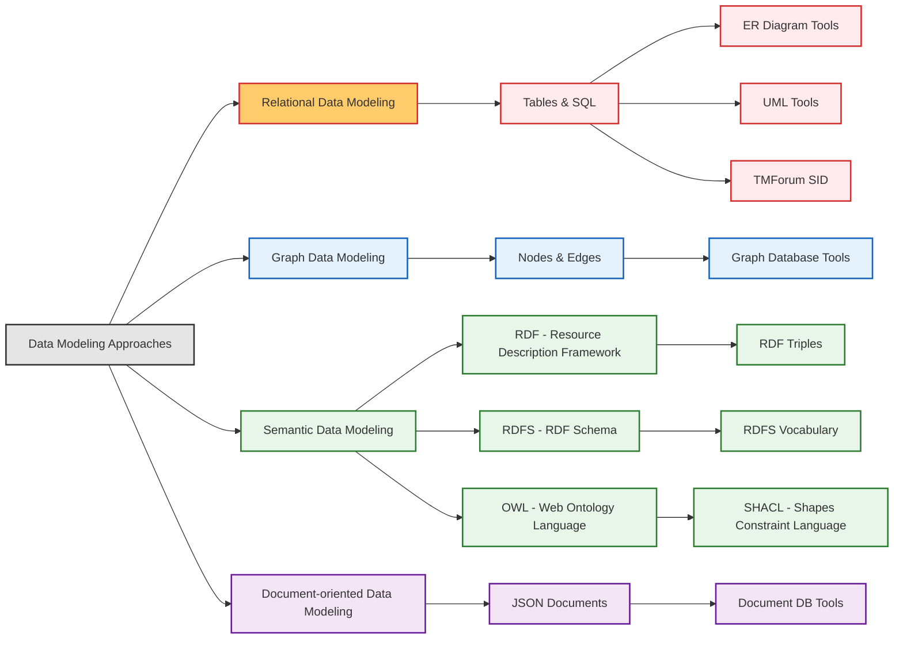
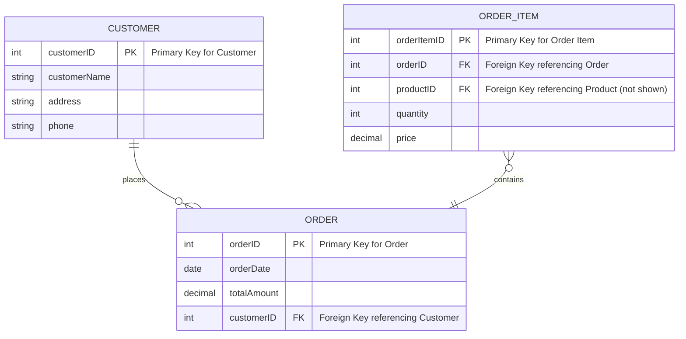
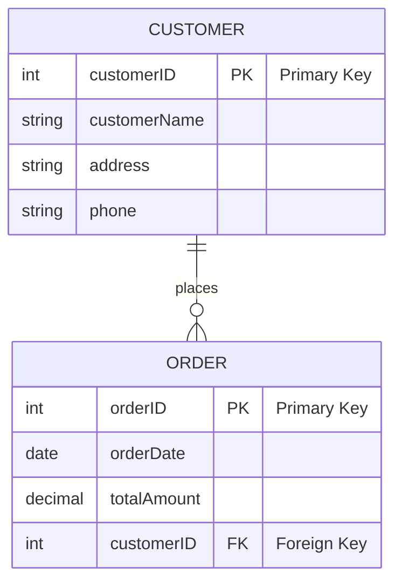

# On this page

- **This page serves as an introduction to the topic of RELATIONAL DATA MODELING.**
- To check out other related topics, click on the links from the diagram below.
- To continue with the current topic, scroll down to read more.

# Relational Data Modeling

## Core Concepts of Relational Data Modeling

- **Introduction to Relational Model**
  - Widely used data modeling approach.
  - Organizes data into relations (tables).
  - Tables have columns (attributes) and rows (records).
  - Relationships established via shared attributes and keys.
- **Entities, Attributes, and Relationships**
  - `Entity:`
    - Real-world object or concept (e.g., Customer, Product).
    - Represented as a table.
    - In "Grid City" analogy: Entities are like _Buildings_.
  - `Attribute:`
    - Property or characteristic of an entity (e.g., Customer Name, Product Price).
    - Represented as a column in a table.
    - In "Grid City" analogy: Attributes are like _Building Features_ (e.g., number of floors, address).
  - `Relationship:`
    - Association between entities (e.g., Customer places Order).
    - Represented using foreign keys.
    - In "Grid City" analogy: Relationships are like _Roads connecting Buildings_.
- **Primary Keys and Foreign Keys**
  - `Primary Key (PK):`
    - Unique identifier for each row in a table.
    - Ensures each record is uniquely identifiable.
    - Example: `CustomerID` in `Customer` table.
    - Like a unique _Building Address_ in "Grid City".
  - `Foreign Key (FK):`
    - Attribute in one table referencing the primary key of another.
    - Establishes links between tables.
    - Example: `OrderID` table with `CustomerID` as FK referencing `Customer` table.
    - Like using a _Building Address_ in a separate registry to link back to the original building in "Grid City".

## Entity-Relationship (ER) Diagrams

- **What are ER Diagrams?**
  - Visual tools for relational data models.
  - Use symbols for entities, attributes, and relationships.
  - Simplify communication about database structure.
  - Like simplified _City Maps_ showing key buildings and roads.
- **ER Diagram Components:**
  - `Entities:`
    - Represented as rectangles.
    - In diagrams: `CUSTOMER`, `ORDER`.
    - Like _Building symbols_ on a city map.
  - **Attributes:**
    - Represented as ovals connected to entities.
    - In diagrams: `CustomerName`, `OrderID`.
    - Like _Labels for Building features_ on a map.
  - **Relationships:**
    - Represented as diamonds connecting entities.
    - In diagrams: `places`, `contains`.
    - Like _Road symbols_ connecting buildings on a map.
  - **Lines:**
    - Indicate relationship type (one-to-one, one-to-many, many-to-many).
    - Indicate _Road types_ (one-way, two-way, highways) on a map in terms of connection capacity.
    - Indicate _Connection capacity_ among the nodes.
- **Mermaid Syntax for ER Diagrams:**
  - Simple text-based syntax for creating diagrams.
  - Defines entities and relationships with specific notations.
  - Allows for clear, code-driven diagram creation.
  - Like a _City Map Key_ explaining symbols used.
- **Example ER Diagram Syntax Overview**
  - This diagram illustrates a basic ER diagram syntax using Mermaid.
  - It shows entities like `CUSTOMER`, `ORDER`, and `ORDER_ITEM` with their attributes, primary keys (PK), and foreign keys (FK).
  - Relationship cardinalities are also visualized (e.g., `||--o{` for one-to-many).
  - Comments (`%%`) explain key elements of the syntax.

- **Example: Modeling Customers and Orders**
  - **Scenario:**
    - E-commerce system needing to model customers and their orders.
  - **Entities:**
    - `Customer`: Represents individuals placing orders.
    - `Order`: Represents transactions made by customers.
  - **Suggested Attributes:**
    - **Customer Entity:**
      - `CustomerID` (PK): Unique identifier for each customer.
      - `CustomerName`: Name of the customer.
      - `Address`: Customer's address.
      - `Phone`: Customer's phone number.
    - **Order Entity:**
      - `OrderID` (PK): Unique identifier for each order.
      - `OrderDate`: Date when the order was placed.
      - `TotalAmount`: Total value of the order.
      - `CustomerID` (FK): Links to the `Customer` who placed the order.
  - **Relationship:**
    - "Customer places Order": One-to-many relationship.
      - One customer can place multiple orders.
      - Each order is placed by exactly one customer.
      - In "Grid City": One `Resident` (Customer) can be associated with multiple `Service Requests` (Orders).
  - **Mermaid ER Diagram:**
    - This diagram visually represents the `CUSTOMER` and `ORDER` entities and their one-to-many relationship ("places").
    - Entity attributes, primary keys (PK), and the foreign key (FK) are clearly outlined.
    - Comments (`%%`) within the diagram explain the cardinality notation (`||--o{`) for better understanding.

