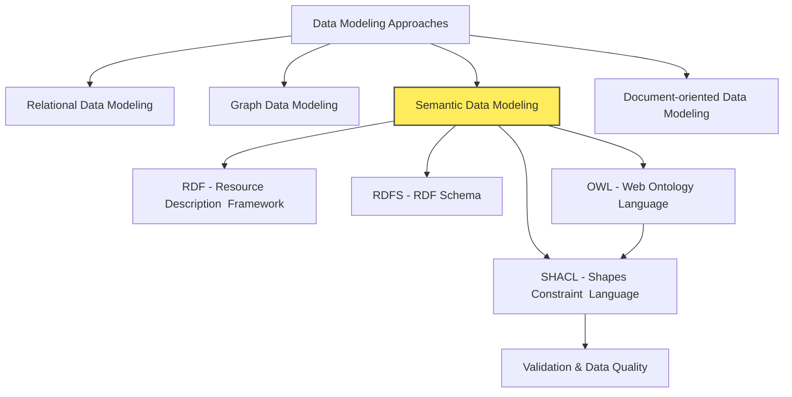
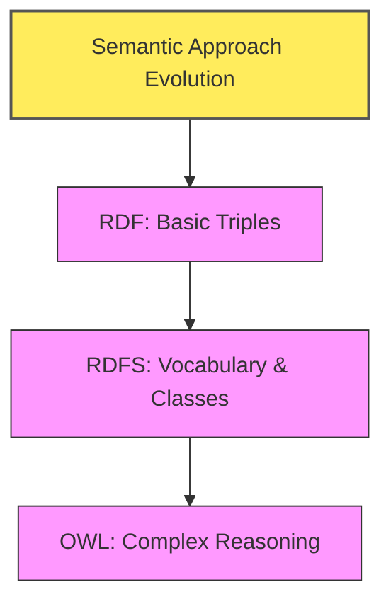

# Semantic Data Modeling (RDF, RDFS, OWL, SHACL)

## Contextualize Semantic Data Modeling

## Introduction to Semantic Data Modeling

- **Semantic Web Vision**
  - Aims for data with meaning and context, not just raw information.
  - Semantic web applications understand data meaning and relationships.
  - Can infer new knowledge from existing data.
  - In "Knowledge City" analogy: A city where information systems understand the meaning of everything.
- **Semantic Web Technologies**
  - Uses technologies like RDF, OWL, and SPARQL.
  - Employs ontologies (formal definitions of concepts and relationships).
  - Enables machines to process and understand data like humans.
- **Definition of Ontology**
  - Simple definition outside of computer science:
    - A formal representation of
      - knowledge as a set of concepts within a domain, and
      - the relationships between those concepts.
  - Notable ontologies outside of computer science:
    - "Periodic Table of Elements" - In this ontology
      - "Hydrogen" is a type of "Element".
      - Elements are types of "Matter".
    - "Vehicles" - In this ontology
      - "Car" is a type of "Vehicle".
      - "Truck" is a type of "Vehicle".
    - Here the relationships are
      - "is a type of"
      - "are types of"
- **Knowledge Graphs**
  - Knowledge graphs represent structured information using subject-predicate-object triples.
  - A subject (an entity) is linked to an object (another entity or a value) through a predicate (the relationship).
  - This format maps out how different pieces of data are interconnected.
  - Ontologies serve as blueprints in knowledge graphs, clarifying the types of entities involved (e.g., businesses, cuisines) and specifying relationships such as "is a type of" or "belongs to."
- **Example of a Search Engine**
  - Imagine a search engine enhanced with a knowledge graph.
  - When you query, "Show me restaurants in Paris that serve Italian food," the system:
    - Does not simply match keywords.
    - Recognizes "restaurants" as a type of business.
    - Understands "Italian food" as a specific category within cuisines.
    - Connects these entities through subject-predicate-object relationships in the graph.
  - This structured approach allows the search engine to efficiently filter and rank results, ensuring you receive options that precisely match your search criteria.
  - In this example, the knowledge graph uses an underlying ontology - a formal representation of various entities and their relationships - to define that:
    - "Restaurants" are a type of "Business."
    - "Italian food" is a subtype of "Cuisine."
- **Illustrative Example**
  - **Non-Semantic Approach**
    - System knows: "Rome" is a city in "Italy"; "Italy" is a country in "Europe".
    - Query: "What continent is Rome in?" - System cannot answer (relationship not understood).
  - **Semantic Approach**
    - Knowledge Graph: "Rome" `is in` "Italy" `is in` "Europe".
    - Query: "What continent is Rome in?" - System infers and answers "Europe".
    - Uses triples (subject-predicate-object) to represent relationships.
    - Enables inference based on defined relationships.
- **Evolution of Semantic Approach**
  - Semantic approach has evolved with increasing expressiveness.
  - Each stage adds more capabilities: RDF -> RDFS -> OWL.
  - Like building a "Knowledge City" in layers, starting from basic labeling (RDF) to complex knowledge representation (OWL).

