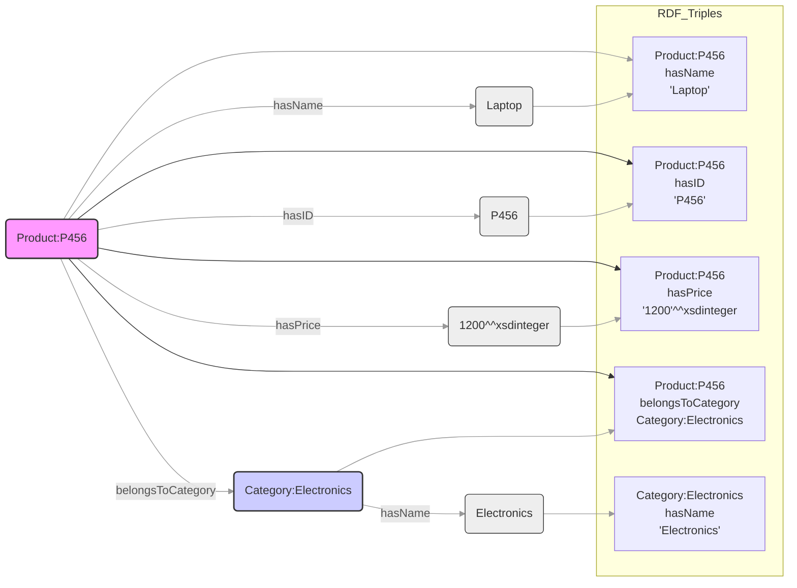

# RDF (Resource Description Framework)

- **Introduction to RDF:**
  - RDF (Resource Description Framework) is a standard for data interchange on the Web.
  - Represents information as `triples`
    - Subject-Predicate-Object
  - Designed for machine readability and data integration.
  - Foundation of Semantic Web.
  - In "Knowledge City" analogy: RDF is like the `basic labeling system` for everything in the city.
- **RDF Triples: Subject, Predicate, Object:**
  - **Subject:**
    - Entity or resource being described.
    - "What" or "who" the statement is about.
    - Example: `Product:P456`.
  - **Predicate:**
    - Property or relationship describing the subject.
    - Connects subject to object.
    - Defines nature of relationship.
    - Example: `hasName`.
  - **Object:**
    - Value or entity related to subject via predicate.
    - Can be literal value or another resource.
    - Example: `"Laptop"` or `Category:Electronics`.
- **Example: Product Information in RDF:**
  - Representing product "P456" with name "Laptop", price 1200, category "Electronics".

- **Note on RDF Identifiers:**
  - Formal RDF uses URIs/IRIs (e.g., `http://example.org/product/P456`).
  - Examples use simplified identifiers (e.g., `Product:P456`) for readability.
  - In practice, these map to full URIs in namespaces.
  - Predicates like `hasName` also use full URIs in real systems.
