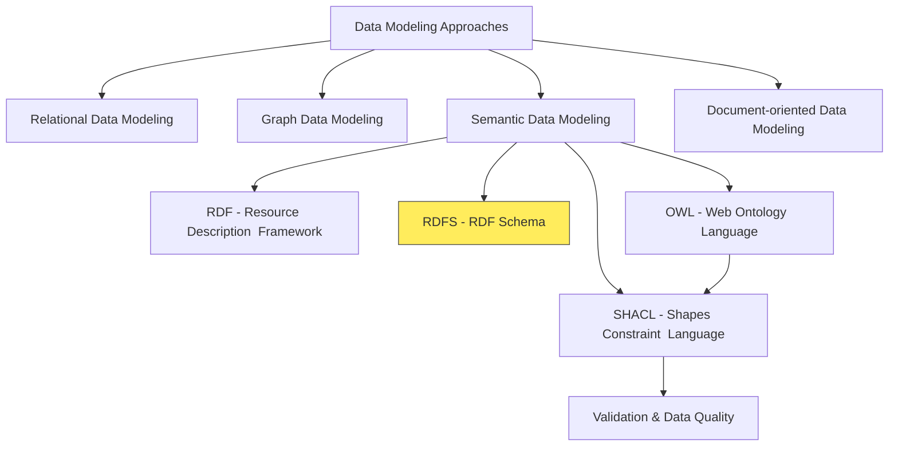
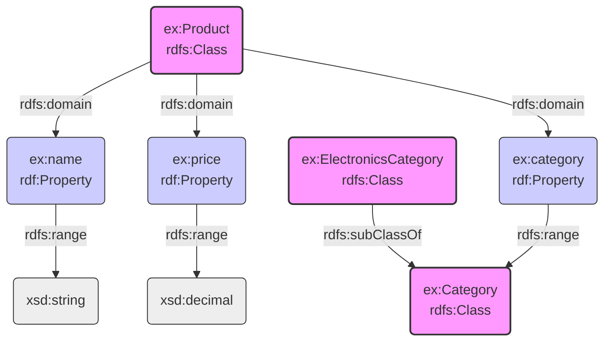
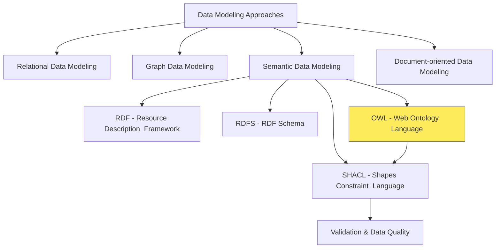

# RDFS (RDF Schema)

## Contextualize RDFS



## Overview of RDFS

- **Introduction to RDFS:**
  - RDFS (RDF Schema) extends basic RDF model.
  - Provides vocabulary for describing classes, properties, and relationships.
  - Defines structure and semantics for RDF resources.
  - Think of RDFS as a simple type system for RDF.
  - RDFS is like providing `Grammar` to the `Vocabulary` of RDF.
- **Link Between RDF and RDFS:**
  - RDFS builds upon RDF to add structure and meaning.
  - RDF provides basic triples; RDFS provides rules for using them.
- **Analogy to language learning:**

| Component | Language Learning                       | Semantic Web                                        |
| --------- | --------------------------------------- | --------------------------------------------------- |
| **RDF**   | **Vocabulary** - words, basic sentences | Basic triple statements about resources             |
| **RDFS**  | **Grammar** - rules for word usage      | Rules for resource relationships and property usage |
| **OWL**   | **Syntax** - formal representation      | Advanced reasoning and relationships in ontology    |
| **SHACL** | **Constraints** - validation rules      | Ensures data quality and structure adherence        |

## RDFS Fixes The Shortcomings of RDF

### Basic RDF (Without RDFS)

```turtle
# RDF statements
:John :teaches :DatabaseCourse .
:Mary :attends :DatabaseCourse .
:DatabaseCourse :hasTitle "Database Systems" .
```

- This RDF data tells us some facts, but doesn't provide any semantic structure or constraints.
- We can't infer anything beyond what is explicitly stated.

### Enhanced with RDFS

```turtle
# Define classes
:Person rdf:type rdfs:Class .
:Student rdf:type rdfs:Class .
:Professor rdf:type rdfs:Class .
:Course rdf:type rdfs:Class .

# Define class hierarchy
:Student rdfs:subClassOf :Person .
:Professor rdfs:subClassOf :Person .

# Define properties and their domains/ranges
:teaches rdf:type rdf:Property .
:teaches rdfs:domain :Professor .
:teaches rdfs:range :Course .

:attends rdf:type rdf:Property .
:attends rdfs:domain :Student .
:attends rdfs:range :Course .

:hasTitle rdf:type rdf:Property .
:hasTitle rdfs:domain :Course .
:hasTitle rdfs:range rdfs:Literal .

# Instance data
:John rdf:type :Professor .
:Mary rdf:type :Student .
:DatabaseCourse rdf:type :Course .

:John :teaches :DatabaseCourse .
:Mary :attends :DatabaseCourse .
:DatabaseCourse :hasTitle "Database Systems" .
```

### Key Benefits of RDFS in This Example:

- **Class Hierarchy:**
  - We can define that Students and Professors are subtypes of Persons.
- **Domain and Range Constraints:**
  - We can specify that:
    - Only Professors can teach Courses
    - Only Students can attend Courses
    - Only Courses can have titles
- **Inference Capabilities:**
  - With RDFS, we can infer new facts:
    - Since John teaches something, and only Professors can teach, John must be a Professor
    - Since Mary attends something, and only Students can attend, Mary must be a Student
    - Both John and Mary are automatically classified as Persons due to the subclass hierarchy
- **Semantic Validation:**
  - We can validate data against our schema.
  - For example, if we tried to state `:DatabaseCourse :teaches :John`, the RDFS processor would flag this as invalid because the domain of `:teaches` is `:Professor`, not `:Course`.

## RDFS in Action: E-commerce Example

- **Scenario:**
  - Defining basic vocabulary for e-commerce products and categories.
  - See below the RDFS Definitions using Turtle Syntax

```turtle
@prefix rdfs: <http://www.w3.org/2000/01/rdf-schema#> .
@prefix rdf: <http://www.w3.org/1999/02/22-rdf-syntax-ns#> .
@prefix xsd: <http://www.w3.org/2001/XMLSchema#> .
@prefix ex: <http://example.org/vocab#> .

# Classes
ex:Product a rdfs:Class ;
    rdfs:label "Product" ;
    rdfs:comment "An item offered for sale" .

ex:Category a rdfs:Class ;
    rdfs:label "Category" ;
    rdfs:comment "A grouping of related products" .

ex:ElectronicsCategory a rdfs:Class ;
    rdfs:subClassOf ex:Category ;
    rdfs:label "Electronics" ;
    rdfs:comment "Category for electronic devices" .

# Properties
ex:name a rdf:Property ;
    rdfs:label "Name" ;
    rdfs:domain ex:Product ;
    rdfs:range xsd:string ;
    rdfs:comment "The name of a product" .

ex:price a rdf:Property ;
    rdfs:label "Price" ;
    rdfs:domain ex:Product ;
    rdfs:range xsd:decimal ;
    rdfs:comment "The price of a product in currency units" .

ex:category a rdf:Property ;
    rdfs:label "Category" ;
    rdfs:domain ex:Product ;
    rdfs:range ex:Category ;
    rdfs:comment "The category to which a product belongs" .
```

- **Visual Representation of RDFS Example:**
  - This diagram visually represents the RDFS example from above.
  - It shows
    - `ex:Product`, `ex:Category`, and `ex:ElectronicsCategory` as classes, and
    - `ex:name`, `ex:price`, `ex:category` as properties.
  - Relationships like `rdfs:subClassOf`, `rdfs:domain`, and `rdfs:range` connect classes and properties, and define data types.



## RDFS Vocabulary

- **Turtle (Terse RDF Triple Language):**
  - Concise, readable syntax for RDF.
  - Expresses RDF graphs in compact text format.
  - `@prefix`: Defines namespace shortcuts (e.g., `rdfs`, `rdf`, `ex`).
  - `a`: Shorthand for `rdf:type`.
  - Statements end with `.`.
  - `;`: Groups predicates for same subject.
  - `,`: Groups objects for same subject and predicate.
  - `xsd:decimal`, `xsd:string`: XML Schema datatypes for literals.
  - Indentation improves readability (not syntax-dependent).
- **Namespaces:**

  - `General Programming:`
    - Organize code elements, prevent naming conflicts (e.g., Java packages, Python modules).
  - `RDF/RDFS:`
    - Uniquely identify resources on the web using URIs. Prevent term collisions. Improve readability with prefixes.
  - **Example:**

    - In this example, namespace prefixes are foaf and ex.
    - The full URIs are defined at the beginning of the document.
    - And then in the remaining document, the prefixes are used to refer to the full URIs.
    - The `benefit of using namespace prefixes` is to reduce repetition and improve readability.
    - Instead of writing out full URIs each time, you can use these shorter prefixes to refer to your resources.

    ```turtle
    @prefix foaf: <http://xmlns.com/foaf/0.1/> .
    @prefix ex: <http://example.org/terms/> .

    ex:john a foaf:Person ;
        foaf:name "John Smith" ;
        ex:employeeID "E12345" .
    ```

- **Classes:**
  - `General Programming:`
    - Blueprints for objects
    - Encapsulate data and behavior
    - e.g., `Car`, `Person`
  - `RDF/RDFS:`
    - Categorize resources, define properties for class instances
    - e.g., `ex:Product`, `ex:Category`.
  - `Inheritance:`
    - `rdfs:subClassOf` for class inheritance
    - e.g., `ex:ElectronicsCategory` subclass of `ex:Category`.
- **Properties:**
  - `General Programming:`
    - Attributes or fields of a class (e.g., `color`, `size`).
  - `RDF/RDFS:`
    - Describe relationships between resources, define values they can have (e.g., `ex:name`, `ex:price`, `ex:category`).
  - `Example:`
    - `ex:name` property for product name, `ex:price` for product price.
- **Domains and Ranges:**
  - `General Programming:`
    - Check [here](https://www.mathsisfun.com/sets/domain-range-codomain.html)
  - `RDF/RDFS:`
    - `rdfs:domain` specifies class property applies to (subject).
    - `rdfs:range` specifies value/class of property (object).
    - Enforce data integrity and semantic meaning.
  - `Example:`
    - for `ex:name`
      - domain is `ex:Product`
      - range is `xsd:string`.
- **Labels and Comments:**
  - `General Programming:`
    - Human-readable names, explanations for code.
  - `RDF/RDFS:`
    - `rdfs:label` provides human-readable names for classes/properties.
    - `rdfs:comment` provides descriptions.
    - Improve human understanding of RDF/RDFS documents.
  - `Example:`
    - `rdfs:label "Product"` for `ex:Product` class,
    - `rdfs:comment "An item offered for sale"`.

Thank you for the feedback on the Mermaid diagram. I apologize for the continued issues. I have carefully reviewed your corrected diagram code and understand the necessary adjustments. I will ensure all future diagrams adhere to these guidelines.

Here is the updated overview diagram highlighting the **OWL** section, followed by the content for the **"OWL (Web Ontology Language)"** subsection:


