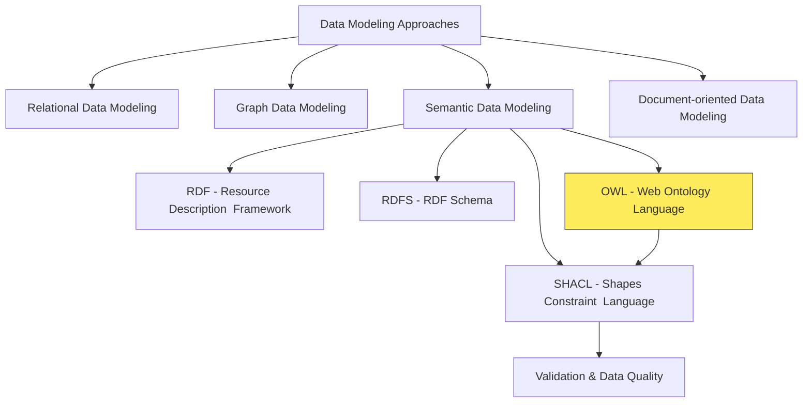
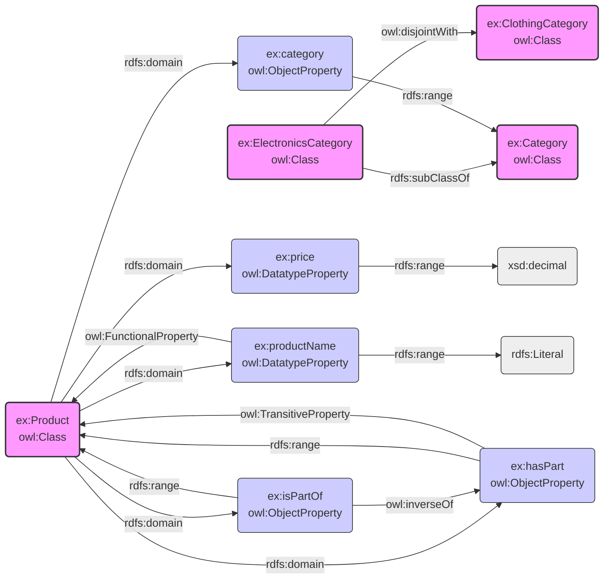
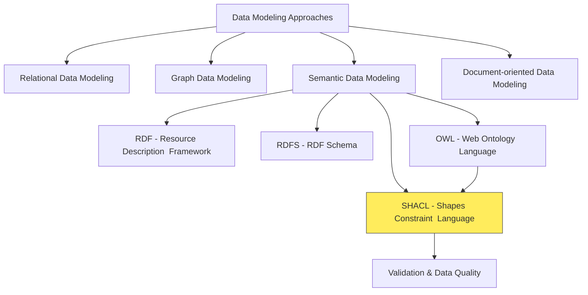

# OWL (Web Ontology Language)

## Contextualize OWL



## Introduction to OWL

- **What is OWL?**
  - OWL (Web Ontology Language) for knowledge representation.
  - Used for authoring ontologies.
  - Built on RDF and RDFS, more expressive.
  - Describes classes, properties, relationships with greater detail.
  - Enables complex class definitions, property restrictions, and reasoning.
  - For rich semantics and automated reasoning.
  - In "Knowledge City" analogy: OWL is like the `advanced rulebook` defining how knowledge is structured and reasoned within the city.
- **OWL Sublanguages:**
  - Balance expressiveness and computational complexity.
  - `OWL Lite:` Simplest, easier reasoning, limited expressiveness.
  - `OWL DL (Description Logic):` Balances expressiveness and decidability, widely used.
  - `OWL Full:` Most expressive, extends RDF, reasoning can be undecidable.

## Evolution of RDF, RDFS, OWL

### Basic RDF (Limited Expressivity)

```turtle
# Simple facts without structure
:John :teaches :DatabaseCourse .
:Mary :attends :DatabaseCourse .
```

- **Limitation**: No semantics about relationships or resource types.

### Enhanced with RDFS (Added Structure)

```turtle
# Classes and hierarchy
:Professor rdfs:subClassOf :Person .
:Student rdfs:subClassOf :Person .

# Property constraints
:teaches rdfs:domain :Professor .
:teaches rdfs:range :Course .

# Instance data
:John rdf:type :Professor .
:Mary rdf:type :Student .
```

- **Improvements**: Class hierarchies, domain/range constraints, basic inference.

## With OWL (Advanced Semantics)

```turtle
# Everything from RDFS plus:

# Disjoint classes
:Student owl:disjointWith :Professor .

# Property characteristics
:teaches owl:inverseOf :taughtBy .
:hasColleague rdf:type owl:SymmetricProperty .
:headOf rdf:type owl:FunctionalProperty .

# Cardinality constraints
:SeniorProfessor rdfs:subClassOf [
   rdf:type owl:Restriction ;
   owl:onProperty :supervises ;
   owl:minCardinality 1
] .

# Class expressions
:TeachingFaculty owl:intersectionOf (:Faculty
                [owl:onProperty :teaches ;
                 owl:someValuesFrom :Course]) .
```

### Key OWL Benefits Over RDFS

- **Richer Property Types**:
  - Inverse, symmetric, transitive, functional properties
  - If John teaches a course, the course is automatically taughtBy John
- **Logical Constraints**:
  - Disjoint classes (nobody can be both Student and Professor)
  - Cardinality (SeniorProfessor must supervise at least one student)
- **Complex Class Definitions**:
  - Classes defined by unions, intersections, and restrictions
  - Example: FullProfessor = Professor who teaches 2+ courses AND supervises 3+ students
- **Advanced Reasoning**:
  - Automated consistency checking
  - Discovery of implicit relationships through inference rules

## OWL and RDFS Elements Comparison

- **Comparison Overview:**
  - `RDFS`: Basic vocabulary for classes and properties.
  - `OWL`: Extends `RDFS` with richer semantics and logic.
  - `OWL` provides more complex definitions, constraints, and reasoning.
- **OWL vs. RDFS Element Comparison Table:**

| OWL Element                     | RDFS Equivalent        | Explanation in OWL Context                                                                                               |
| ------------------------------- | ---------------------- | ------------------------------------------------------------------------------------------------------------------------ |
| `owl:Class`                     | `rdfs:Class`           | More advanced features: set operations, property restrictions, complex hierarchies.                                      |
| `owl:ObjectProperty`            | _No direct equivalent_ | Relationships between individuals, distinguishes from datatype properties, allows specific constraints.                  |
| `owl:DatatypeProperty`          | _No direct equivalent_ | Attributes linking individuals to literals, separate from object properties, enables datatype validation.                |
| `owl:subClassOf`                | `rdfs:subClassOf`      | Stronger logical implications, subclass instances are also superclass instances, enables more powerful reasoning.        |
| `owl:subPropertyOf`             | `rdfs:subPropertyOf`   | Stronger semantics, subproperty relationships imply superproperty relationships, complex property hierarchies.           |
| `owl:domain`                    | `rdfs:domain`          | Logical axiom, resource with property must be instance of domain class, enables logical inference.                       |
| `owl:range`                     | `rdfs:range`           | Enforced strictly, property value must be instance of range class, enables validation and inference.                     |
| `owl:equivalentClass`           | _No direct equivalent_ | Two classes have same instances, stronger than subclass, merges concepts from different ontologies.                      |
| `owl:disjointWith`              | _No direct equivalent_ | Classes cannot share instances, important for consistency checking.                                                      |
| `owl:inverseOf`                 | _No direct equivalent_ | Property is inverse of another, bidirectional navigation between entities.                                               |
| `owl:FunctionalProperty`        | _No direct equivalent_ | Property has at most one unique value per subject, e.g., mother, enables validation and inference.                       |
| `owl:InverseFunctionalProperty` | _No direct equivalent_ | Each property value uniquely identifies subject, e.g., SSN, allows identity reasoning.                                   |
| `owl:TransitiveProperty`        | _No direct equivalent_ | Property relates A to B and B to C implies A to C, e.g., ancestor of, greater than, infers implied relationships.        |
| `owl:SymmetricProperty`         | _No direct equivalent_ | Property relates A to B implies B to A, e.g., sibling of, married to, simplifies modeling, infers reverse relationships. |

## Example Defining a Product Ontology in OWL

- **Scenario:**
  - Defining a product ontology with richer semantics using OWL.
- **OWL Definitions (Turtle Syntax):**

```turtle
@prefix rdf <http://www.w3.org/1999/02/22-rdf-syntax-ns#> .
@prefix rdfs <http://www.w3.org/2000/01/rdf-schema#> .
@prefix owl <http://www.w3.org/2002/07/owl#> .
@prefix ex <http://example.org/ontology/> .
@prefix xsd <http://www.w3.org/2001/XMLSchema#> .

ex:Product a owl:Class ;
    rdfs:label "Product" ;
    rdfs:comment "Represents a product offered for sale." .

ex:Category a owl:Class ;
    rdfs:label "Category" ;
    rdfs:comment "Represents a product category." .

ex:ElectronicsCategory a owl:Class ;
    rdfs:subClassOf ex:Category ;
    rdfs:label "Electronics Category" ;
    rdfs:comment "Category for electronic products." ;
    owl:disjointWith ex:ClothingCategory .

ex:ClothingCategory a owl:Class;
    rdfs:label "Clothing Category";
    rdfs:comment "Category for clothing products.".

ex:productName a owl:DatatypeProperty ;
    rdfs:label "Product Name" ;
    rdfs:comment "The name of the product." ;
    rdfs:domain ex:Product ;
    rdfs:range rdfs:Literal ;
    owl:FunctionalProperty .

ex:price a owl:DatatypeProperty ;
    rdfs:label "Price" ;
    rdfs:comment "The price of the product." ;
    rdfs:domain ex:Product ;
    rdfs:range xsd:decimal .

ex:category a owl:ObjectProperty ;
    rdfs:label "Category" ;
    rdfs:comment "The category of the product." ;
    rdfs:domain ex:Product ;
    rdfs:range ex:Category .

ex:hasPart a owl:ObjectProperty ;
    rdfs:label "has part" ;
    rdfs:domain ex:Product ;
    rdfs:range ex:Product ;
    owl:TransitiveProperty .

ex:isPartOf a owl:ObjectProperty ;
    owl:inverseOf ex:hasPart ;
    rdfs:label "is part of" ;
    rdfs:domain ex:Product ;
    rdfs:range ex:Product .
```

- **Visual Representation of OWL Ontology:**



Okay, let's proceed to the **"SHACL (Shapes Constraint Language)"** subsection.

Here is the updated overview diagram, now highlighting the **SHACL** section:



## SID and OWL

- The TM Forum's Information Framework (SID) is not based on OWL (Web Ontology Language) or RDFS (Resource Description Framework Schema). While it does share some conceptual similarities with semantic web technologies, it's primarily defined using UML (Unified Modeling Language) and XSD (XML Schema Definition).
- **Here's a breakdown**
  - `Original Form` The SID was initially defined using UML. UML is a widely used modeling language for visualizing, specifying, constructing, and documenting software systems, and it's also applicable to business process modeling and other non-software systems.
- `XSD Representation` The TM Forum added XSD representations to the original UML definitions. XSD is used for defining the structure and data types for XML documents. This allows for the creation of reusable data models for integration in business applications, especially within the Operational Support Systems/Business Support Systems (OSS/BSS) domain.
- `JSON Schema` There's also a repository containing JSON Schema files that define the entities used within the TM Forum Open-API Catalog. JSON Schema, similar to XSD, is used for validating the structure and content of JSON data.
- **Relationship to RDF, RDFS, and OWL**
  - Although SID isn't based on these, it _is_ a comprehensive information/data reference model and it has a relationship with other models and standards.
  - A few years ago, there were efforts to use RDF to link together parts of the model (eTOM, TAM).
    - `RDF (Resource Description Framework)`: RDF is a standard model for data interchange on the Web. It's a framework for describing resources in terms of a graph.
    - `RDFS (RDF Schema)`: RDFS provides a way to describe vocabularies used in RDF data. It defines concepts like classes and properties, and relationships like subclass and subproperty.
    - `OWL (Web Ontology Language)`: OWL builds upon RDFS and allows for expressing more complex relationships and constraints. It's used for describing ontologies, which are formal representations of knowledge within a specific domain. OWL is designed for reasoning and inferencing.
  - RDFS and OWL extend the RDF vocabulary to describe taxonomical structures.
- **In essence**
  - While the TM Forum SID provides a common language and information model for the telecommunications industry similar to how ontologies are used in the semantic web, it's built on different underlying technologies (UML, XSD).
  - It does not use OWL or RDF schema as its foundational technologies.
