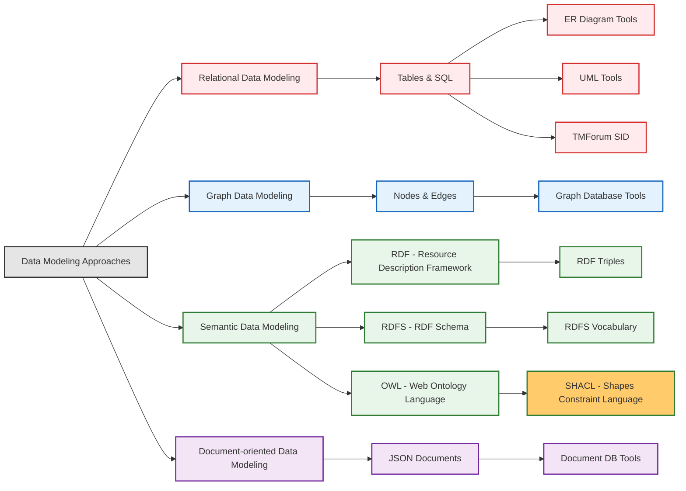

# On this page

- **This page serves as an introduction to the topic of SHACL - SHAPES CONSTRAINT LANGUAGE.**
- To check out other related topics, click on the links from the diagram below.
- To continue with the current topic, scroll down to read more.



# SHACL (Shapes Constraint Language)

## Contextualize SHACL


## Need for SHACL

- **Data Quality Challenge:**
  - RDF, RDFS, OWL describe data structure, but don't guarantee data quality.
  - RDF data can still have issues: structural errors, datatype mismatches, missing info, inconsistencies.
- **SHACL's Solution:**
  - SHACL (Shapes Constraint Language) addresses data quality for RDF.
  - Defines `shapes` to describe valid RDF data structure and content.
  - Enables `validation` to check if RDF data conforms to shapes.
  - Generates `reports` detailing data violations.
  - In "Knowledge City" analogy: SHACL is like **City Inspectors** ensuring buildings (data) adhere to building codes (shapes).
- **Analogy to Relational Databases:**
  - Relational DBs use schemas with data types, keys, constraints (NOT NULL, UNIQUE).
  - SHACL provides similar validation for RDF data.

## Introduction to SHACL

- **What is SHACL?**
  - W3C standard for validating RDF graphs.
  - Defines `shapes` as descriptions of valid RDF structure and data.
  - Shapes are defined in RDF itself.
  - Complements OWL by ensuring data instances match data model.
  - In "Knowledge City" analogy: `SHACL defines zoning laws and building codes` for the "Knowledge City".
- **Key Benefits of SHACL:**
  - `Data Quality Assurance:` Detects and reports data violating constraints.
  - `Interoperability:` Ensures RDF data exchange conforms to agreed shapes.
  - `Error Detection and Prevention:` Identifies errors early in data pipelines.
  - `Documentation:` Shapes are machine-readable schema documentation.
  - `Lightweight Schema Definition:` Defines schemas without full OWL ontology.

## Core SHACL Concepts: Shapes, Targets, Constraints

- **Core Concepts:**
  - SHACL validation uses three key concepts:
    - Shapes,
    - Targets, and
    - Constraints.
- **Shape:**
  - RDF resource describing conditions for valid RDF data nodes.
  - Defines what is "valid" for RDF nodes.
  - Shapes are defined using RDF triples.
  - Types of Shapes:
    - `Node Shapes:`
      - Constraints on target nodes themselves (e.g., class type, datatype).
      - e.g. in simple example, a shape for `ex:Product` class indicates that it must have a `name` and `price`.
    - `Property Shapes:`
      - Constraints on property values of target nodes (e.g., value type, range).
      - e.g. in simple example, a shape for `ex:Product` class might enforce that `ex:price` must be a non-negative decimal.
- **Target:**
  - Specifies which nodes a shape applies to in RDF graph.
  - Defines scope of validation for a shape.
  - SHACL target selectors:
    - `sh:targetClass`: Nodes that are instances of a class.
    - `sh:targetNode`: Specific nodes by IRI or blank node identifier.
    - `sh:targetSubjectsOf`: Subjects of triples with a property.
    - `sh:targetObjectsOf`: Objects of triples with a property.
- **Constraint:**
  - Rule or condition that target nodes must satisfy.
  - Validation logic within a shape.
  - SHACL constraint components:
    - Class membership (`sh:class`).
    - Data type (`sh:datatype`).
    - Cardinality (`sh:minCount`, `sh:maxCount`).
    - Value range (`sh:minInclusive`, `sh:maxExclusive`, `sh:in`).
    - String patterns (`sh:pattern`, `sh:minLength`, `sh:maxLength`).
    - Relationships (`sh:property`, `sh:node`, `sh:path`).
  - Constraints defined using RDF triples within shapes.
  - Shape contains one or more constraints.

## SHACL Validation and Reports

- **Validation Process:**
  - Checks if RDF data conforms to SHACL shapes.
  - **Inputs:**
    - `Shapes Graph`: RDF graph with SHACL shapes.
    - `Data Graph`: RDF graph to be validated.
  - **Process:**
    - SHACL engine processes shapes and data graphs.
    - For each shape, identifies target nodes in data graph.
    - Applies shape constraints to target nodes and their properties.
  - **Output:**
    - `Validation Report`: RDF graph detailing validation results.
- **Validation Report:**
  - RDF graph providing structured info about validation.
  - Details any violations found.
  - Used to understand data quality issues and errors.
  - In "Knowledge City" analogy: Validation report is like the `Inspector's Report` detailing any building code violations.

## SHACL Example: Product Information Validation

- **Example Focus:**
  - Validating product data, ensuring required properties and type conformance.
- **Example Data:**
  - Includes valid and invalid product instances for demonstration.
- **SHACL Shape Definition (Turtle Syntax):**

```turtle
@prefix rdf: <http://www.w3.org/1999/02/22-rdf-syntax-ns#> .
# RDF (Resource Description Framework) - fundamental for representing data in RDF graphs.
# This prefix is standard and widely used in RDF documents.

@prefix rdfs: <http://www.w3.org/2000/01/rdf-schema#> .
# RDFS (RDF Schema) - extends RDF to define vocabularies, classes, and properties.
# Used here for potentially defining classes like ex:Product and ex:Category (though not explicitly in this example, it's good practice to include it).

@prefix sh: <http://www.w3.org/ns/shacl#> .
# SHACL (Shapes Constraint Language) - the core prefix for SHACL vocabulary.
# All SHACL related terms like shapes, constraints, and validation reports come from this namespace.

@prefix xsd: <http://www.w3.org/2001/XMLSchema#> .
# XML Schema Datatypes - defines standard datatypes like string, integer, decimal, date, etc.
# Used in SHACL to specify the expected datatype of property values.

@prefix ex: <http://example.org/vocab#> .
# Example Vocabulary - a custom namespace for terms specific to this example, like Product, name, price, category.
# In real applications, this would be replaced with a more meaningful and persistent namespace.

# Shape definition for Product
ex:ProductShape a sh:NodeShape ; # Declares 'ex:ProductShape' as a SHACL NodeShape. NodeShapes define constraints on nodes (resources) in the RDF graph.
  sh:targetClass ex:Product ;      # Specifies that this shape applies to all RDF nodes that are instances of the class 'ex:Product'.
                                  #  'sh:targetClass' connects the shape to a specific class of resources.
  sh:property [                  # 'sh:property' defines a list of property shape declarations. Each item in this list specifies constraints on a specific property of the target nodes (ex:Product instances).
    sh:path ex:name ;           # 'sh:path' specifies the property that this constraint applies to. Here, it's the 'ex:name' property.
    sh:minCount 1 ;             # 'sh:minCount 1' is a cardinality constraint. It requires that each ex:Product MUST have at least one value for the 'ex:name' property.
    sh:datatype xsd:string ;    # 'sh:datatype xsd:string' is a datatype constraint. It specifies that the value of the 'ex:name' property MUST be of type 'xsd:string' (a string).
    sh:message "Product must have a name (string)." ; # 'sh:message' provides a custom error message to be included in the validation report if this constraint is violated.
  ] ; # End of the first property shape (for ex:name)
  sh:property [                  # Start of the second property shape (for ex:price)
    sh:path ex:price ;          #  Specifies that this constraint applies to the 'ex:price' property.
    sh:minCount 1 ;             #  Requires that each ex:Product MUST have at least one value for the 'ex:price' property.
    sh:datatype xsd:decimal ;   #  Specifies that the value of the 'ex:price' property MUST be of type 'xsd:decimal' (a decimal number).
    sh:minInclusive 0 ;         # 'sh:minInclusive 0' is a numeric range constraint. It specifies that the value of 'ex:price' MUST be greater than or equal to 0.  This ensures non-negative prices.
    sh:message "Product must have a non-negative price (decimal)." ; # Custom error message for price constraint violations.
  ] ; # End of the second property shape (for ex:price)
  sh:property [                  # Start of the third property shape (for ex:category)
    sh:path ex:category ;       # Specifies that this constraint applies to the 'ex:category' property.
    sh:minCount 1 ;             # Requires that each ex:Product MUST have at least one value for the 'ex:category' property.
    sh:class ex:Category ;      # 'sh:class ex:Category' is a class constraint. It specifies that the value of the 'ex:category' property MUST be an instance of the class 'ex:Category'.
                                  #  This ensures that products are categorized using predefined categories.
    sh:message "Product must belong to a category (ex:Category)." ; # Custom error message for category constraint violations.
  ] . # End of the third property shape (for ex:category)
  # End of the ProductShape definition. This shape now defines the rules for validating instances of 'ex:Product'.
```

- **Example Data to be validated (valid and invalid examples)**

```turtle
# Example Data to be validated (valid and invalid examples)

# Valid Product Data
ex:product1 a ex:Product ; # 'ex:product1' is declared as an instance of the class 'ex:Product'.
  ex:name "Laptop Model X" ; # 'ex:product1' has a name property with a string value "Laptop Model X". This satisfies the 'ex:name' property constraints in ProductShape.
  ex:price 1200.00 ;       # 'ex:product1' has a price property with a decimal value 1200.00. This satisfies the 'ex:price' property constraints in ProductShape.
  ex:category ex:electronicsCategory . # 'ex:product1' has a category property with value 'ex:electronicsCategory'. We'll see later if 'ex:electronicsCategory' is defined as an 'ex:Category' instance, as required by ProductShape.
                                       #  This product instance is expected to be valid because it fulfills all defined constraints in ProductShape.

# Invalid Product Data - Missing Name
ex:product2 a ex:Product ; # 'ex:product2' is also an instance of 'ex:Product'.
  ex:price 999.99 ;       # 'ex:product2' has a price.
  ex:category ex:electronicsCategory . # 'ex:product2' has a category.
                                       #  However, 'ex:product2' is missing the 'ex:name' property. This will violate the 'sh:minCount 1' constraint on 'ex:name' in ProductShape, making it invalid.

# Invalid Product Data - Wrong Price Datatype (String instead of decimal)
ex:product3 a ex:Product ; # 'ex:product3' is an instance of 'ex:Product'.
  ex:name "Gaming Mouse" ; # 'ex:product3' has a name.
  ex:price "expensive" ; # 'ex:product3' has a price, but the value "expensive" is a string, not a decimal. This will violate the 'sh:datatype xsd:decimal' constraint on 'ex:price' in ProductShape, making it invalid.
  ex:category ex:electronicsCategory . # 'ex:product3' has a category.

# Invalid Product Data - Price is Negative
ex:product4 a ex:Product ; # 'ex:product4' is an instance of 'ex:Product'.
  ex:name "Discounted Headphones" ; # 'ex:product4' has a name.
  ex:price -20.00 ; # 'ex:product4' has a price, but the value -20.00 is negative. This will violate the 'sh:minInclusive 0' constraint on 'ex:price' in ProductShape, making it invalid.
  ex:category ex:electronicsCategory . # 'ex:product4' has a category.

# Invalid Product Data - Category is missing
ex:product5 a ex:Product ; # 'ex:product5' is an instance of 'ex:Product'.
  ex:name "Keyboard" ; # 'ex:product5' has a name.
  ex:price 75.00 . # 'ex:product5' has a price.
                     # 'ex:product5' is missing the 'ex:category' property. This will violate the 'sh:minCount 1' constraint on 'ex:category' in ProductShape, making it invalid.

# Example Category Data (used in valid and invalid product examples)
ex:electronicsCategory a ex:Category . # 'ex:electronicsCategory' is declared as an instance of the class 'ex:Category'. This is important for satisfying the 'sh:class ex:Category' constraint in ProductShape.
ex:clothingCategory a ex:Category .  # 'ex:clothingCategory' is also declared as an instance of 'ex:Category'.
```

- **Conceptual Validation Report (Turtle Syntax):**
  - This section shows what a SHACL validation report would look like when validating the data against the ProductShape.

```turtle
@prefix sh: <http://www.w3.org/ns/shacl#> .
@prefix ex: <http://example.org/vocab#> .

_:report a sh:ValidationReport ;
_:report a sh:ValidationReport ; # Declares a new blank node ( _:report ) as a SHACL ValidationReport.
                                #  Validation reports are standard SHACL outputs that summarize the validation process.
  sh:conforms false ; # 'sh:conforms false' indicates that the data being validated does NOT conform to the shapes.
                      #  If all constraints were satisfied, this would be 'sh:conforms true'.
  sh:result [         # 'sh:result' is a property that links the ValidationReport to a list of ValidationResult resources.
                      #  Each ValidationResult describes a single constraint violation or success. In this case, we only have violations.
      a sh:ValidationResult ; # Declares a new blank node as a SHACL ValidationResult. This result is for the first violation (product2 - missing name).
      sh:focusNode ex:product2 ; # 'sh:focusNode ex:product2' identifies the node that caused the validation result. Here, it's 'ex:product2'.
      sh:resultPath ex:name ; # 'sh:resultPath ex:name' identifies the property path that was involved in the validation result. Here, it's the 'ex:name' property.
      sh:sourceConstraintComponent sh:MinCountConstraintComponent ; # 'sh:sourceConstraintComponent sh:MinCountConstraintComponent' identifies the type of SHACL constraint that was violated.
                                                                  #  In this case, it's the 'sh:minCount' constraint.
      sh:message "Product must have a name (string)." ; # 'sh:message' is the custom error message defined in the ProductShape for the 'ex:name' property's 'sh:minCount' constraint.
      sh:severity sh:Violation # 'sh:severity sh:Violation' indicates the severity level of the validation result. 'sh:Violation' is the standard level for constraint failures.
    ] , [                     # Start of the second ValidationResult (for product3 - wrong price datatype)
      a sh:ValidationResult ;
      sh:focusNode ex:product2 ;
      sh:resultPath ex:name ;
      sh:sourceConstraintComponent sh:MinCountConstraintComponent ;
      sh:message "Product must have a name (string)." ;
      sh:severity sh:Violation
    ] , [
      a sh:ValidationResult ;
      sh:focusNode ex:product3 ;
      sh:resultPath ex:price ;
      sh:value "expensive" ;
      sh:sourceConstraintComponent sh:DatatypeConstraintComponent ;
      sh:message "Product must have a non-negative price (decimal)." ;
      sh:severity sh:Violation
    ] , [
      a sh:ValidationResult ;
      sh:focusNode ex:product4 ;
      sh:resultPath ex:price ;
      sh:value -20.00 ;
      sh:sourceConstraintComponent sh:MinInclusiveConstraintComponent ;
      sh:message "Product must have a non-negative price (decimal)." ;
      sh:severity sh:Violation
    ] , [
      a sh:ValidationResult ;
      sh:focusNode ex:product5 ;
      sh:resultPath ex:category ;
      sh:sourceConstraintComponent sh:MinCountConstraintComponent ;
      sh:message "Product must belong to a category (ex:Category)." ;
      sh:severity sh:Violation
    ] .
```
