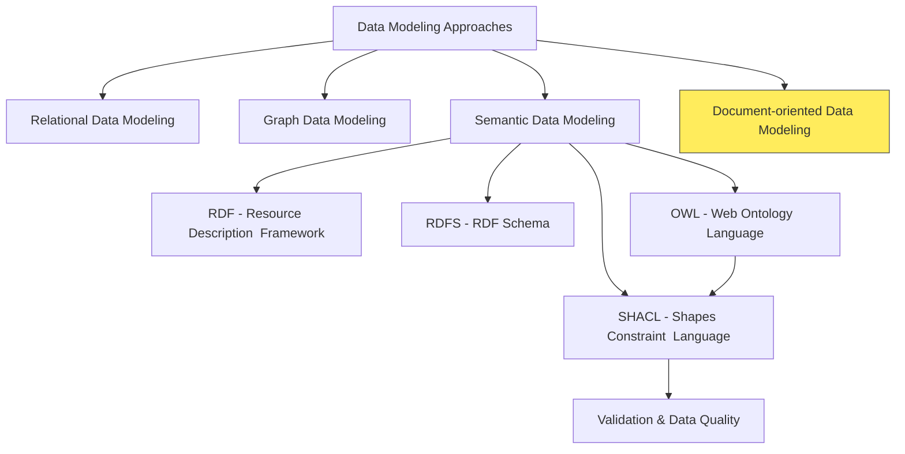

# Document Databases & JSON-based Modeling

## Contextualize Document Databases



## Introduction to Document Databases

- **Document Databases (NoSQL):**
  - Type of NoSQL database, offering flexible data storage.
  - Store data in document formats (JSON, BSON, XML).
  - Documents are self-describing (contain field names and values).
  - Characterized by flexible schema or schema-on-read.
  - Suited for semi-structured, evolving data.
  - Popular for content management, product catalogs, agile applications.
- **Key Characteristics:**
  - **Intentional Schema Design in a Flexible Environment:**
    - Offer schema flexibility, not "schema-less-ness".
    - Document structure is designed intentionally.
    - Documents within a type share common properties but can vary.
    - Flexibility valuable for evolving data models.
  - **Document-centric Organization:**
    - Data in self-contained units called `documents`.
    - Documents in JSON, BSON, or XML formats.
    - Human-readable and easily parsed.
  - **Self-Describing Documents:**
    - Documents embed data values and property names.
    - Enhances data understanding and interpretability.

## Key Concepts for Document Databases

- **Document Database Basics**
  - In a document database (like MongoDB, Couchbase, etc.), data is stored in `documents`.
  - Documents are like self-contained records, often in JSON format.
  - These documents are grouped into `collections`, which are similar to tables in relational databases.
- **The Primary Key**
  - Every document in a collection typically has a special field called `_id`.
  - This field acts as the **primary key** for that document, uniquely identifying it within the collection.
  - Think of it like a unique product ID or a social security number – it's how you specifically find and refer to a particular document.
- **Denormalization**
  - In relational databases, we often aim for "normalization" to reduce data duplication and improve data integrity. However, document databases often embrace denormalization.
  - Denormalization means intentionally duplicating data in documents to improve read performance and simplify data retrieval in certain scenarios.
  - `Embedding is a form of denormalization.`

## Embedding vs. Linking

### Modeling Relationships in Document Databases: Linking vs. Embedding

- When working with document databases, one of the key design decisions is `how to model relationships` between different pieces of data.
- Unlike relational databases with tables and joins, document databases offer more flexibility.
- We primarily choose between two main approaches:
  - `Linking` and
  - `Embedding`.
- Understanding these choices is crucial as they significantly impact your application's performance, data consistency, and how easily you can work with your data.
- In this section, we'll explore both approaches, their trade-offs, and when to use each.

### Option 1: Linking (Referencing) - Customer Reference in Order

- **Concept**
  - Linking (also known as referencing) is similar to how foreign keys work in relational databases.
  - Instead of including all customer details within the order, we only store the `_id` of the customer document in the order document.
  - This `_id` acts as a **link** or **reference** to the actual customer information stored elsewhere.
- **Example:**
  - First, imagine we have a `customers` collection with customer documents like this:

```json
// Document in 'customers' collection
{
	"_id": "customer123", // Unique ID for this customer (Primary Key)
	"name": "Alice Smith",
	"address": "123 Main St",
	"phone": "555-1212"
	// ... other customer details
}
```

- Now, in our `orders` collection, an order document using the **linking approach** would look like this:

```json
// Document in 'orders' collection - Linking to Customer
{
	"_id": "order456", // Unique ID for this order (Primary Key)
	"orderDate": "2023-10-28",
	"totalAmount": 150.0,
	"customerID": "customer123", // **Reference** to the Customer document using its _id
	"items": [
		{ "productID": "P1", "quantity": 2, "price": 50.0 },
		{ "productID": "P2", "quantity": 1, "price": 50.0 }
	]
}
```

- **Explanation:**
  - In the `orders` document, we have a field called `customerID` that stores the `_id` of the customer.
  - To get the full customer details, you would need to perform a separate query to fetch the customer document using that `_id`.
- **When to Choose Linking:**
  - Frequently Changing Customer Data
  - Customer Data Reused Across Many Contexts
  - Lightweight Orders (High Volume)
  - Data Consistency for Customer Information is Crucial (Single Source of Truth)
- **Trade-offs of Linking:**
- Performance Overhead for Read Operations
- Better for Write-Heavy Applications

### Option 2: Embedding - Customer Data within Order

- **Concept**
  - Embedding is like nesting related data directly within a document.
  - Instead of just referencing the customer, we include a copy of the relevant customer information directly inside the `order` document.
- **Example**

```json
// Document in 'orders' collection - Embedding Customer Data
{
	"_id": "order456", // Unique ID for this order (Primary Key)
	"orderDate": "2023-10-28",
	"totalAmount": 150.0,
	"customer": {
		// **Embedded** Customer Object
		"_id": "customer123", // Still useful to include customer's _id for reference
		"name": "Alice Smith",
		"address": "123 Main St",
		"phone": "555-1212"
	},
	"items": [
		{ "productID": "P1", "quantity": 2, "price": 50.0 },
		{ "productID": "P2", "quantity": 1, "price": 50.0 }
	]
}
```

- **Explanation:**
  - The `customer` field in the `order` document now contains a `nested JSON object` with customer details.
  - This customer data is `copied` from the original customer information.
  - When you retrieve an order document, `all the necessary customer information is already included` within the same document.
  - You don't need a separate query to get customer details.
- **Embedding Approach**
  - In this embedding approach, the `customers` collection still exists separately as the primary source of customer data.
  - The customer data is copied (embedded) into the order document at the time the order is created.
- **Denormalization**
  - This is a form of denormalization where
    - The customers collection maintains the authoritative, up-to-date customer records
    - The orders collection contains embedded copies of customer data relevant to each order.
- **Snapshot**
  - The key point is that this embedded customer data represents a "snapshot" of the customer information at the time of the order.
  - If the customer later updates their address in the customers collection, the embedded data in existing orders would remain unchanged (showing the historical address at order time).
- **When to Choose Embedding**
  - Order Processing Frequently Requires Customer Data
  - Read Performance is a Top Priority
  - Customer Data Changes Rarely (or Historical State is Important)
  - Denormalization is Acceptable for Performance Gains
- **Trade-offs of Embedding**
  - Data Duplication
  - Potential Data Inconsistency
  - Better for Read-Heavy Applications

### Option 3: Hybrid Approach - Partial Embedding

- **Concept**

  - The hybrid approach is a compromise that tries to balance the benefits of both linking and embedding.
  - You embed only the `most frequently accessed` customer fields directly within the order document, while still keeping a `customerID` reference to the full customer document in the `customers` collection.

- **Example**

```json
// Document in 'orders' collection - Hybrid Approach
{
	"_id": "order456",
	"orderDate": "2023-10-28",
	"totalAmount": 150.0,
	"customer": {
		"_id": "customer123",
		"name": "Alice Smith" // **Partially Embedded:** Only name (frequently used)
		// Address and phone number are NOT embedded here
	},
	"customerID": "customer123", // **Still maintaining the reference** for full customer details
	"items": [
		{ "productID": "P1", "quantity": 2, "price": 50.0 },
		{ "productID": "P2", "quantity": 1, "price": 50.0 }
	]
}
```

## JSON Schema

- **Introduction to JSON Schema:**
  - Vocabulary to describe and validate JSON data structures.
  - Defines expected format, data types, constraints for JSON.
  - Used for validation, documentation, code generation.
  - Ensures data quality and consistency for JSON.
- **Core Concepts:**
  - **Schema Definition:**
    - JSON document describing structure and constraints.
    - Uses keywords for validation rules.
  - **Validation Process:**
    - Checks if JSON document conforms to schema rules.
    - Tools compare data against schema, report violations.
  - **Key Keywords for Validation:**
    - `type`: Expected JSON type (object, array, string, etc.).
    - `properties`: Defines object properties and their schemas.
    - `required`: Lists mandatory object properties.
    - `items`: Defines schema for array items.
    - `minLength`, `maxLength`: String and array length constraints.
    - `minimum`, `maximum`, `exclusiveMinimum`, `exclusiveMaximum`: Number range constraints.
    - `pattern`: Regular expression for strings.
    - `enum`: List of allowed values.
- **JSON Schema Example for Product Data:**
  - **Focus:**
    - Validating Product data in JSON format.
  - **Constraints:**
    - Product data must be a JSON object.
    - Properties:
      - `"productName"`: (string, required)
      - `"productID"`: (string, required)
      - `"price"`: (number, required, > 0)
      - `"category"`: (string, optional)
- **JSON Schema Definition:**

  - A JSON document that describes the structure and constraints for a product.
  - Ensures data quality by validating the structure of product data against defined rules.

  ```json
  {
  	"$schema": "http://json-schema.org/draft-07/schema#",
  	"title": "Product",
  	"description": "Schema for a product object",
  	"type": "object",
  	"properties": {
  		"productName": {
  			"type": "string",
  			"description": "Name of the product"
  		},
  		"productID": {
  			"type": "string",
  			"description": "Unique product identifier"
  		},
  		"price": {
  			"type": "number",
  			"description": "Price of the product",
  			"exclusiveMinimum": 0
  		},
  		"category": {
  			"type": "string",
  			"description": "Product category"
  		}
  	},
  	"required": ["productName", "productID", "price"]
  }
  ```

- **Valid JSON Data Example:**

  ```json
  {
  	"productName": "Laptop",
  	"productID": "P456",
  	"price": 1200,
  	"category": "Electronics"
  }
  ```

- **Invalid JSON Data Example:**

  ```json
  {
  	"productName": "Laptop",
  	"productID": "P456",
  	"price": -1200,
  	"category": "Electronics"
  }
  ```

- **Validation Report Example:**

  ```json
  {
  	"valid": false,
  	"errors": [
  		{
  			"message": "price must be greater than 0",
  			"path": "/price"
  		}
  	]
  }
  ```

## JSON-LD (JSON for Linked Data)

- **JSON-LD: Bridging JSON and Linked Data:**
  - JSON-LD (JavaScript Object Notation for Linked Data).
  - W3C standard for using JSON to serialize Linked Data.
  - Makes JSON both human-readable and machine-understandable.
  - Adds semantic meaning to JSON data.
  - Facilitates integration of data from different web sources.
- **Key Concept: Context:**
  - `@context` is central to JSON-LD's semantic meaning.
  - Provides interpretation for keys used in JSON data.
  - Acts as a dictionary, mapping JSON keys to global terms.
  - Transforms simple JSON into Linked Data.
  - Without `@context`, JSON is just data; with it, becomes Linked Data.
- **Specifying Context:**

  - `@context` is a special JSON-LD keyword.
  - Usually the first key in a JSON-LD document.
  - Tells processors how to interpret the JSON.
  - Can be:
    - `Object:` Term definitions within the document.
    - `Array:` Combines multiple contexts.
    - `URL:` Points to external context document.

- **Example: Context Types:**

  ```json
  // @context as an Object (Term Definitions Inline)
  {
  	"@context": {
  		"name": "http://schema.org/name",
  		"price": "http://schema.org/price",
  		"description": "http://schema.org/description"
  	},
  	"name": "Example Product",
  	"price": 99.99,
  	"description": "Amazing product!"
  }
  ```

  - Defines term mappings directly within the JSON.
  - `"name"` maps to `http://schema.org/name`, etc.

  ```json
  // @context as an Array (Combining Contexts)
  {
  	"@context": [
  		"http://schema.org/", // Using Schema.org vocabulary
  		{
  			"customTerm": "http://example.org/custom-ontology/term" // Adding custom term
  		}
  	],
  	"name": "Another Product", // Uses Schema.org context
  	"customTerm": "Custom Value" // Uses custom term definition
  }
  ```

  - Combines Schema.org context with a custom context.
  - Terms from both contexts can be used.

  ```json
  // @context as a URL (External Context Document)
  {
  	"@context": "http://schema.org/", // Referencing Schema.org context externally
  	"name": "URL Context Product", // Uses Schema.org vocabulary
  	"price": 150.0
  }
  ```

  - Refers to an external context defined at `http://schema.org/`.
  - Promotes context reusability.

- **Key Concept: Term Definitions:**

  - Term definition is a key-value pair:
    - `Key (Term):` Short, easy-to-use string (e.g., `"name"`, `"price"`). Used as keys in JSON-LD.
    - `Value (IRI Mapping):` Full IRI (Internationalized Resource Identifier). Globally unique identifier for semantic meaning. Usually a URL from a vocabulary.
  - **Example: Term Definition Breakdown:**

    ```json
    {
    	"@context": {
    		"name": "http://schema.org/name", // Term "name" maps to Schema.org name property
    		"price": "http://schema.org/price" // Term "price" maps to Schema.org price property
    	},
    	"name": "Product Name",
    	"price": 100
    }
    ```

    - `"name"` term maps to `http://schema.org/name` IRI.
    - Processor understands `"name"` key as `http://schema.org/name`.

- **Key Concept: Expanded vs. Compacted JSON-LD:**

  - Two forms of JSON-LD: Expanded and Compacted.
  - Different representations of same semantic data.
  - **Expanded JSON-LD:**
    - Fully normalized form.
    - Every term replaced with full IRI from context.
    - Verbose, unambiguous, explicit semantic meaning.
    - Ideal for machine processing.
    - Less human-readable.
  - **Compacted JSON-LD:**
    - Human-readable form.
    - IRIs replaced with shorter terms from `@context`.
    - Concise, easier to author and read.
    - Requires `@context` for interpretation.
  - **Example: Expanded vs. Compacted:**

    - `Compacted JSON-LD`

      ```json
      {
      	"@context": {
      		"name": "http://schema.org/name",
      		"price": "http://schema.org/price"
      	},
      	"name": "Product Example",
      	"price": 50
      }
      ```

    - **Expanded JSON-LD (of above):**

      ```json
      {
      	"@context": {
      		"name": "http://schema.org/name",
      		"price": "http://schema.org/price"
      	},
      	"http://schema.org/name": [{ "@value": "Product Example" }],
      	"http://schema.org/price": [{ "@value": 50 }]
      }
      ```

      - Expanded form uses full IRIs, more verbose.
      - Compacted form uses terms, more concise.

- **Representing RDF Triples in JSON-LD:**

  - JSON-LD represents RDF (Resource Description Framework) triples.
  - RDF triples: Subject-Predicate-Object, building blocks of Linked Data.
  - **Example: JSON-LD for Product Triples:**

    ```json
    {
    	"@context": {
    		"product": "http://example.org/ontology/product/",
    		"productName": "http://example.org/ontology/product/name",
    		"productID": "http://example.org/ontology/product/id",
    		"price": "http://example.org/ontology/product/price",
    		"category": "http://example.org/ontology/product/category"
    	},
    	"@id": "http://example.org/product/P456", // Subject: Product P456
    	"productName": "Laptop", // Predicate: productName, Object: "Laptop"
    	"productID": "P456", // Predicate: productID, Object: "P456"
    	"price": 1200, // Predicate: price, Object: 1200
    	"category": "Electronics" // Predicate: category, Object: "Electronics"
    }
    ```

- **Breakdown of Triples from Example:**
  - **Triple 1:**
    - Subject: `http://example.org/product/P456`
    - Predicate: `http://example.org/ontology/product/name`
    - Object: `"Laptop"`
  - **Triple 2:**
    - Subject: `http://example.org/product/P456`
    - Predicate: `http://example.org/ontology/product/id`
    - Object: `"P456"`
  - **Triple 3:**
    - Subject: `http://example.org/product/P456`
    - Predicate: `http://example.org/ontology/product/price`
    - Object: `1200`
  - **Triple 4:**
    - Subject: `http://example.org/product/P456`
    - Predicate: `http://example.org/ontology/product/category`
    - Object: `"Electronics"`
