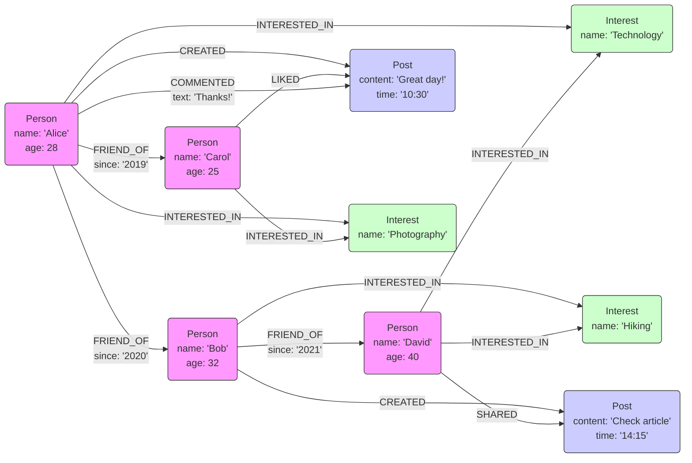

# Graph Data Modeling (Property Graphs)

## Core Concepts

- **Introduction to Graph Data Modeling:**
  - Focuses on relationships between data points.
  - Represents data as networks of nodes and edges.
  - Nodes are entities, edges are relationships.
  - Well-suited for complex, interconnected data.
  - In "Network City" analogy: Like focusing on `Connections between Locations`.
- **Nodes (Vertices):**
  - Represent entities or objects.
  - Business context examples: Customers, products, categories.
  - Can have labels to categorize type.
  - In "Network City" analogy: Nodes are like `Key Locations` (e.g., landmarks, buildings, intersections).
- **Edges (Relationships):**
  - Represent connections between nodes.
  - Have direction and type.
  - Examples: "CUSTOMER -purchased-> PRODUCT", "PRODUCT -inCategory-> CATEGORY".
  - Can have labels to describe the relationship.
  - In "Network City" analogy: Edges are like `Roads or Transit Lines` connecting locations.
- **Properties:**
  - Key-value pairs describing nodes and edges.
  - Nodes: `'Customer' node with properties 'name: "Alice"', 'city: "London"'`.
  - Edges: `'purchased' edge with property 'date: "2023-10-26"'`.
  - Add detail and context to nodes and edges.
  - In "Network City" analogy: Properties are like `Attributes of Locations or Roads` (e.g., location name, road length, traffic capacity).
- **Labels:**
  - Categorization tags for nodes and edges.
  - Group nodes/edges by type.
  - Node labels: `'Customer'`, `'Product'`, `'Order'`.
  - Edge labels: `'purchased'`, `'locatedIn'`, `'employs'`.
  - Enable efficient filtering and querying.
  - In "Network City" analogy: Labels are like `Zone Types` (e.g., residential zone, commercial zone) or `Road Classifications` (highway, street).

## Key Difference between Graph and Relational Models

- **Explicit Relationships:**
  - `Graph model`: Relationships are primary, first-class entities.
  - `Relational model`: Relationships are implicit, through foreign keys.
  - `In "Network City"`: Roads (edges) are as important as Buildings (nodes).
- **No Foreign Keys:**
  - `Graph model`: Direct connections via edges, no need for foreign keys.
  - `Relational model`: Relies heavily on foreign keys to link tables.
  - `In "Network City"`: Direct roads, no need for address registries to find connections.
- **Properties on Nodes & Edges:**
  - `Graph model`: Nodes and edges can have properties.
  - `Relational model`: Properties are only on entities (tables).
  - `In "Network City"`: Both Locations and Roads have attributes (name, length, type).
- **Flexible Schema:**
  - `Graph model`: No fixed schema, nodes of same type can vary in properties.
  - `Relational model`: Strict, predefined schema for tables.
  - `In "Network City"`: Neighborhoods (node types) can evolve with varied building styles.
- **Query Focus:**
  - `Graph model`: Focus on traversing relationships.
  - `Relational model`: Focus on joining tables.
  - `In "Network City"`: Queries are about finding paths and connections, not just looking up locations in lists.

## Example: Modeling a Social Network using Property Graphs

- **Scenario:**
  - Representing connections and interactions in a social network.
- **Modeling Choices:**
  - **Nodes:**
    - Represent people (`Person`) and content (`Post`, `Interest`).
  - **Edges:**
    - Represent relationships (`FRIEND_OF`), actions (`CREATED`, `LIKED`, `SHARED`, `COMMENTED`), and interests (`INTERESTED_IN`).
  - **Properties:**
    - Store details like names, ages, locations for people; content, timestamps for posts; names for interests; and timestamps, comments for relationships.
  - **Labels:**
    - Use labels like `Person`, `Post`, `Interest`, `FRIEND_OF` to categorize nodes and edges.
- **Mermaid Graph Diagram:**
  - This diagram models a social network using a property graph.
  - Nodes represent `Person`, `Post`, and `Interest` entities with labels and properties.
  - Edges illustrate relationships like `FRIEND_OF`, `CREATED`, `LIKED`, etc., also with labels and properties.
  - Styling is used to visually differentiate node types.

