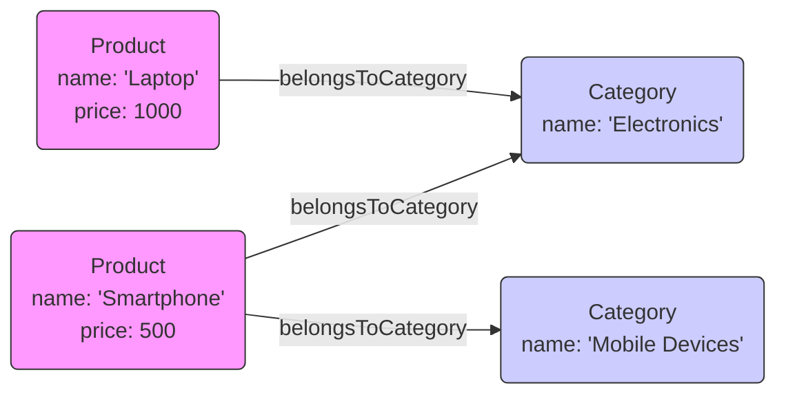

# Semantic Data Modeling

## Core Concepts

- **Introduction to Semantic Data Modeling:**
  - Focuses on meaning and context of data.
  - Uses ontologies to define data relationships.
  - Represents data as triples (subject-predicate-object).
  - Well-suited for knowledge representation and reasoning.
  - In "Knowledge City" analogy: Like focusing on `Meaning and Context of Locations`.
- **Triples:**
  - Basic unit of semantic data.
  - Consists of subject, predicate, and object.
  - Example: "Customer -hasName-> Alice".
  - In "Knowledge City" analogy: Triples are like `Statements about Locations` (e.g., "Library -locatedIn-> Downtown").
- **Ontologies:**
  - Define classes, properties, and relationships.
  - Provide a shared vocabulary for data.
  - Example: Ontology defining "Customer", "Product", "Order".
  - In "Knowledge City" analogy: Ontologies are like `City Plans` defining types of locations and their relationships.
- **RDF (Resource Description Framework):**
  - Standard for representing semantic data.
  - Uses triples to describe resources.
  - Example: RDF graph representing customer data.
  - In "Knowledge City" analogy: RDF is like `Blueprints` for describing locations and their attributes.
- **RDFS (RDF Schema):**
  - Provides basic vocabulary for RDF.
  - Defines classes and properties.
  - Example: RDFS defining "Customer" class and "hasName" property.
  - In "Knowledge City" analogy: RDFS is like `Zoning Regulations` defining types of buildings and their attributes.
- **OWL (Web Ontology Language):**
  - Extends RDFS with more expressive vocabulary.
  - Supports complex relationships and constraints.
  - Example: OWL ontology defining "Customer" as a subclass of "Person".
  - In "Knowledge City" analogy: OWL is like `Building Codes` defining detailed rules for construction.
- **SHACL (Shapes Constraint Language):**
  - Defines constraints on RDF data.
  - Ensures data validity and consistency.
  - Example: SHACL shape ensuring "Customer" has a "hasName" property.
  - In "Knowledge City" analogy: SHACL is like `Inspection Standards` ensuring buildings meet regulations.

## Key Difference between Semantic and Relational Models

- **Focus on Meaning:**
  - `Semantic model`: Emphasizes meaning and context.
  - `Relational model`: Emphasizes structure and relationships.
  - `In "Knowledge City"`: Focus on `Meaning and Context` vs. `Grid Layout`.
- **Triples vs. Tables:**
  - `Semantic model`: Uses triples (subject-predicate-object).
  - `Relational model`: Uses tables with rows and columns.
  - `In "Knowledge City"`: Statements about locations vs. Grid of buildings.
- **Ontologies vs. Schemas:**
  - `Semantic model`: Uses ontologies to define data.
  - `Relational model`: Uses schemas to define tables.
  - `In "Knowledge City"`: City plans vs. Grid layout.
- **Flexibility:**
  - `Semantic model`: More flexible, can evolve over time.
  - `Relational model`: More rigid, predefined schema.
  - `In "Knowledge City"`: Evolving city plans vs. Fixed grid layout.
- **Reasoning:**
  - `Semantic model`: Supports reasoning and inference.
  - `Relational model`: Limited reasoning capabilities.
  - `In "Knowledge City"`: Ability to infer new information vs. Fixed data.

## Example: Modeling a Product Catalog using Semantic Data

- **Scenario:**
  - Representing products and their categories in a product catalog.
- **Modeling Choices:**
  - **Triples:**
    - Represent products, categories, and their relationships.
  - **Ontologies:**
    - Define classes like "Product" and "Category".
    - Define properties like "hasName", "belongsToCategory".
  - **RDF:**
    - Use RDF to represent product data as triples.
  - **RDFS:**
    - Use RDFS to define classes and properties.
  - **OWL:**
    - Use OWL to define complex relationships and constraints.
  - **SHACL:**
    - Use SHACL to ensure data validity and consistency.
- **Mermaid Graph Diagram:**
  - This diagram models a product catalog using semantic data.
  - Nodes represent `Product` and `Category` entities with labels and properties.
  - Edges illustrate relationships like `belongsToCategory`, also with labels and properties.
  - Styling is used to visually differentiate node types.

