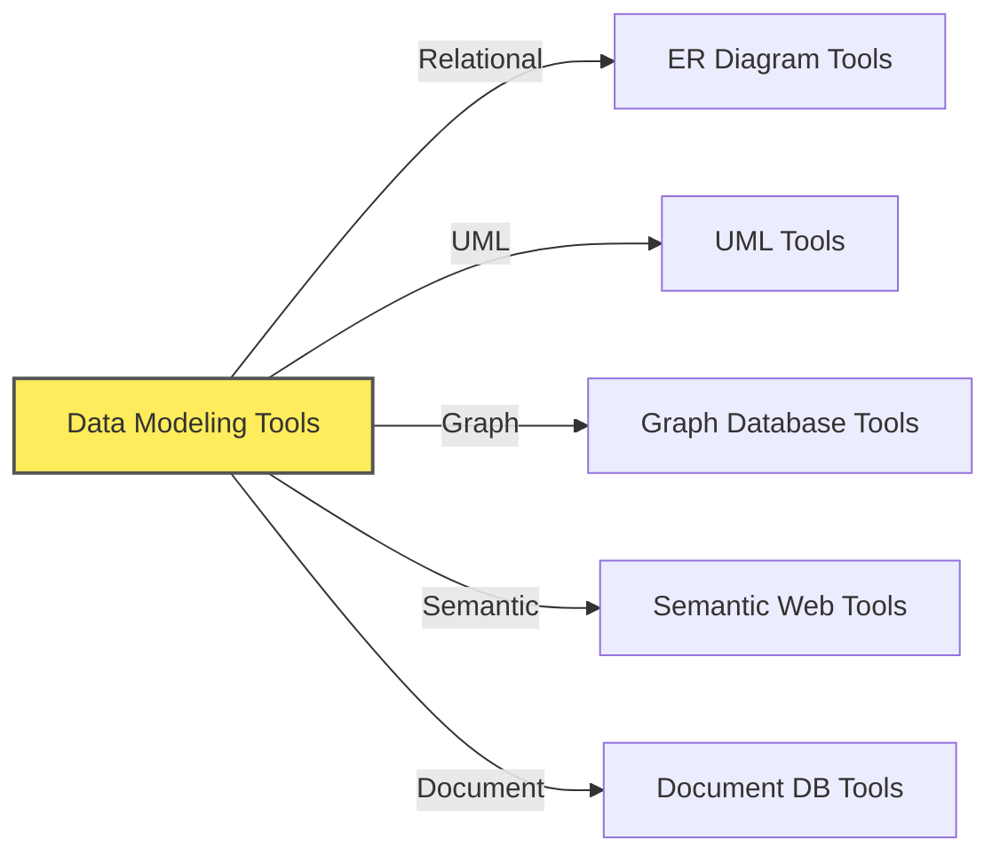
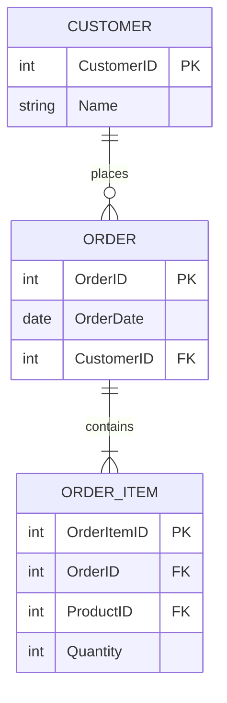
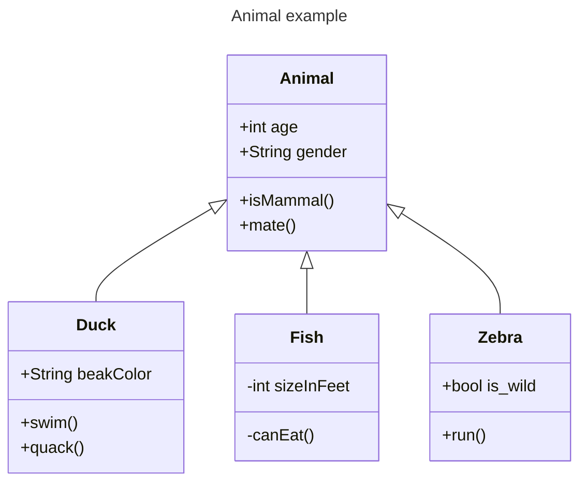
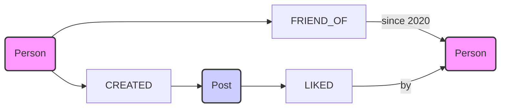
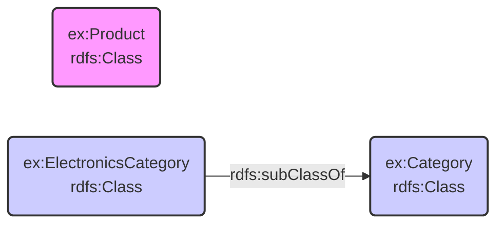
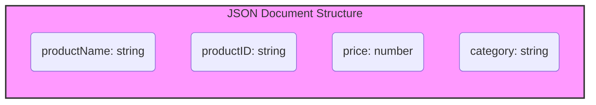
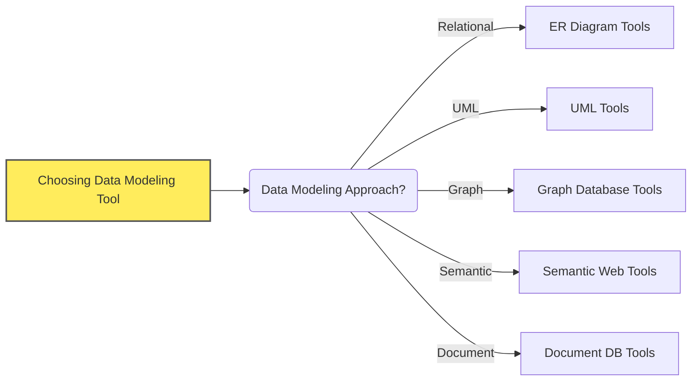

# Data Modeling Tools: An Overview

## Purpose of this Document

- This document provides an overview of various data modeling tools available for different types of data models.
- It aims to help you understand the purpose of these tools, their categories, and how to choose the right one for your needs.
- The tools discussed in this document are not exhaustive and are meant to provide a starting point for your data modeling needs.

## Pre-read Recommendations

- It is recommended to read the [Data Modeling Techniques](./100-data_modeling_techniques.md) document first to understand the context of the tools discussed here.
- That document provides an overview of data modeling techniques including
  - Relational Data Modeling
  - Graph Data Modeling
  - Document Data Modeling
  - Semantic Data Modeling

## Tools Covered in this Document

## Why Use Data Modeling Tools?

- **Visualize Data Models:** Tools help create visual representations, making models easier to understand.
- **Improve Communication:** Visual models facilitate discussions with both technical and business teams.
- **Increase Efficiency:** Tools streamline the design process, automate tasks, and reduce errors.
- **Ensure Consistency:** Tools help enforce modeling standards and maintain consistency across projects.

## Categories of Data Modeling Tools

### ER Diagram Tools (For Relational Data Models)

- **What are they?**
  - Tools specifically designed for creating Entity-Relationship (ER) diagrams.
  - Focus on entities, attributes, and relationships in relational databases.
- **What do they help with?**
  - Designing database schemas.
  - Visualizing tables and their connections.
  - Generating database creation scripts (DDL).
- **Example Tools:**
  - [MySQL Workbench](https://www.mysql.com/products/workbench/)
  - [ERwin Data Modeler](https://technicspub.com/erwinDM/)
  - [Draw.io](https://drawio-app.com/blog/entity-relationship-diagrams-with-draw-io/)
  - [Mermaid ER Diagrams](https://mermaid.js.org/syntax/entityRelationshipDiagram.html) (example below)

### UML Tools (For Broader System & Data Modeling)

- **What are they?**
  - Unified Modeling Language (UML) tools are for modeling software systems in general.
  - Include diagram types like class diagrams that can be used for data modeling (object-oriented perspective).
- **What do they help with?**
  - Modeling classes, attributes, and relationships in software design.
  - Visualizing data structures within a larger system context.
  - Can be used for database design, but are more general-purpose.
- **Example Tools:**
  - [PlantUML](https://plantuml.com)
  - [Lucidchart](https://www.lucidchart.com/pages/uml-class-diagram)
  - [Visual Paradigm](https://www.visual-paradigm.com/solution/freeumltool/)
  - [Mermaid Class Diagrams](https://mermaid.js.org/syntax/classDiagram.html) (example below)

### Graph Database Tools (For Graph Data Models)

- **What are they?**
  - Tools designed for visualizing and working with graph data models.
  - Often specific to graph databases or general graph visualization.
- **What do they help with?**
  - Exploring relationships between data points (nodes and edges).
  - Designing graph database schemas visually.
  - Querying and analyzing graph data.
- **Example Tools:**
  - [Neo4j Bloom](https://neo4j.com/product/bloom/)
  - [Gephi](https://gephi.org)

### Semantic Web Tools (For Semantic Data Models)

- **What are they?**
  - Tools for creating and managing semantic data models (ontologies, RDF graphs).
  - Support RDF, RDFS, OWL, and SHACL standards.
- **What do they help with?**
  - Building ontologies (defining classes, properties, relationships semantically).
  - Editing RDF data and schemas.
  - Validating RDF data against SHACL shapes.
  - Reasoning and inference with semantic data.
- **Example Tools:**
  - [Protégé](https://github.com/protegeproject/protege)
  - [TopBraid Composer](https://topbraidcomposer.org/html/What_is_TopBraid_Composer.htm)

### Document Database Tools (For Document Data Models)

- **What are they?**
  - Tools that help design and manage document structures, often within document databases themselves.
  - Can include schema validation tools for JSON documents.
- **What do they help with?**
  - Visualizing document structures (JSON schemas).
  - Designing collections and document layouts.
  - Validating document data against schemas (e.g., using JSON Schema).
- **Example Tools:**
  - [MongoDB Compass Schema](https://www.mongodb.com/docs/compass/current/validation/)
  - [JSON Schema Validators ](https://json-schema.org/)
  - [Studio 3T (for MongoDB)](https://studio3t.com/)
  - [Couchbase Capella UI](https://www.couchbase.com/products/capella)
- **Mermaid Diagram Example (Document Data Model - JSON Structure):**

## Choosing the Right Tool

- **Consider your data modeling approach:** Relational, Graph, Semantic, Document?
- **Think about your team's needs:** Ease of use, collaboration, features required?
- **Evaluate tool features:** Diagram types, export options, integration, price.
- **Start simple:** For basic needs, free and web-based tools might be enough. For complex projects, consider more feature-rich options.

