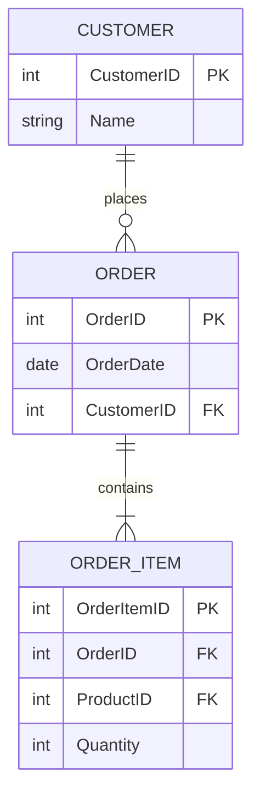

# ER Diagram Tools (For Relational Data Models)

- **What are they?**
  - Tools specifically designed for creating Entity-Relationship (ER) diagrams.
  - Focus on entities, attributes, and relationships in relational databases.
- **What do they help with?**
  - Designing database schemas.
  - Visualizing tables and their connections.
  - Generating database creation scripts (DDL).
- **Example Tools:**
  - [MySQL Workbench](https://www.mysql.com/products/workbench/)
  - [ERwin Data Modeler](https://technicspub.com/erwinDM/)
  - [Draw.io](https://drawio-app.com/blog/entity-relationship-diagrams-with-draw-io/)
  - [Mermaid ER Diagrams](https://mermaid.js.org/syntax/entityRelationshipDiagram.html) (example below)

