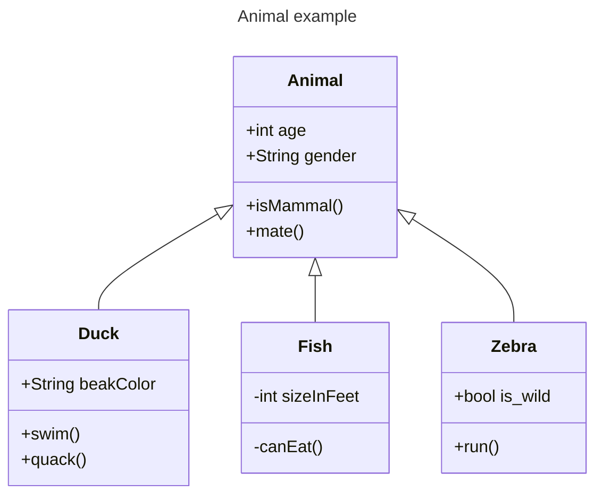

# UML Tools (For Broader System & Data Modeling)

- **What are they?**
  - Unified Modeling Language (UML) tools are for modeling software systems in general.
  - Include diagram types like class diagrams that can be used for data modeling (object-oriented perspective).
- **What do they help with?**
  - Modeling classes, attributes, and relationships in software design.
  - Visualizing data structures within a larger system context.
  - Can be used for database design, but are more general-purpose.
- **Example Tools:**
  - [PlantUML](https://plantuml.com)
  - [Lucidchart](https://www.lucidchart.com/pages/uml-class-diagram)
  - [Visual Paradigm](https://www.visual-paradigm.com/solution/freeumltool/)
  - [Mermaid Class Diagrams](https://mermaid.js.org/syntax/classDiagram.html) (example below)

