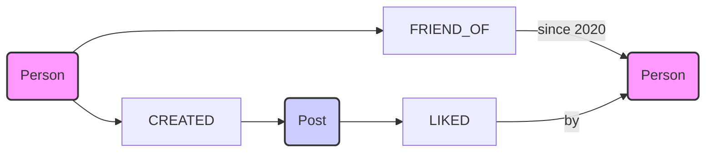

# Graph Database Tools (For Graph Data Models)

- **What are they?**
  - Tools designed for visualizing and working with graph data models.
  - Often specific to graph databases or general graph visualization.
- **What do they help with?**
  - Exploring relationships between data points (nodes and edges).
  - Designing graph database schemas visually.
  - Querying and analyzing graph data.
- **Example Tools:**
  - [Neo4j Bloom](https://neo4j.com/product/bloom/)
  - [Gephi](https://gephi.org)

