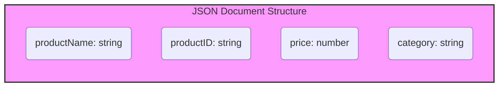

# JSON-based Modeling Tools

## What are they?

- Tools designed for creating and managing JSON-based data models.
- Focus on flexible, schema-less data structures.
- Often used with document databases like MongoDB, Couchbase, etc.

## What do they help with?

- Designing and visualizing JSON document structures.
- Validating JSON data against schemas.
- Managing collections and documents in document databases.

## Example Tools

- [MongoDB Compass](https://www.mongodb.com/products/compass)
- [Studio 3T](https://studio3t.com/)
- [Couchbase Capella](https://www.couchbase.com/products/capella)
- [JSON Schema Validators](https://json-schema.org/)

## Mermaid Diagram Example (Document Data Model - JSON Structure)

