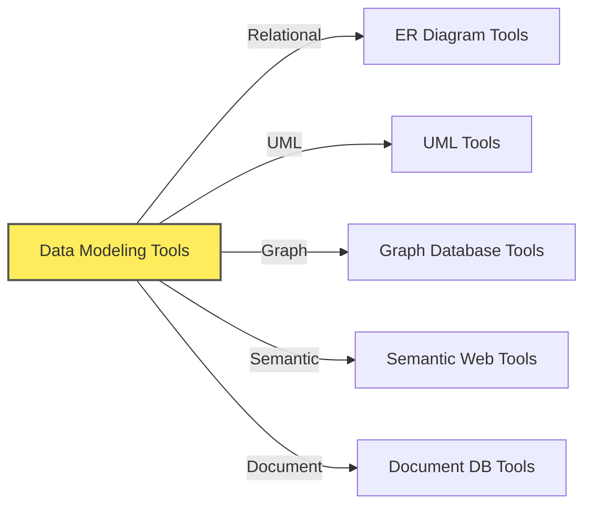

# Data Modeling Tools

## Overview of the Contents

This folder contains multiple files that provide detailed information about various data modeling tools. Each file focuses on a specific category of data modeling tools, offering insights and examples.

## Purpose of this Document

- This document provides an overview of various data modeling tools available for different types of data models.
- It aims to help you understand the purpose of these tools, their categories, and how to choose the right one for your needs.
- The tools discussed in this document are not exhaustive and are meant to provide a starting point for your data modeling needs.

## Pre-read Recommendations

- It is recommended to read the [Data Modeling Techniques](../100-data_modeling_techniques/readme.md) document first to understand the context of the tools discussed here.
- That document provides an overview of data modeling techniques including
  - Relational Data Modeling
  - Graph Data Modeling
  - Document Data Modeling
  - Semantic Data Modeling

## Tools Covered in this Document

## Why Use Data Modeling Tools?

- **Visualize Data Models:** Tools help create visual representations, making models easier to understand.
- **Improve Communication:** Visual models facilitate discussions with both technical and business teams.
- **Increase Efficiency:** Tools streamline the design process, automate tasks, and reduce errors.
- **Ensure Consistency:** Tools help enforce modeling standards and maintain consistency across projects.
