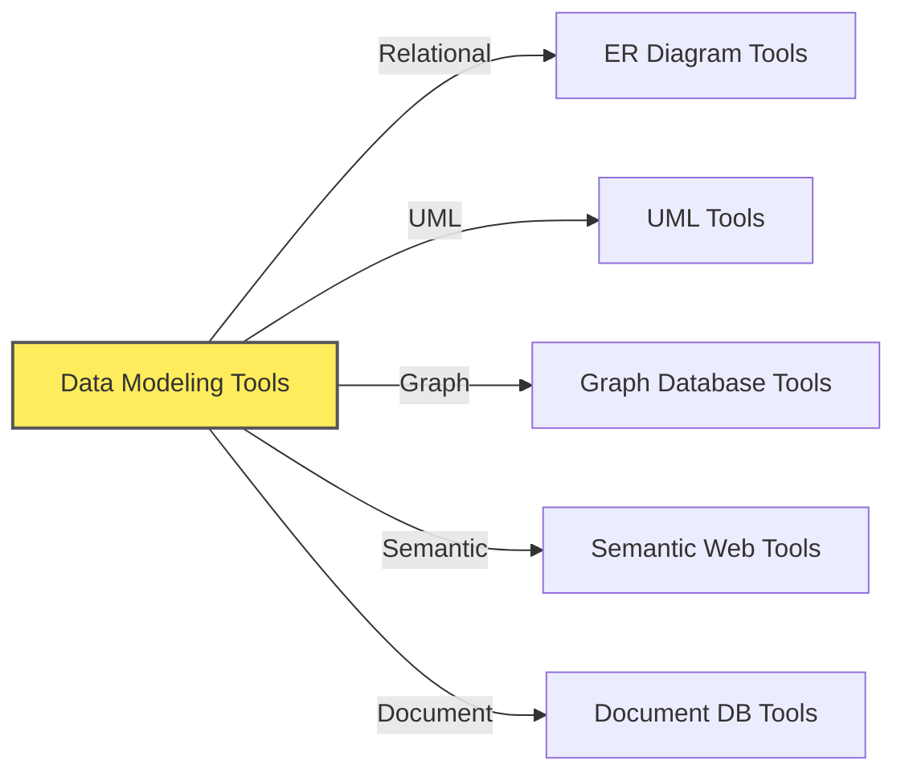

# Data Modeling Tools

## Overview of the Contents

- This folder contains multiple files that provide detailed information about various data modeling tools.
- Each file focuses on a specific category of data modeling tools, offering insights and examples.

## Pre-read Recommendations

- It is recommended to understand [Data Modeling Techniques](./../100-data_modeling_techniques) first to understand the context of the tools discussed here.
- Topics covered in that folder are:
  - Relational Data Modeling
  - Graph Data Modeling
  - Document Data Modeling
  - Semantic Data Modeling

## Tools Covered in this Folder

- [ER Diagram Tools](./10-er_diagram_tools.md): Focus on relational data models, entities, and relationships.
- [UML Tools](./20-uml_tools.md): General-purpose modeling tools that can be used for data modeling.
- [Graph Database Tools](./30-graph_data_modeling_tools.md): Designed for graph data models, focusing on nodes and edges.
- [Semantic Web Tools](./40-semantic_data_modeling_tools.md): For semantic data models, ontologies, and RDF graphs.
- [Document Database Tools](./50-json_based_modeling_tools.md): For document data models, focusing on JSON or XML structures.

## Choosing the Right Tool

- **Consider your data modeling approach:** Relational, Graph, Semantic, Document?
- **Think about your team's needs:** Ease of use, collaboration, features required?
- **Evaluate tool features:** Diagram types, export options, integration, price.
- **Start simple:** For basic needs, free and web-based tools might be enough. For complex projects, consider more feature-rich options.
