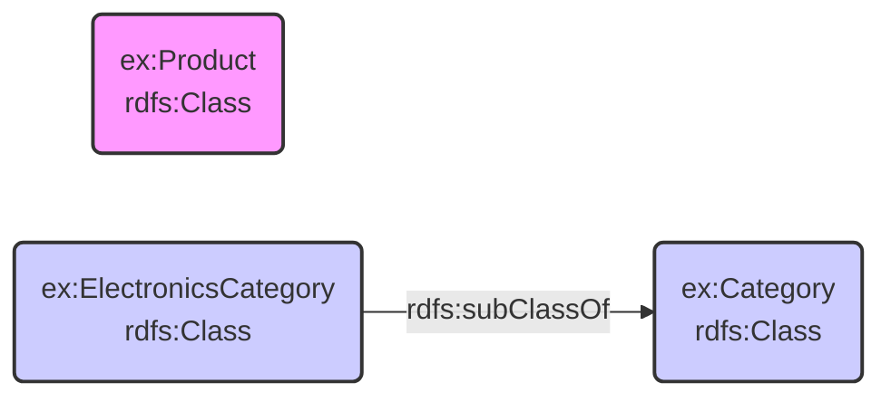

# Semantic Data Modeling Tools

## What are they?

- Tools for creating and managing semantic data models (ontologies, RDF graphs).
- Support RDF, RDFS, OWL, and SHACL standards.

## What do they help with?

- Building ontologies (defining classes, properties, relationships semantically).
- Editing RDF data and schemas.
- Validating RDF data against SHACL shapes.
- Reasoning and inference with semantic data.

## Example Tools

- [Protégé](https://github.com/protegeproject/protege)
- [TopBraid Composer](https://topbraidcomposer.org/html/What_is_TopBraid_Composer.htm)

