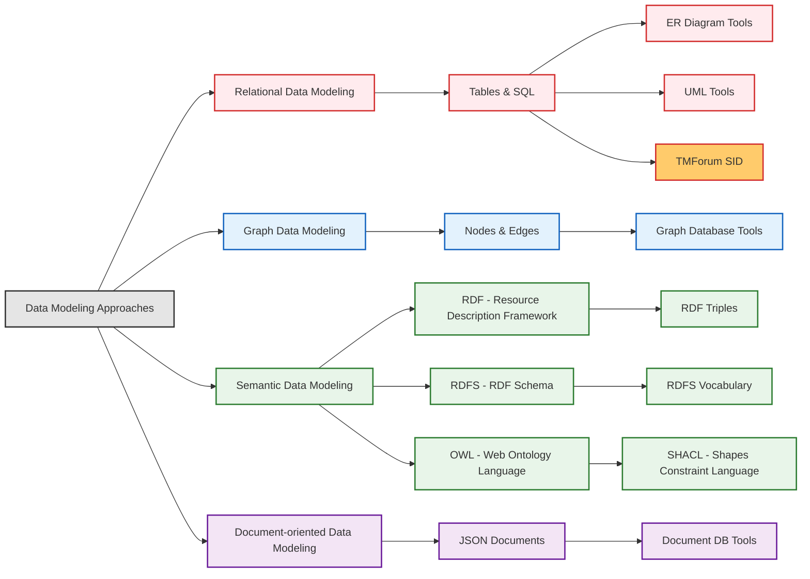
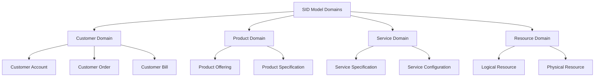
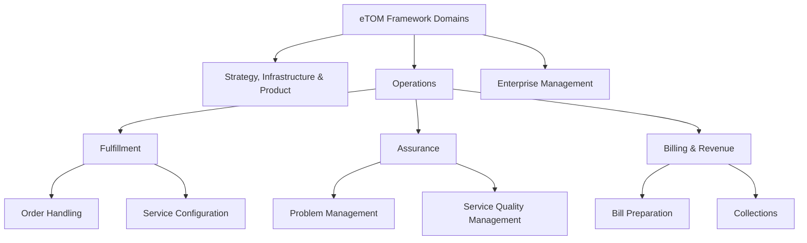
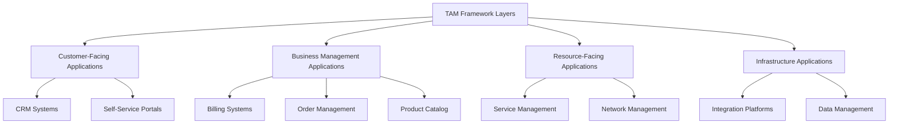

# On this page

- **This page serves as an introduction to the topic of TM Forum's SID.**
- To check out other related topics, click on the links from the diagram below.
- To continue with the current topic, scroll down to read more.

# TM Forum's Information Framework

## Introduction

- The TM Forum's Information Framework (SID, eTOM, and TAM) is a comprehensive set of standards and guidelines for the telecommunications industry.
- These components are closely related to the data modeling [techniques](../100-data_modeling_approaches) and [tools](../120-data_modeling_tools) discussed in the other folders in this repository.
- Here's how they are co-related:
  - **SID (Shared Information/Data Model):**
    - Primarily based on UML and entity-relationship concepts.
    - Uses a hierarchical information model that can be implemented in relational databases.
    - Often used for telecommunications data modeling that gets implemented in SQL databases.
  - **eTOM (Enhanced Telecom Operations Map):**
    - Provides a comprehensive business process framework.
    - Can be mapped to various data modeling techniques to ensure that data models support business processes effectively.
  - **TAM (Telecom Applications Map):**
    - Blueprints application alignment with business functions.
    - Ensures that data models are aligned with the applications that use them.
  - **Open Digital Architecture (ODA) and TM Forum Open APIs:**
    - Facilitate the integration and interoperability of different systems and applications.
    - Ensure that data models are compatible with industry standards and can be easily integrated with other systems.

## In this Document

- **This document explains**
  - TM Forum's Information Framework components (SID, eTOM, and TAM)
  - How these components work together
  - Open Digital Architecture (ODA)
  - TM Forum Open APIs
- **The goal is**
  - to provide a technical understanding of these frameworks and
  - their practical implementation in telecom systems.
- **Structure of this document**
  - Introduction to TM Forum
  - Information Framework
    - SID
    - eTOM
    - TAM
  - ODA and Open APIs

## Introduction to TM Forum

- TM Forum drives digital transformation in telecommunications.
- It provides industry-standard frameworks, tools, and best practices for service providers and suppliers in the telecom/digital services industry.
- It helps organizations modernize systems, ensure business continuity, and reduce risks during digital transformation.

## TM Forum - Information Framework

- **About the Information Framework**
  - TM Forum offers industry-standard frameworks for integrated management of telecom operations and IT infrastructure.
- **Components of the Information Framework**
  - `SID (Shared Information/Data Model)` Standardizes data definitions for a common language across systems.
  - `eTOM (Enhanced Telecom Operations Map)` Provides a comprehensive business process framework.
  - `TAM (Telecom Applications Map)` Blueprints application alignment with business functions.
- **Interactive Exploration**
  - Access the Information Framework [here](https://www.tmforum.org/oda/moda/)
  - 

### Integration of SID, eTOM, and TAM

- **Together, SID, eTOM, and TAM provide a comprehensive view of telecom operations**
  - eTOM defines processes
  - SID defines data
  - TAM defines applications
- **TAM**
  - Identifies applications implementing eTOM processes
- **SID**
  - Defines data used by TAM applications
- **eTOM**
  - Defines processes that TAM applications implement

### Analogy using Data Modeling Levels

- **Conceptual Data Model**
  - Focuses on the "big picture": what entities exist and how they relate.
  - Remains free of technical details, ensuring it is technology agnostic.
- **Logical Data Model**
  - Digs into the details: defines the structure, attributes, data types, and relationships.
  - Acts as a bridge between business requirements and technical implementation.
- **Physical Data Model**
  - Details how the logical model is implemented using a specific technology.
  - Specifies database features such as tables, columns, indexes, and constraints.

| Data Model Type | Information Framework Component | Primary Purpose                                                                       |
| --------------- | ------------------------------- | ------------------------------------------------------------------------------------- |
| **Conceptual**  | **SID**                         | Defines WHAT information the business manages (business concepts and data entities)   |
| **Logical**     | **eTOM**                        | Defines HOW the business operates (business processes and operational workflows)      |
| **Physical**    | **TAM**                         | Defines WHAT application capabilities are needed (application functions and features) |

### SID

- **What is SID?**
  - A standardized data model for the telecommunications industry.
  - Provides a common language for data definitions, ensuring consistent understanding and usage across systems.
  - Enables interoperability and integration of systems, reducing complexity and improving efficiency.
- **SID - Domain**
  - `Definition`
    - A high-level grouping of related business areas that represent major functional parts of a telecom business.
    - SID organizes telecom business concepts in a structured hierarchy.
  - `Practical Analogy`
    - Think of them as the "departments" or "subject areas" in a company.
  - `SID Context Example`
    - Customer Domain, Product Domain, Service Domain, Resource Domain
  - 
  - `SID domains`
    - SID is organized into domains, which represent major functional areas of the telecom business.
    - These domains provide a logical grouping for related business concepts.

- **SID - Abstract Business Entity (ABE)**
  - `Definition`
    - Drilling down into a Domain, brings us to the Abstract Business Entity (ABE).
    - ABE is a subdivision within a Domain, grouping together related Entities within a Domain to further organize the model.
  - `Practical Analogy`
    - "Folder" within a Department
  - `SID Context Example`
    - In image above, within each Domain rectangle, smaller colored rectangles labeled "ABE" represent Abstract Business Entities.
- **SID - Business Entity (BE)**
  - `Definition`
    - A fundamental building block of the SID, representing a distinct "thing," "concept," or "object" in the business domain that we need to store information about.
  - `Practical Analogy`
    - Entities are like the "nouns" in the business language.
  - `SID Context Example`
    - CustomerBillingAccount, CustomerAccount, CustomerBill (yellow boxes in diagrams)
  - 
- **SID - Attribute**
  - `Definition`
    - A characteristic or property of an Entity, describing the data elements associated with an Entity.
  - `Practical Analogy`
    - Attributes are like the "adjectives" that describe the "nouns" (Entities).
  - `SID Context Example`
    - creditLimit, pin in CustomerBillingAccount (listed under "Attributes" tab)
  - 
- **SID - Relationship (or Association)**
  - `Definition`
    - A connection or link between two or more Entities, describing how Entities are related in the business context.
  - `Practical Analogy`
    - Relationships are like the "verbs" that connect "nouns."
  - `SID Context Example`
    - Lines connecting Entity boxes in diagrams, labeled with relationship type and cardinality.
    - CustomerBillingAccount _described by_ CustomerBill, PartyRole _plays_ Customer
  - 

| Term              | Definition                                                       | Practical Analogy                      | SID Context Example                                                            |
| ----------------- | ---------------------------------------------------------------- | -------------------------------------- | ------------------------------------------------------------------------------ |
| **Domain**        | High-level business area grouping related concepts.              | "Department" in a company              | Customer Domain, Product Domain, Service Domain, Resource Domain               |
| **Package** (ABE) | Subdivision within a Domain, grouping related Entities.          | "Folder" within a Department           | Customer Management ABE, Billing ABE                                           |
| **Entity**        | A distinct "thing," "concept," or "object" in the business.      | "Noun"                                 | CustomerBillingAccount, CustomerAccount, CustomerBill                          |
| **Attribute**     | A characteristic or property of an Entity.                       | "Adjective"                            | creditLimit, pin in CustomerBillingAccount                                     |
| **Relationship**  | A connection or link between Entities.                           | "Verb"                                 | CustomerBillingAccount _described by_ CustomerBill, PartyRole _plays_ Customer |
| **Class**         | Often used interchangeably with Entity, sometimes more abstract. | "Blueprint" (in object-oriented terms) | CustomerBillingAccount (concrete entity in the diagram)                        |
| **Aggregate**     | Collection of related Entities treated as a unit.                | "Document with embedded sections"      | CustomerBillingAccount with related entities and connections                   |

### eTOM

- **What is eTOM?**
  - `Definition`
  - A comprehensive `business process framework` for telecom service providers.
  - Provides a standardized view of all business processes required to run a telecom operation.
  - `Practical Analogy`
    - Blueprint for Business Processes
  - `eTOM Context Example`
    - eTOM (overall structure)
  - 
- **eTOM Level 1 Process Area**
  - `Definition`
    - Major category of business processes, representing a high-level overview of the entire business process landscape.
  - `Practical Analogy`
    - Department
  - `eTOM Context Example`
    - Operations, Strategy, Enterprise Management
  - 

- **eTOM Level 2 Process Area**
  - `Definition`
    - Sub-category of processes within a Level 1 area, representing key functional domains within each broader category.
  - `Practical Analogy`
    - Division within a Department
  - `eTOM Context Example`
    - Fulfillment, Assurance, Billing (within Operations)
  - 
- **eTOM Level 3 Process Grouping**
  - `Definition`
    - Group of related processes within a Level 2 area, providing even more detail.
  - `Practical Analogy`
    - "Section within a Division"
  - `eTOM Context Example`
    - Manage Customer Order Placement, Manage Customer Order Fulfillment
  - 
- **eTOM Level 4 Process**
  - `Definition`
    - Specific set of activities to achieve a business goal, representing the most granular level of detail.
  - `Practical Analogy`
    - "Process/Task"
  - `eTOM Context Example`
    - Capture Customer Order, Issue Customer Order

| Term                          | Definition                                            | Practical Analogy                  | eTOM Context Example                                               |
| ----------------------------- | ----------------------------------------------------- | ---------------------------------- | ------------------------------------------------------------------ |
| eTOM Framework                | Standard business process framework for telecoms      | "Blueprint for Business Processes" | eTOM (overall structure)                                           |
| eTOM Level 1 Process Area     | Major category of business processes                  | "Department"                       | Operations, Strategy, Enterprise Management                        |
| eTOM Level 2 Process Area     | Sub-category of processes within a Level 1 area       | "Division within a Department"     | Fulfillment, Assurance, Billing (within Operations)                |
| eTOM Level 3 Process Grouping | Group of related processes within a Level 2 area      | "Section within a Division"        | Manage Customer Order Placement, Manage Customer Order Fulfillment |
| eTOM Level 4 Process          | Specific set of activities to achieve a business goal | "Process/Task"                     | Capture Customer Order, Issue Customer Order                       |

### TAM

- **What is TAM?**
  - `Definition`
    - A business-oriented view of the telecom application landscape.
    - Outlines the functional capabilities that telecom applications should provide to support the business processes defined in eTOM and manage the data defined in SID.
  - `Practical Analogy`
    - "Software Catalog"
  - `TAM Context Example`
    - TAM (overall structure)
  - 
- **TAM Level 1 Application Area (or Layers)**
  - `Definition`
    - Major category of application functionality, representing high-level application domains. These are also commonly referred to as _TAM Layers_.
  - `Practical Analogy`
    - "Application Domain" or "Application Layer"
  - `TAM Context Example`
    - Customer-Facing Applications, Business Management Applications, Resource-Facing Applications, Infrastructure Applications (often grouped into layers)
  - 

- **TAM Level 2 Application Area**
  - `Definition`
    - More specific functional grouping of applications within a Level 1 Area, representing specific application functional areas.
  - `Practical Analogy`
    - "Application Functional Area"
  - `TAM Context Example`
    - Customer Order Management, Customer Information Management
  - 
- **TAM Application**
  - `Definition`
    - Specific software system or functional module, representing a concrete software component with a defined function.
  - `Practical Analogy`
    - "Software Application/Module"
  - `TAM Context Example`
    - Customer Order Acceptance, Customer Order Enrichment
  - 

| Term                         | Definition                                                              | Practical Analogy             | TAM Context Example                                        |
| ---------------------------- | ----------------------------------------------------------------------- | ----------------------------- | ---------------------------------------------------------- |
| TAM (Functional Framework)   | Application framework for telecoms                                      | "Software Catalog"            | TAM (overall structure)                                    |
| TAM Level 1 Application Area | Major category of application functionality                             | "Application Domain"          | Customer Domain, Product Domain, Service Domain            |
| TAM Level 2 Application Area | More specific functional grouping of applications within a Level 1 Area | "Application Functional Area" | Customer Order Management, Customer Information Management |
| TAM Application              | Specific software system or functional module                           | "Software Application/Module" | Customer Order Acceptance, Customer Order Enrichment       |

## TM Forum - ODA and Open APIs

- Information Framework provides the `conceptual foundation` for telecom operations.
- TM Forum further promotes interoperability and agility through standardized APIs and data models
- For this reason, TM Forum has developed the
  - `Open Digital Architecture (ODA)`
  - `Open APIs`
- Next sections will cover these two topics in detail.

### Open Digital Architecture (ODA)

- **What is ODA?**
  - Provides a framework for integrating various systems and applications within the telecom ecosystem.
  - Breaks down complex systems into smaller, reusable parts.
  - It replaces traditional operations and business support systems (OSS/BSS) with a new approach that simplifies your design, modernizes your build, and automates your operation.
  - 
- **Interactive explorer**
  - Find it [here](https://www.tmforum.org/oda/)
  - 

### TM Forum Open APIs

- **What are Open APIs?**
  - TM Forum Open APIs are standardized REST APIs with JSON payloads specifically designed for telecom operations.
  - They provide practical, well-documented, and widely adopted interfaces for various telecom business functions.
- **Open APIs and the Information Framework**
  - `SID Implementation` APIs expose SID data in a standardized format, allowing systems to exchange information based on the common data model.
  - `eTOM Enablement` API operations are designed to support eTOM business processes, facilitating standardized process execution across different systems.
  - `TAM Connectivity` TAM applications can connect and interact with each other through Open APIs, enabling a modular and interoperable application landscape.
- **More details**
  - Find them [here](https://www.tmforum.org/oda/open-apis/open-api-dashboard/)
  - 
  - 
