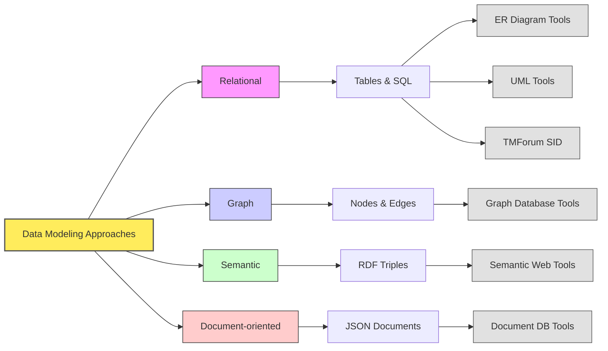

# Introduction to Data Modeling

## Overview of the Repository

This repository serves as an introduction to the topic of data modeling. It contains documents that provide insights into various data modeling techniques, tools, and industry standards.

## Purpose of Each Document

1. [100-data_modeling_techniques.md](./100-data_modeling_techniques.md)
   - **Purpose:** Introduces the concept of data modeling and delves into various techniques such as relational data modeling, graph data modeling, semantic data modeling (RDF, RDFS, OWL, SHACL), and Document Databases & JSON-based Modeling.
   - **Link:** [100-data_modeling_techniques.md](./100-data_modeling_techniques.md)

2. [120-data_modeling_tools.md](./120-data_modeling_tools.md)
   - **Purpose:** Provides an overview of various data modeling tools available for different types of data models.
   - **Link:** [120-data_modeling_tools.md](./120-data_modeling_tools.md)

3. [200-tm_forum.md](./200-tm_forum.md)
   - **Purpose:** Contains details about TM Forum's Information Framework components (SID, eTOM, and TAM), and how these components work together, about Open Digital Architecture (ODA) and TM Forum Open APIs.
   - **Link:** [200-tm_forum.md](./200-tm_forum.md)

## Navigation

