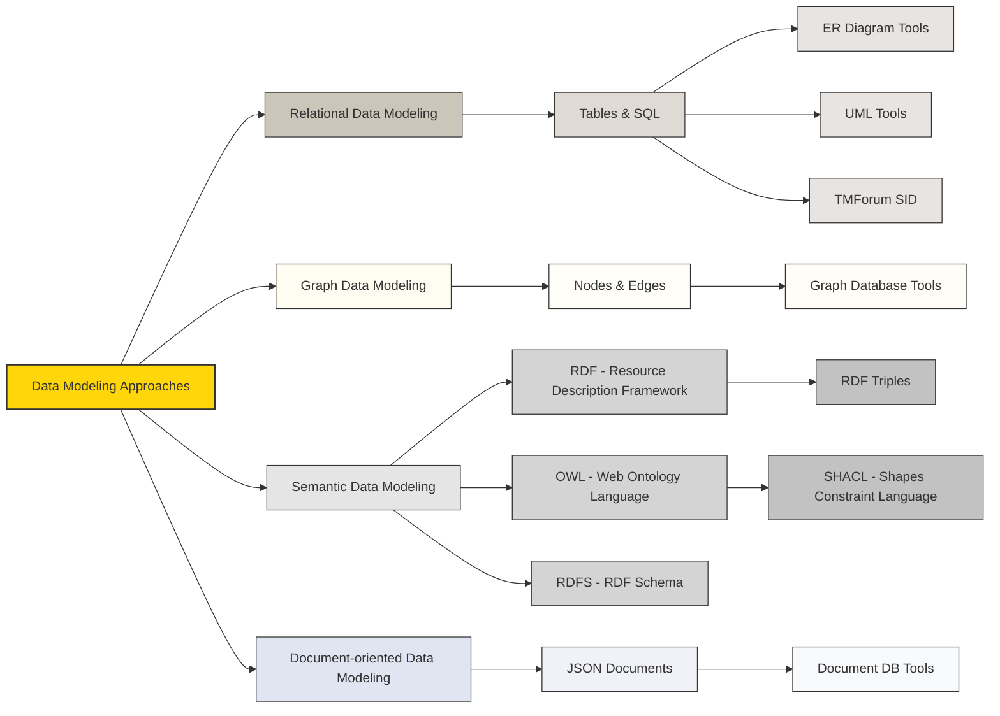
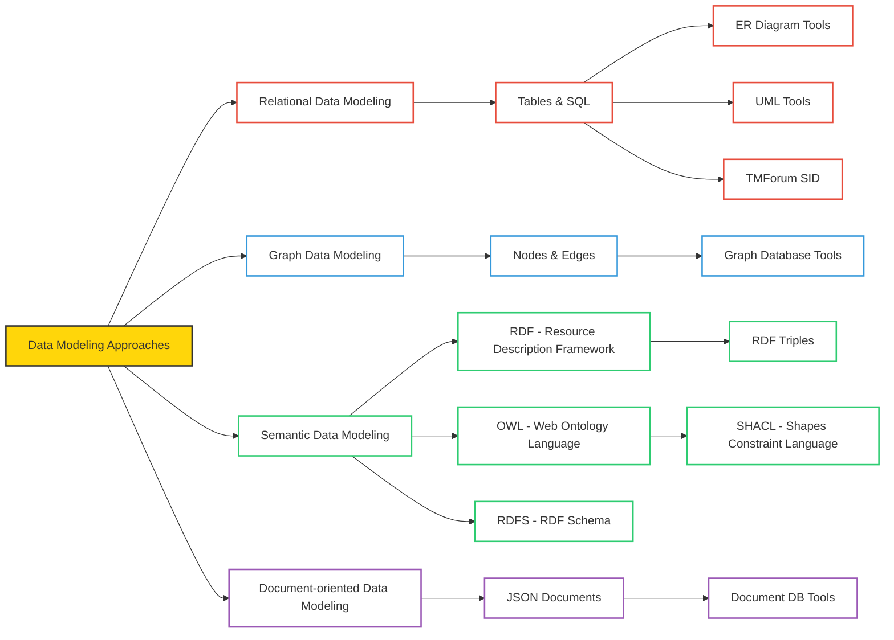

# Introduction to Data Modeling

## Overview of the Repository

- This repository serves as an introduction to the topic of data modeling.
- It contains documents that provide insights into various data modeling techniques, tools, and industry standards.

## Topics Covered

- **Click on any of the links in the boxes to explore the respective topics**:

## With Hyperlinks

