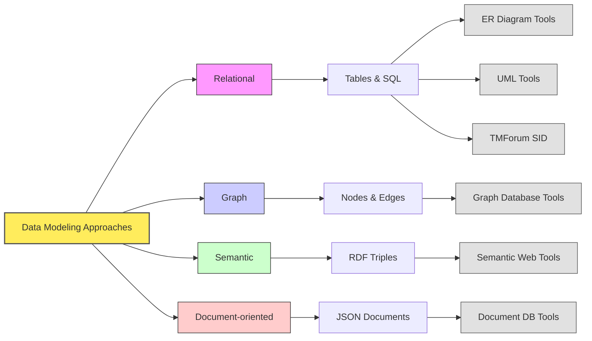

# Project Title

## Purpose of this repository

- work in progress

## Navigation

```mermaid
graph LR
    DM[Data Modeling Approaches]
    RDM[Relational]
    GDM[Graph]
    SDM[Semantic]
    DDM[Document-oriented]

    DM --> RDM
    DM --> GDM
    DM --> SDM
    DM --> DDM

    RDM --> Tables[Tables & SQL]
    GDM --> NodesEdges[Nodes & Edges]
    SDM --> Triples[RDF Triples]
    DDM --> Documents[JSON Documents]

    Tables --> ERTools[ER Diagram Tools]
    Tables --> UMLTools[UML Tools]
    Tables --> TMFSID[TMForum SID]
    NodesEdges --> GraphTools[Graph Database Tools]
    Triples --> SemanticTools[Semantic Web Tools]
    Documents --> DocumentTools[Document DB Tools]

    style DM fill:#ffec5c,stroke:#555,stroke-width:2px
    style RDM fill:#f9f,stroke:#333,stroke-width:1px
    style GDM fill:#ccf,stroke:#333,stroke-width:1px
    style SDM fill:#cfc,stroke:#333,stroke-width:1px
    style DDM fill:#fcc,stroke:#333,stroke-width:1px

    classDef approachStyle fill:#eee,stroke:#333,stroke-width:1px
    class RDM,GDM,SDM,DDM approachStyle

    classDef toolStyle fill:#e1e1e1,stroke:#555,stroke-width:1px
    class ERTools,UMLTools,GraphTools,SemanticTools,DocumentTools,TMFSID toolStyle
```
