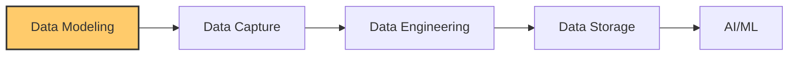
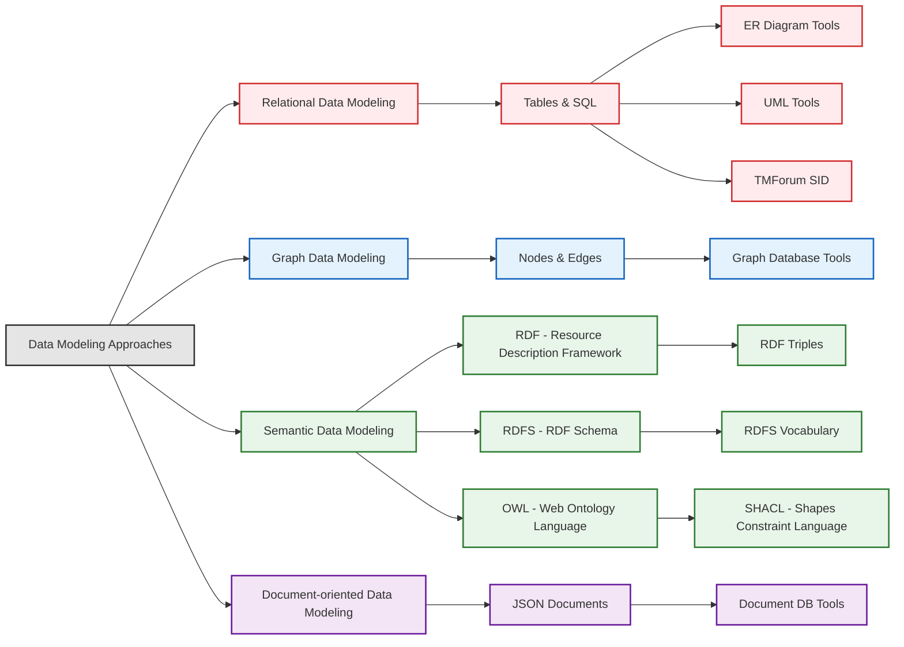

## What's Data Modeling?

- Data is everywhere, but it can quickly become overwhelming.
- Think of it like exploring a new city. Without a map, you'd be lost, wandering aimlessly.
- **Data modeling is like creating that map for your data.**

## What's Inside This Repository?

- This repository breaks down data modeling into easy-to-understand, practical steps.
- You'll discover:
  - Straightforward explanations of different ways to map your data.
  - Useful tools you can start using right away.
  - Real-world examples that show data mapping in action.
  - Proven patterns to solve common data challenges.

## How to Explore

- There are two main ways to navigate this repository:

1. **Visually Explore Sections:** Use the diagram below. Click on any link within the diagram to go directly to that section.
2. **Learn Sequentially:** Go step-by-step, start with: [Data Modeling Concepts](./100-data_modeling_techniques/05-overview_of_data_modeling_concepts.md). This is a good starting point for beginners.

